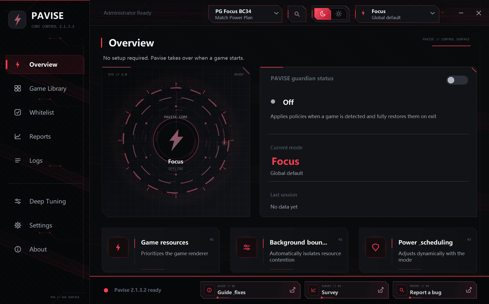
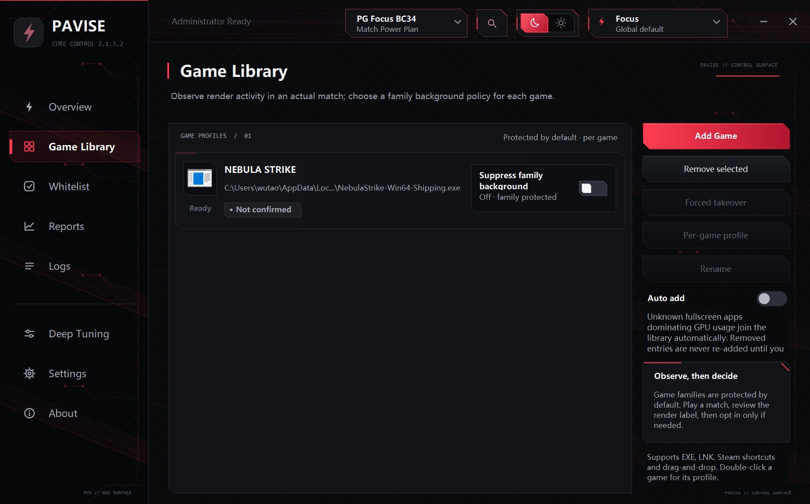
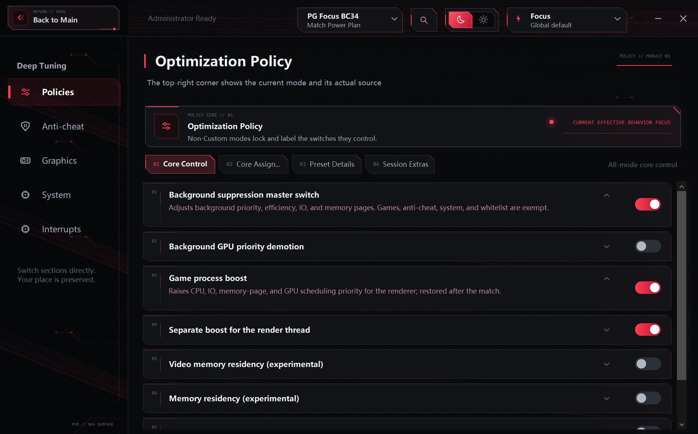
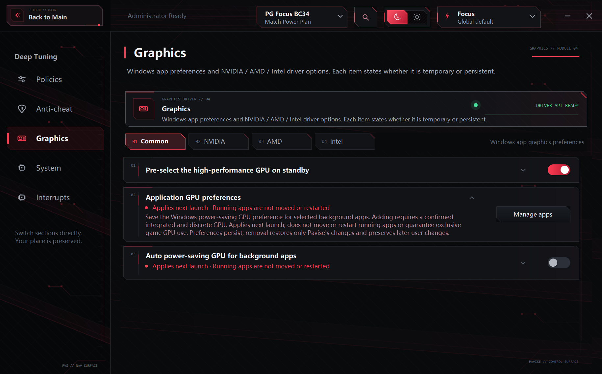
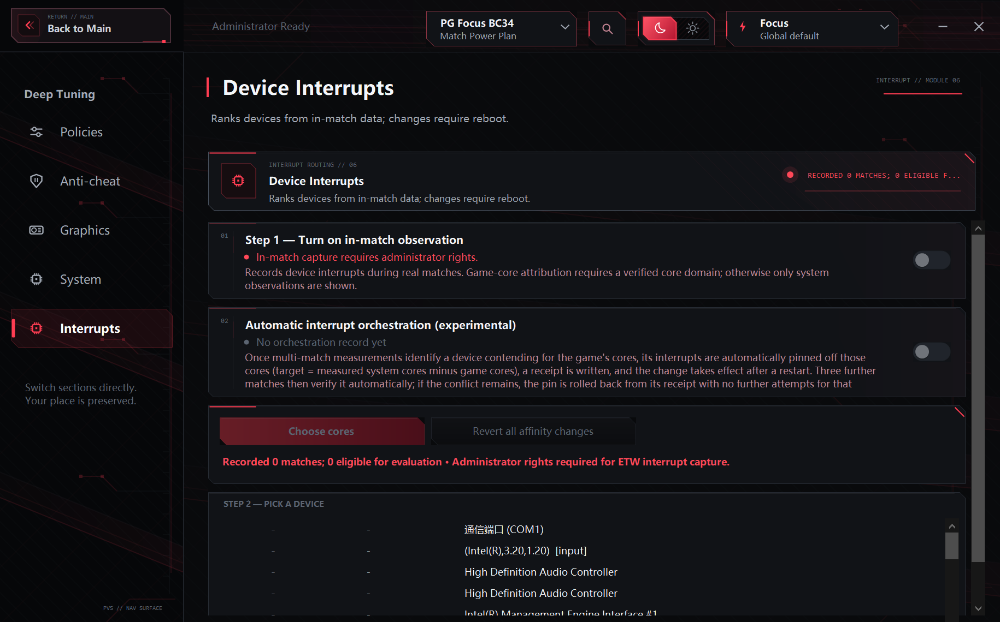
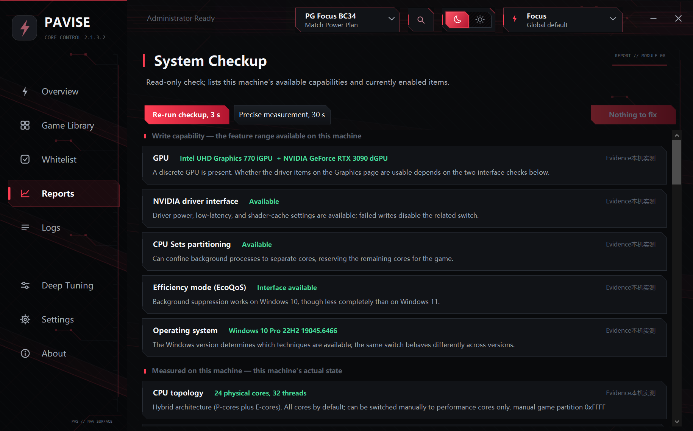

# Pavise

Windows game resource scheduling and guard tool

`C#` · `WinForms` · `Chinese / English / Japanese`

[简体中文](README.md) · **English** · [日本語](README.ja.md)

**v2.1.3.3 · [Release notes (Chinese)](docs/releases/v2.1.3.3.md)**

 

## Performance

Pavise does not generate additional performance. It returns the share taken by background processes to the game. Machines with many background programs and noticeable CPU or disk contention benefit the most. A clean system, or a game entirely limited by the GPU, will see little change.

Suppression strength does not correlate with performance. The retired Extreme mode scored only 71 in the heavy-load scenario, below Competitive's 93, and that is why it was removed. The default preset is the mildest tier.

The existing four-tier bench figures date from v1.7.1: an i7-9750H laptop with WeChat, Clash, QQ and a music player in the background, scored against a clean system as 100, averaging 59 without Pavise, 60 in Normal and 96 in Competitive (Normal and Competitive are today's Smart and Focus). The 2.x scheduling model differs from 1.7, so treat those numbers as an order-of-magnitude reference; they have not been re-run on 2.x.

Measure the effect by toggling it on and off in the same game and the same scene.

## Usage

Add a game's EXE or shortcut to the library, or use the scan function to import games already installed through Steam, Epic, GOG, Ubisoft, Riot, WeGame, Battle.net or Xbox.

Protection applies for as long as the game runs; switching to the desktop or minimising does not end it. Games started through a launcher (League of Legends, for example) have their real executable remembered after the first confirmation and are recognised directly afterwards. Launchers, updaters, crash reporters and anti-cheat processes are not identified as games.

Session changes are restored from their records when the game exits. After an abnormal Pavise exit, the next launch retries recovery and keeps records of failures. Three exceptions: application GPU preferences remain saved, input-language changes are not rolled back, and purged cache contents cannot be restored.

## Modes

| Mode | Suppression scope |
|---|---|
| Smart | Every background process that clears the protection boundary is isolated outright the moment the match starts, with no heat check and no tier-by-tier escalation. Whatever you are using, and its family, is exempt from suppression; under sustained CPU saturation (above 90% for over ten seconds) it temporarily escalates to the Focus profile, stepping back down after two stable minutes, at most three times per match |
| Focus | The scope widens to everything outside the game, windowed apps included. Programs you use after alt-tabbing are demoted too; only the whitelist is exempt |
| Light | Background suppression identical to Focus, with the power side left to vendor tools: no power slider, and pure power-saving items stay enabled on AC. Requires a battery; for handhelds and thin-and-light laptops |
| Custom | Background suppression, cores, memory and power, system environment and graphics, each chosen individually |

The tiers differ in which processes are eligible to be touched, not in how hard they are suppressed. Anything past the boundary is isolated directly, cold processes included, without waiting for one to consume resources for ten seconds first. Isolation writes the lowest priority, the lowest disk I/O and paging priority, EcoQoS, a timer-resolution cap and disabled turbo boost. With GPU yielding on, the GPU scheduling priority drops to minimum as well.

This is the opposite of the 1.9-era approach, because the premise changed. Isolating everything really was a net loss back then: the scattered wake-ups of a hundred idle processes were squeezed onto two cores by affinity narrowing and queued behind each other, tripling the longest frame by 2.6×. From 2.0 on, background affinity is never modified and the entire narrowing-and-migration mechanism is gone. A cold process with no ready threads costs no CPU to begin with, and when it does wake it can run on any core without higher-priority work, so nothing queues and the cost of isolating everything disappears.

In every mode, anti-cheat, Windows core services, network accelerators, the input/audio/peripheral chain, hardware control tools and other signed-in accounts are never suppressed. No switch affects this boundary.

Game family exemption is on by default: game platforms, launcher shells, resident processes inside the game folder and child processes spawned by the game are all released as a family. Turning it off releases only the game itself and the whitelist; everything else is suppressed as ordinary background.

## Per-game configuration

Select a game in the library and open its own configuration. Each game can override the mode, background suppression, cores, memory and power, system environment and graphics policy, 33 items in total. Items not overridden follow the global setting, and changes save immediately.

- Most per-game settings are resolved when the match activates and apply to the next one. Pausing nonessential services and disabling CPU idle are handled in the current session and reverted when turned off
- The current core selection can be pinned to one game without affecting others
- A whole override set can be cleared back to global in one action
- The overview page and the tray show the mode actually in effect, labelled with the game its configuration came from
- When repeated driver-write failures turn a switch off automatically, that game's override for it is cleared as well

Library entries can be renamed. This changes the displayed name only and does not affect recognition.

## Features

Features come in two kinds: in-match changes, restored automatically when the game exits, and persistent changes, collected on the System Environment page, which need a restart and can be reverted at any time. Here they are in interface order.

### Overview and guard

One guard switch decides whether Pavise takes over. With it on, nothing happens until a game is detected; with it off, nothing happens at all.

- The overview shows the active mode, whether it comes from the global setting or a specific game's configuration, and the last session's report
- **Session report**: play time, the number of suppressed processes and their CPU usage, the share of time spent power- or thermal-limited, and the peak shared video memory the game spilled into system RAM
- **Feature search**: type a keyword at the top to jump straight to a switch instead of remembering which page it lives on
- **Auto-hide**: the window collapses to the tray ten seconds after a game is detected, once per session
- **Interface**: light and dark themes; Chinese, English and Japanese switch instantly, and newly written log lines follow

### Library

- Add an EXE or shortcut manually, or scan to import from Steam, Epic, GOG, Ubisoft, Riot, WeGame, Battle.net and Xbox
- **Forced takeover**: for emulators, cloud gaming and anything else that cannot be recognised, the match starts as soon as the process does
- **Auto-add**: newly recognised games are collected automatically. A path you removed goes on an ignore list and is never auto-added again until you add it back by hand
- **Render observation label**: marks whether GPU 3D activity has actually been seen on that EXE, which is what tells you whether family suppression is safe to enable
- **Family background suppression**: per-game, off by default. While off, game platforms, launcher shells, resident processes in the game folder and child processes spawned by the game are released as a family
- **Per-game configuration**: 33 policy items can be overridden per game; anything not overridden follows the global setting, and entries can be renamed

### Processes and cores

- **Game process boost**: the renderer receives high priority and higher disk I/O, memory-page and GPU scheduling priority, restored on exit
- **Separate render-thread boost**: the thread that determines frame rate is identified and boosted on its own. Bench testing shows a 77%-96% improvement in 1% low frames under full CPU load
- **Smart yield**: when the CPU stays saturated for ten seconds and the frame thread did not take over, the game process steps back to normal priority. Whole-process high priority measurably worsens tail frames in that state
- **In-match self-yield**: Pavise moves off the game cores and lowers its own scheduling weight
- **Background suppression**: everything past the protection boundary is isolated at once, receiving the lowest priority, the lowest disk I/O and paging priority, EcoQoS, a timer-resolution cap and disabled turbo boost
- **Background GPU priority demotion**: a background process using the GPU also has its GPU scheduling priority lowered
- **Wider and stronger suppression**: maximum suppression of non-game background apps, including after alt-tab. Locked on in Focus and Light; whitelist your IME and device tools
- **Game core partitioning**: background work is confined to its own cores and the rest are left to the game. Handles hybrid architectures, X3D and multiple processor groups; six cores or fewer are not partitioned
- **Partition swap**: X3D machines can switch to the large-cache CCD
- **Manual core selection**: draw it per core, with presets for all cores, no SMT, P-cores only and inverse. Written on Apply
- **Whitelist**: drag an EXE in, scope determined automatically, never suppressed in any mode

### Anti-cheat coverage

Nine anti-cheat systems are listed individually, each stating which games it protects and which of its components are kernel drivers that must not be touched: ACE (Tencent), TenProtect, Vanguard (Riot), EasyAntiCheat (Epic), BattlEye, EA Javelin, nProtect GameGuard, FACEIT and NEAC (NetEase).

The **compatibility list** records games that refuse writes, so priority and I/O writes certain to fail are not retried while GPU scheduling priority and the frame thread are still attempted. The list expires when the game updates.

**Anti-cheat suppression** (per-group switches on the Anti-Cheat page, off by default) offers no intensity choice; the profile is fixed and scan-safe: below-normal CPU priority, very low disk I/O (disk scanning is the main source of harm) and efficiency-core capping. It never drops the scanner to the lowest CPU priority, seals its timer resolution, or lowers its memory page priority — game threads can be suspended by the system during a scan and resume only when the scanner finishes, so starving it of CPU time only stretches a brief stutter into a multi-second freeze.

### Graphics

- **Application GPU preferences**: save the Windows power-saving GPU preference for chosen background apps. Applies at their next launch and never moves a running app
- **Preselect high-performance GPU on standby**: on dual-GPU machines, preselects the high-performance GPU while idle, skips anything already set by hand, and restores on exit
- **GPU power limit**: raised to the vendor-permitted maximum during the match and restored from the snapshot afterwards
- **NVIDIA**: maximum performance power mode, low latency (on or ultra), Smooth Motion frame generation, unrestricted shader cache, DLSS override (latest or a pinned J/K generation), per-game ReBAR
- **AMD**: Anti-Lag, AFMF frame generation, RSR driver-level upscaling
- **Intel**: global low latency, only on DX9/DX11 paths the driver reports as supporting live changes. Boost and XeSS are never touched

Original values are snapshotted and restored when a switch is turned off. Writes whose ownership cannot be confirmed are never overwritten.

### Input devices

- Turn off **Filter Keys, Sticky Keys and Toggle Keys**. Microsoft defines these features as ignoring brief keystrokes, so leaving them on necessarily adds latency
- **Disable selective suspend for keyboards and mice**, which removes the loose first input after an idle period. Keyboards and mice only, never USB storage or audio
- Repair **input queue length** broken by other tools and turn off **pointer precision enhancement**
- **Foreground time slice**, three modes: system default, foreground weighted, report only. Non-standard values are reported as anomalies
- **Switch to English once at game entry**: one English keyboard layout request to the foreground game inside a short entry window. Switching back to Chinese, alt-tabbing and returning are never intervened in

### Device interrupts

- **Match interrupt observation**: kernel ETW collects per-device DPC activity, accounted per match, identifying devices contending with the game's cores
- **Manual pinning**: pick the device and the target cores. The cost is spelled out before writing, and every device keeps a receipt for reverting
- **GPU interrupt affinity**: moved to cores near the render thread
- The page flags cases that are not worth touching: pinning a multi-message MSI-X device can reduce parallelism, and StorPort DPCs follow the CPU that issued the I/O, so pinning them usually does nothing

### Memory and power

- **Managed power plan**: created on the first match with parameters written for this processor. Any plan on the machine can be selected instead, in which case Pavise only switches to it and changes none of its parameters
- **Disable CPU idle**: only during a game, on confirmed AC power, with the managed plan active, and only the AC value is changed
- **Standby memory cleanup**: the entire standby list is purged only when both the list-size and true-free-memory thresholds are crossed. Technical detail below
- **MMCSS multimedia scheduling**: the share reserved for non-multimedia work drops from 20% to 10%, and the Games task's scheduling category and file I/O are raised
- **Pause Windows Update, Delivery Optimization, nonessential services and background wireless scanning**, all resumed on exit
- **Turn off Game DVR and Xbox background recording**, and **keep the display awake during a match**

### System environment

Changes on this page need a restart and persist on the machine. Every one of them is revertible:

- **Hardware-accelerated GPU scheduling (HAGS)**, **disable VBS**, **remove speculative-execution mitigations**
- **Game mode guard**, **windowed game optimisation**
- **Constant timer tick**, **global timer resolution**
- **Disable NIC power saving**, **disable NIC interrupt moderation** (only the standardized setting on physical wired adapters)
- **Accessibility key interception**, **disable keyboard and mouse selective suspend**

### Experimental features

Eight of them, all off by default, all requiring confirmation, all per-game overridable. Every write is read back and verified; a failed verification reverts the change and stops further attempts; everything is restored at match end or on disable.

- **VRAM residency**: declares a minimum reservation when video memory runs tight, reducing long frames from textures being evicted and paged back. It neither adds nor locks memory
- **Memory residency**: pins a hard minimum working set under sustained physical-memory pressure so trimming no longer reclaims the game's pages. It allocates nothing, and machines under 16 GB do not participate
- **Cache warm-up**: pre-reads game assets into the standby cache at the lowest disk priority after the match settles. Reading only; runs on AC power, with sufficient memory, on an SSD game drive
- **Single display in match**: switches to primary-only so a stray click cannot steal focus, and saves the second screen's composition. Switched back afterwards; the screen blanks briefly
- **Power budget yield**: on laptops, hands shared power budget to the GPU when it is pinned against its limit and the CPU has headroom. Verification detail below
- **Automatic interrupt orchestration**: pins a device off the game cores once multi-match measurement identifies it, with receipts, effective after a restart, then verifies over three more matches and rolls back if ineffective
- **Auto power-saving GPU**: enrols background apps still running 3D on the game's render GPU to use the power-saving GPU at their next launch, at most 2 per match
- **Intel global low latency**: see the Graphics section above

### System audit

A read-only capability check of the machine, with 132 conclusions each labelled by evidence level: measured here, bench-tested, mechanism clear, or unverified. System items broken by third-party tools can be repaired in place, and you can see whether the GPU is currently power- or thermal-limited. The interrupt row uses kernel ETW to capture DPC and ISR activity and names the top source directly.

The Settings page offers a full configuration wipe that reverts every persistent change Pavise ever made, including those left by retired features.

A purely local tool. It installs no service, uploads no data, injects into no game process, and modifies no game memory or files. Every write is read back where possible, and a value that does not read back as expected is not counted as success.

## How power budget yield verifies itself

This feature changes the processor energy performance preference, which affects whole-machine power distribution, so it verifies more thoroughly than the others.

Twenty seconds of observation to decide whether to yield, then fifteen more to verify after engaging. A failed verification reverts immediately and stops automatic attempts until the user re-enables it.

A passed verification is not a one-way trip. A rolling 30-second window returns the budget when the bottleneck moves back to the processor (GPU load falling or CPU under pressure), and yields again if the GPU saturates, at most three times per match, each with a full re-observation and verification. The hysteresis band is yield at 90, release at 80, which prevents oscillation around the threshold.

Verification has two tiers:

- Machines with readable RAPL wattage verify by package power. Less than 3W freed, or GPU utilization dropping more than 3%, reverts and stops
- Machines without readable power fall back to platform frequency. EPP frees power by lowering frequency, so a relative drop under 3% means EPP has no effect on that machine, and it reverts and stops likewise

The two tiers are accounted separately. If CPU load shifts more than 10 points inside the verification window the result is indeterminate: it reverts without stopping and retries next match. That rule exists so a verification window landing on a cutscene or loading screen, where power falls on its own, is not mistaken for an ineffective change.

On this machine's i7-9750H, EPP across its full range moved neither package power nor actual frequency, so machines like it fail both tiers. That is the intended behavior.

## Memory cleanup

**Currently available: standby memory cleanup, off by default.** Enable it under Optimization Policies → Session Extras. The Parameters button next to it saves three values together: list-size threshold, free-memory threshold and check interval. The dialog offers Conservative, Standard and Aggressive presets that fill the fields for you. Defaults are 1024 MB, 1024 MB and 4000 ms; MB means 1024² bytes, thresholds accept 0–1048576 MB and the interval accepts 250–300000 ms.

The condition is `List ≥ list threshold AND Free < free threshold`. List counts the standby list plus the system working set; Free counts only Free + Zero pages and does not treat standby cache as truly free. Task Manager's Available includes standby cache and cannot stand in for Free. [Microsoft's definitions of these counters](https://learn.microsoft.com/en-us/windows/win32/api/psapi/ns-psapi-performance_information).

Polling runs only while a game session is detected. The operation is `MemoryPurgeStandbyList`, which purges standby pages of every priority. It does not trim system or process working sets, flush the modified page list, combine memory pages, or change memory compression, the page file or timer resolution. Polling uses a dedicated thread with no overlapping execution and no catch-up for missed checks. Two consecutive read or purge failures disable the policy, and re-enabling requires confirmation again.

The purge itself stutters the game briefly and the call cannot be interrupted. After a successful purge, cleanup cools down for at least about a minute (no less than eight check intervals). It may also increase disk reads and load times and does not guarantee higher frame rates. Running it alongside another automatic memory cleaner is not recommended.

### Why only this one

The table below measures the system-level commands tools in this category use. Test machine: 64 GB RAM, 40344 MB available and 16154 MB system cache before measurement.

| Command | Duration | Available memory | System cache |
|---|---|---|---|
| Empty all process working sets | 1894.9 ms | +5191 MB | +3364 MB |
| Purge standby list (low priority) | 13.3 ms | +144 MB | −47 MB |
| Purge standby list (all) | 1380.6 ms | +382 MB | −18894 MB |
| Flush modified page list | 8019.7 ms | +5845 MB | +251 MB |
| Combine physical memory pages | 6152.1 ms | +2121 MB | +531 MB |

Purging the entire standby list discards 18894 MB of system cache to gain 382 MB of available memory. The standby list already counts as available memory, so purging it converts cached available memory into empty available memory: the total barely moves, the cached content is gone, and the game load that follows reads from disk again. Flushing the modified page list takes 8 seconds and combining physical pages 6.2 seconds, neither of which belongs on the path into a match.

These are measurements of the old implementation, not performance conclusions for the current policy. For background, see Mark Russinovich, "The Memory-Optimization Hoax" (Windows and .NET Magazine, January 2004).

## Retired features

A feature that does not hold up under measurement is retired rather than left in the interface. Historical changes from retired features remain revertible; normal startup and version updates do not restore them, and the Settings page has a clear button.

**Low-priority standby cleanup under memory pressure** (retired 2026-08-20)

The trigger used the available-memory ratio, and available memory already counts standby pages. Purging only moves pages from the standby list to the free list, so the ratio does not change, the condition never clears, and the 45-second cooldown merely set a tempo for repeat triggers. User logs show 14 triggers in 10 minutes at exactly 45-second intervals.

The effect did not hold up either: `MemoryPurgeLowPriorityStandbyList` only clears priority 0, which totals 1.4 MB on a 24 GB machine, releasing 0.0 to 0.1 MB per call. What it saves is a few hundred nanoseconds of page-reclaim work in the memory manager, which is noise against a frame's budget.

**Reclaiming background working sets after the match settles**

Calling `SetProcessWorkingSetSize` per process does not release memory. It moves pages from the working set to the standby list, and dirty pages among them must be written to the page file first, which puts that disk I/O inside the match. The targets are already-suppressed background processes, exactly what the memory manager trims first under pressure. They are not suspended, so they fault the pages back immediately, and the net effect is one extra round of reads and writes during the match.

**Driver-level frame rate cap** (retired 1.8.0.3, removed again in 2.1.3.3)

Capping frame rate is more direct in the game's own settings or the GPU control panel. A second cap at the driver level tends to fight the game's own limiter and VRR, and on AMD it has to go through Radeon Chill, which is mutually exclusive with Anti-Lag: one latency optimisation traded for another.

**USB and storage controller interrupt affinity** (retired 1.8.1.0)

On hybrid architectures with few performance cores it lands interrupts on low-clocked efficiency cores, which makes the first movement of a high-polling-rate mouse feel loose after idle. GPU interrupt affinity near the render cores is kept.

**Others**

MSI mode, low-latency mode, background hard frame caps, game file prefetch and masking CPU 0/1 by position were all implemented and removed, either because measurement showed no effect, because of the risk of damaging a device, or because of a semantic misreading: the driver's background frame cap actually applies to applications that lose focus, so alt-tabbing out of the game caps the game itself.

A separate in-match core unparking override duplicated the parking settings in the managed power plan. Per-game forced discrete GPU preference is redundant on modern Windows, which already picks the discrete GPU for games. Automatic processor-idle disabling in Competitive became a manual policy instead of a preset-driven one. Extreme mode and the League of Legends section were retired in 1.8.0.2. Fallback boosting (IFEO) and per-game CFG disabling were removed entirely, with no legacy field compatibility.

## What is reported but not modified

Most of the widely shared keyboard and mouse registry tweaks act on the order of a few tenths of a millisecond, while latency comes mainly from the render queue. Pavise reports these items without modifying them, including Bluetooth mice and 125 Hz polling rates. The audit page points them out and the decision is yours.

## Interface

A full illustrated walkthrough (Chinese, 21 screenshots) is in [docs/tutorial](docs/tutorial/README.md).

## Running and data locations

Double-click `Pavise.exe` to start it in the tray. The program is unsigned, so SmartScreen may prompt; choose to run it anyway. Adjusting other processes requires administrator rights. Launch at startup is implemented as a scheduled task. Pavise checks the official update source once at startup and uploads no local data.

Data is stored in `%AppData%\Pavise` by default, including target configuration, whitelist and run logs. Interface and feature switches live in the registry under `HKCU\Software\Pavise`. Placing an empty `Pavise.portable` file next to the executable switches storage to the program directory.

The Settings page provides a one-click restore.

## Author and licence

bdth ｜ 2074055628@qq.com ｜ Douyin 44601770838 (bugs, suggestions and usage questions)

The project uses the [Pavise Licence](LICENSE): free to use, free to redistribute unmodified, no reverse engineering, **no selling**.

Taking money in any form for distributing Pavise or a modified version is not allowed. This includes selling copies, activation codes or download access, bundling it into a paid product or subscription, paywalls, paid unlocks and donation gates.

Distributions must keep the licence and author information intact, tell recipients that the software may not be sold, and label the modifier and the modifications when distributing a modified version.

Provided as is, with no guarantee of effect or compatibility. Anti-cheat suppression, VBS and cache cleanup can all have side effects. Use it only on your own machine and understand the risks first.

The latest version is always free in the QQ groups: 1051472054, 1101249532, 383761286. **If you paid for it, you were scammed.** Ask for a refund and get it free from the groups.
