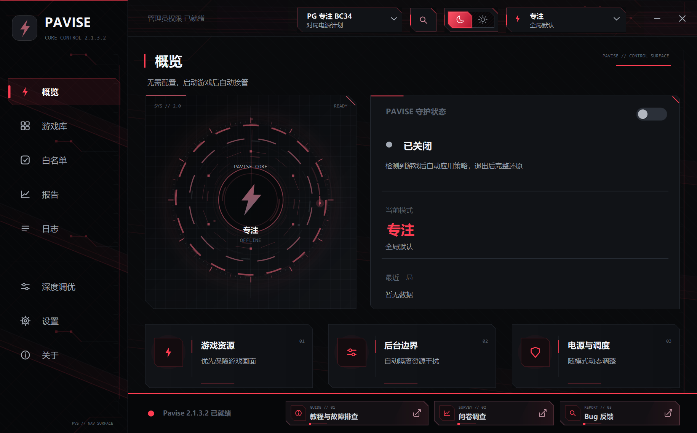
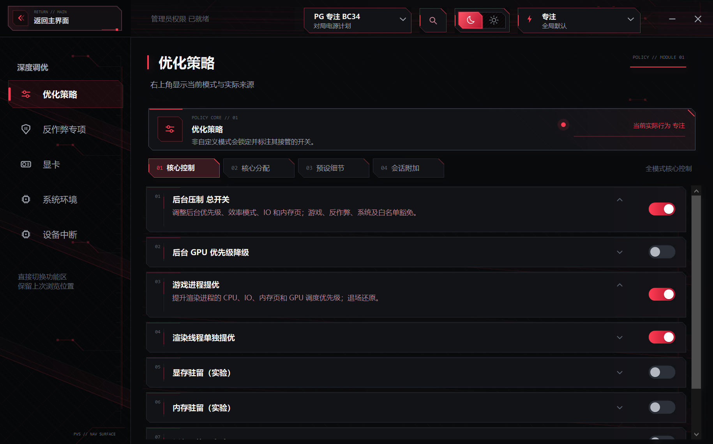
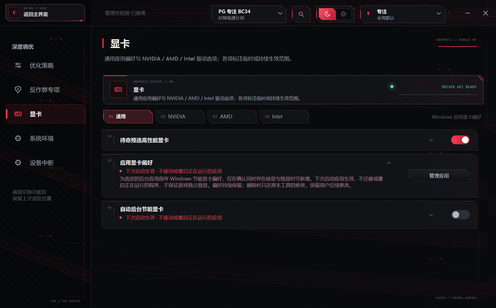
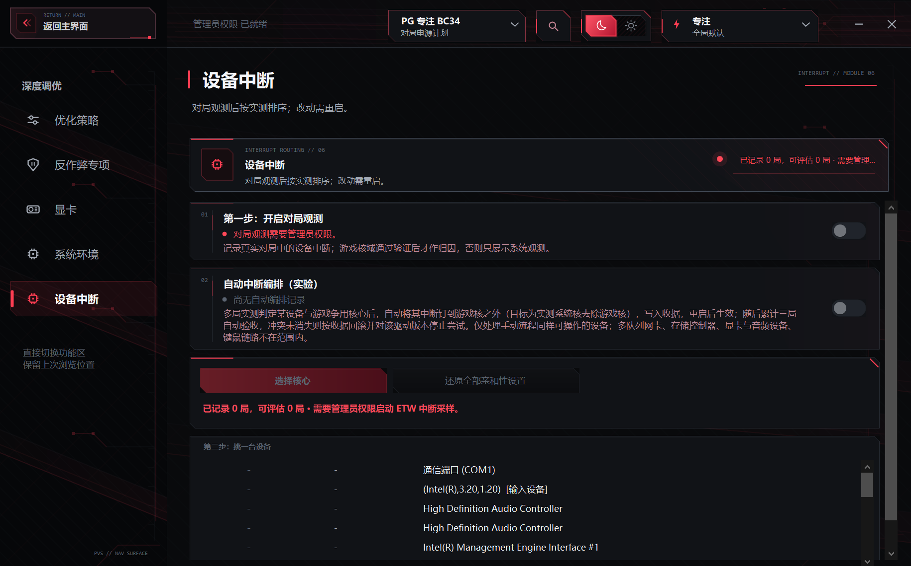
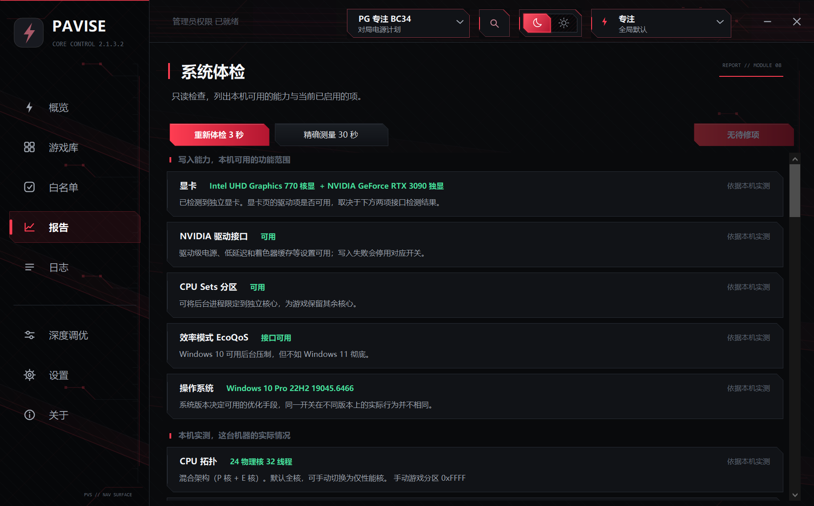



# Pavise

Windows 向けゲームリソース制御・保護ツール

`C#` · `WinForms` · `UI：中国語 / English`

このページは日本語の説明書です。現在のアプリ UI は中国語と英語のみで、以下の日本語 UI 画像は旧版の参考画像です。

[简体中文](README.md) · [English](README.en.md) · **日本語**

**v2.2.1.2 · [更新履歴（中国語）](docs/releases/v2.2.1.2.md)**

 

## 性能

Pavise は性能を新たに生み出しません。バックグラウンドに取られていた分をゲームに戻すツールです。常駐プログラムが多く CPU やディスクの奪い合いが起きている環境ほど効果が大きく、もともとクリーンな環境や完全に GPU 律速のゲームでは変化は限定的です。

抑制の強さと性能は比例しません。1.x 期の旧極限モード（全体隔離）は高負荷シナリオで 71 にとどまり、当時の競技モードの 93 を下回りました。これが削除の理由です。現在の極限ティアは名前が同じだけの別物で、抑制の範囲と強度は eスポーツと完全に同一、違いはオプション最適化項目の有効化範囲のみです。既定のプリセットは最も穏やかな設定です。

現在ある 4 段階ベンチの数値は v1.7.1 当時のものです。i7-9750H のノート PC で WeChat・Clash・QQ・音楽プレーヤーを常駐させ、クリーンな状態を 100 とした相対値で、3 シナリオ平均は Pavise なし 59、通常 60、競技 96 でした（通常と競技が現在のスマートと eスポーツ）。2.x のスケジューリングモデルは 1.7 と異なるため、この数値は桁の目安に留まり、2.x での再測定はまだ行っていません。

効果は、同じゲームの同じ場面でオン・オフを比較して測定してください。

## 使い方

Windows 10 2004（ビルド 19041）以降が必要で、Windows 11 24H2 を推奨します。これより古いビルドではバックグラウンド抑制が依存する効率モードとプロセス単位のタイマー精度分離が存在せず、スケジューリングが機能しないため、Pavise は通知したうえで終了し、以前のバージョンが残したシステム変更を復元します。

ゲームの EXE またはショートカットをライブラリに追加します。スキャン機能で Steam・Epic・GOG・Ubisoft・Riot・WeGame・Battle.net・Xbox のインストール済みゲームを取り込むこともできます。

ゲームの実行中は自動的に保護され、デスクトップへの切り替えや最小化でも解除されません。ランチャー経由で起動するゲーム（League of Legends など）は初回確認後に本体を記憶し、次回から直接認識します。ランチャー・アップデーター・クラッシュレポーター・アンチチートのプロセスはゲームとして認識しません。

ゲーム終了時は記録に基づいてセッション変更を戻し、異常終了後は次回起動時に再試行して失敗した記録を保持します。アプリの GPU 設定、EXE ごとの互換設定、システム環境の永続項目は個別に復元する必要があります。入力言語は戻しません。消去したキャッシュや手動削除した LOL の追加コンポーネントは設定の復元では戻せず、追加コンポーネントはクライアントの更新や修復で再ダウンロードされる場合があります。

## モード

| モード | 抑制範囲 |
|---|---|
| スマート | 対戦開始と同時に、保護境界を通過したバックグラウンドを一度にすべて隔離します。負荷は見ませんし、段階的に引き上げることもしません。使用中のプログラムとその一族は抑制の対象外です。CPU 飽和が続く場合（90% 超が 10 秒以上）は一時的に eスポーツモードの基準へ引き上げ、負荷が回復して 2 分間安定すれば自動で戻します。1 対戦につき最大 3 回 |
| eスポーツ | 保護境界を通過したゲーム以外のプロセスへ抑制範囲を広げます。ウィンドウのあるアプリやゲームから切り替えて使うアプリも対象ですが、ホワイトリストと組み込みの保護規則は有効です |
| 極限 | eスポーツを土台に、極限カタログ内で本機の条件を満たし、除外されていない項目を有効化します。一部の永続設定を含みます。設定で解錠して再起動後に表示され、抑制範囲と強度は eスポーツと同じです。すべてのオプションを自動で有効にするわけではありません |
| 携帯機 | バックグラウンド抑制は eスポーツと同一で、電力側はベンダーツールに任せます。電源スライダーを操作せず、AC 接続時も純粋な省電力項目を有効のままにします。バッテリーが必要で、携帯機や薄型ノート向け |
| カスタム | バックグラウンド抑制・コア・メモリと電源・システム環境・グラフィックスを個別に選択 |

各段階の主な違いは対象プロセスと追加ポリシーです。対象となる通常のバックグラウンドには Idle CPU 優先度、極低ディスク IO 優先度、低ページ優先度、EcoQoS、タイマー精度上限を適用し、GPU 譲渡が有効なら GPU 優先度も下げます。Windows の動的優先度ブーストは維持し、ゲームが待っているバックグラウンド処理の完了を助けます。これは CPU のターボとは別の機構で、バックグラウンド抑制はターボを直接無効にしません。

これは 1.9 当時とは逆の方針です。前提が変わったためです。当時の全体隔離は確かに逆効果でした。100 以上のアイドルプロセスの散発的なウェイクアップが、アフィニティ縮小によって 2 コアへ押し込まれて順番待ちになり、最長フレームが 2.6 倍になりました。2.0 以降はバックグラウンドのアフィニティを既定では変更せず、縮小とコア移動の仕組みを廃止しました。2.2 からは負荷判定付きのコア収縮を実験的機能として復活させ、CPU を使い続けるバックグラウンドだけに適用します。アイドルなものには引き続き触れません。レディスレッドを持たないコールドプロセスはもともと CPU を消費せず、たまに起きても優先度の高い処理がない任意のコアで実行できるため順番待ちが発生せず、全体隔離の代償が消えました。

通常のバックグラウンド抑制は、アンチチート、Windows コアサービス、通信アクセラレーター、入力・音声・周辺機器、ハードウェア制御、他のログインアカウントを除外します。アンチチートページには別の既定オフのユーザーモード抑制スイッチがありますが、カーネルドライバーを制御するものではありません。

ゲーム一族の除外は既定で有効です。ゲームプラットフォーム、ランチャーのシェル、ゲームフォルダー内の常駐プロセス、ゲームが生成した子プロセスを一族としてまとめて解放します。手動で無効にすると、ゲーム本体とホワイトリストのみを解放し、残りは通常のバックグラウンドとして抑制します。

## ゲームごとの個別設定

ライブラリの個別設定から、モード、バックグラウンド、コア、メモリと電源、環境、グラフィックスを上書きできます。現行のポリシーカタログはモード・一族設定・コアマスクを含めて 34 項目です。未指定項目は全体設定を引き継ぎ、変更は即時保存します。EXE ごとの全画面最適化と DPI 互換設定はこの 34 項目とは別で、対戦終了時には戻りません。

- 大半のゲーム別設定は対戦の開始時に確定し、次の対戦から反映されます。非必須サービスの一時停止と CPU アイドルの無効化は現在のセッション内で処理し、オフにすればその変更を取り消します
- 現在のコア選択を特定のゲームに固定できます。他のゲームには影響しません
- 上書き一式はワンクリックで全体設定に戻せます
- 概要ページとトレイには実際に有効なモードを表示し、どのゲームの個別設定によるものかを明記します
- ドライバーへの書き込みが連続して失敗しスイッチが自動でオフになった場合、そのゲームの当該上書きも削除します

ライブラリの項目は名称変更に対応しています。表示名のみが変わり、認識には影響しません。

## 機能

セッション変更は対戦終了時に記録から復元します。永続設定は主にシステム環境ページにありますが、アプリの GPU 設定と EXE ごとの互換設定も個別の復元が必要です。再起動の要否は各項目の説明に従ってください。ファイル削除は別操作で、設定の復元では削除内容を戻せません。

### 概要と保護

保護スイッチは汎用ゲームセッションの制御用です。有効にすると自動検出と接管を開始し、無効にすると停止してセッション変更の復元を試みます。待機時の事前設定、永続設定、LOL 拡張には個別の規則があり、保護をオフにしても全変更が戻るわけではありません。

- 概要ページには現在のモード、それが全体設定か特定ゲームの個別設定かの別、直前の対戦レポートが表示されます
- **セッションレポート**：プレイ時間、抑制したプロセス数とその CPU 使用率、電力上限・温度上限で制限された時間の割合、ゲームがシステムメモリへ溢れた共有ビデオメモリのピーク
- **機能検索**：上部にキーワードを入力すると目的のスイッチへ直接移動でき、どのページにあるか覚える必要がありません
- **自動的に折りたたむ**：ゲーム検出の 10 秒後にトレイへ収納します。1 対戦につき 1 回
- **インターフェース**：ライトとダークのテーマ、中国語と英語の即時切替、新しく出力されるログの言語切替。現在のアプリに日本語 UI はありません

### ライブラリ

- EXE・ショートカット・ゲームのフォルダーの手動追加（ウィンドウへのドロップも可。フォルダーに候補が複数あれば一覧から選択）のほか、Steam・Epic・GOG・Ubisoft・Riot・WeGame・Battle.net・Xbox からのスキャン取り込みに対応
- **強制引き継ぎ**：エミュレーターやクラウドゲームなど認識できないものは、プロセスの起動と同時に対戦へ入ります
- **自動登録**：認識した新しいゲームを自動で収録します。ライブラリから削除したパスは無視リストに入り、手動で追加し直すまで自動登録されません
- **不審プロセス警告**：可視ウィンドウがなく Windows や Program Files の外にあるプロセスが論理コアの 4 分の 1 以上を 2 分間占有し続けるか、抑制されたプロセスが自らバックグラウンドコア制限を解除した場合、ログに記録しトレイ通知でマイナー感染の可能性を知らせます。ランダムな名前はしきい値半分、同名は 1 日 1 回のみ
- **描画観測ラベル**：その EXE の GPU 3D 活動を記録します。それだけで主描画プロセスだと証明したり、関連プロセスの抑制が安全だと保証したりはできません
- **一族バックグラウンド抑制**：ゲームごとのスイッチで既定はオフ。オフの間はゲームプラットフォーム、ランチャーのシェル、ゲームフォルダー内の常駐プロセス、ゲームが生成した子プロセスを一族としてまとめて解放します
- **個別設定**：現行のポリシーカタログは 34 項目。未指定項目は全体設定に従い、表示名も変更できます
- **WeGame シェル除去**：CrossFire・逆戦・Delta Force など WeGame 経由で起動するゲームのカード下に、リーグ・オブ・レジェンドと同じシェル除去エリアを表示します。シェル起動をオンにすると、対戦開始 30 秒後に WeGame・Cross・Tencent 付属プロセスを正確に終了します。20 秒以内にゲームが終了した場合は本機でそのゲームの自動除去を停止し、シェルが再起動を繰り返す場合はその対戦では停止します。ゲームごとのスイッチ、既定はオフ
- **音声は抑制しない**：マイクの採取セッションが有効なプロセスをオーディオセッションから識別し、層を問わず対戦中は抑制しません。QQ と WeChat も通話中はこの判定で除外され、それ以外は通常どおり抑制されます。KOOK・YY・TeamSpeak・Mumble・Oopz と DS4Windows・reWASD などのコントローラーマッパーは名前でも除外します。スマート層の適応エスカレーションは独立したスイッチになり、既定はオフです

### プロセスとコア

- **ゲームプロセスの昇格**：描画プロセスに高優先度と、より高いディスク IO・メモリページ・GPU スケジューリング優先度を与え、終了時に戻します
- **候補スレッドの昇格**：既定はオンで、極限では強制オン。他のモードではフレームレートが下がるゲームだけゲーム別にオフにできます。CPU 時間による候補選択はフレームに重要なスレッドの証明ではなく、誤選択で遅くなる場合があります。CPU が継続して飽和すると候補の昇格を撤回し、ゲームを通常優先度へ戻します
- **スマート譲渡**：CPU の飽和が 10 秒続くと、候補の昇格状態に関係なく、ゲームを通常優先度へ戻して候補スレッドの昇格も撤回します。リスク対策であり、すべてのゲームで FPS が上がる保証ではありません
- **対戦中の自己譲渡**：Pavise 自身がゲームコアから退き、自らのスケジューリング比重を下げます
- **バックグラウンド抑制**：保護境界を通過した通常のバックグラウンドに CPU・IO・ページ優先度、EcoQoS、タイマー精度の制限を適用します。Windows の動的優先度ブーストは維持します
- **バックグラウンド GPU 優先度の降格**：バックグラウンドが GPU を使う際、その GPU スケジューリング優先度も下げます
- **高負荷バックグラウンドのコア収縮**（実験的）：対戦中、10 秒連続で半コア以上を使うバックグラウンドプロセスを、ゲームが使わない最少のコアに限定します。複数 CCD ではゲーム側の L3 ブロックを避け、ハイブリッド構成では E コアへ寄せます。アイドルなものには触れず、負荷が下がって 30 秒で解除、退出時に復元します。既定ではオフ、物理 5 コア未満では提供しません
- **抑制中ワーキングセットの削減**（極限専用）：極限対戦で有効になり、極限管理で除外できます。利用可能メモリが 4 GiB 未満かつ総メモリの 1/8 未満の場合だけ実行します。その後のページフォールトや初回応答の遅れは依然起こり得ます。アンチチートは対象外です
- **バックグラウンド抑制範囲の拡大**：保護境界を通過したゲーム以外のプロセスは切り替え後も対象です。eスポーツ・極限・携帯機ではオンですが、保護規則とホワイトリストは有効です
- **ゲームコア分割**：ゲームが利用するコア集合を選び、ハイブリッド、X3D、複数プロセッサーグループに対応します。全バックグラウンドを残りのコアへ移すものではなく、ゲームの独占も保証しません。バックグラウンドの固定には個別の高負荷またはアンチチートポリシーが必要です
- **分割ブロックの切替**：X3D 機では大容量キャッシュ側の CCD に切り替えられます
- **手動コア選択**：コア単位で指定でき、全コア・SMT オフ・P コアのみ・反転のプリセットがあります。適用を押した時点で書き込みます
- **ホワイトリスト**：EXE をドラッグするだけで適用範囲を自動判定し、どのモードでも抑制しません

### アンチチート対応

9 種のアンチチートを個別に掲載し、どのゲームを保護するか、どのコンポーネントがカーネルドライバーで触れられないかを明記しています。ACE（Tencent）、TenProtect、Vanguard（Riot）、EasyAntiCheat（Epic）、BattlEye、EA Javelin、nProtect GameGuard、FACEIT、NEAC（NetEase）。

中国のアリーナは別枠で掲載します。完美世界競技プラットフォーム、5E、B5 はアンチチートがプラットフォームのクライアント内にあるため、Pavise は保護のみで抑制しません。NetEase NEAC に NeacClient と OWNeacClient、Tencent TP に TP3Helper を追加。HoYoverse はカーネルドライバーのみで、ログ説明用に識別します。

さらに PunkBuster、Nexon Game Security（BlackCipher など）、Wellbia XIGNCODE3 / UNCHEATER の 3 グループを**保護専用**で掲載しています。プロセス名、名前の接頭辞、専用ディレクトリでバックグラウンド抑制から除外し、`.aes` コンポーネントや同ディレクトリ内の補助プロセスも対象とします。この 3 グループに抑制スイッチはありません。アンチチートのマスタースイッチをオフにしても保護は継続します。[識別規則・出典・対応範囲（中国語）](docs/anti-cheat-coverage.md)。

**互換リスト**は書き込みを拒否されたゲームを記録し、確実に失敗する優先度と IO の書き込みを再試行しません。GPU スケジューリング優先度とフレームスレッドは通常どおり試行します。ゲームのバージョンが変われば自動的に失効します。

**アンチチート抑制**（アンチチートページの各グループスイッチ、既定はオフ）は強度の選択を持たず、構成はスキャンセーフに固定です。通常より低い CPU 優先度、極めて低いディスク IO（ディスクスキャンが主な害）、効率コアへの制限、ゲームが使わない最少コアへの限定（6〜8 コア機では末尾の物理 1 コア、ハイブリッド構成では E コア、複数 CCD ではゲーム側とは別の L3 ブロック。アンチチート自身の保護に書き込みを拒否された場合は、その実行中は抑制全体を放棄し再試行しません）。最低優先度まで落とすこと、タイマー精度の封印、メモリページ優先度の引き下げは行いません——スキャン中はゲームスレッドがシステムに一時停止されることがあり、再開はスキャンの完了に依存するため、CPU 時間を与えないと短いカクつきが数秒のフリーズへ延びるだけです。

### グラフィックス

- **アプリの GPU 設定**：指定したバックグラウンドアプリに Windows の省電力 GPU 設定を保存します。次回起動時に反映され、実行中のアプリは移動しません
- **待機時に高性能 GPU を事前選択**：デュアル GPU 機で待機中に高性能 GPU を事前選択します。手動設定済みのものはスキップし、終了時に戻します
- **対戦時の電力上限引き上げ**：ベンダーが許可する上限まで引き上げ、終了時にスナップショットから戻します
- **NVIDIA**：電源管理を最大パフォーマンス（CUDA 起因のメモリクロック低下も抑止）、G-SYNC をウィンドウモードへ拡張、低遅延（オンまたはウルトラ）、Smooth Motion フレーム生成、シェーダーキャッシュの上限解放、DLSS 上書き（最新または J・K 世代の指定）、ゲームごとの ReBAR
- **AMD**：Anti-Lag、AFMF フレーム生成、RSR ドライバーレベルアップスケーリング
- **Intel**：グローバル低遅延。ドライバーがリアルタイム切替に対応すると報告する DX9/DX11 パスでのみ有効化し、Boost と XeSS には触れません。対局中は Endurance Gaming をオフにし、バッテリー駆動時にパネルリフレッシュレートの分数でフレームレートが制限されなくなります
- **ビデオメモリ常駐**：VRAM が逼迫した際に最小限の予約を宣言し、テクスチャが追い出されて再読み込みされることで生じる長いフレームを減らします。VRAM を増やすことも固定することもありません。既定ではオフです
- **バックグラウンドアプリの自動省電力 GPU**：ゲームの描画 GPU 上でまだ 3D を実行しているバックグラウンドアプリを、次回起動時に省電力 GPU を使うよう登録します。1 対戦につき最大 2 件、既定ではオフです

元の値はスナップショットに保存し、オフにすれば復元します。帰属を確認できない書き込みは上書きしません。

### 入力デバイス

- **フィルターキー・固定キー・切り替えキー**と起動ショートカットを無効化し、ゲーム中の誤起動やキー動作の変化を避けます
- **キーボードとマウスの選択的サスペンドを無効化**し、放置後の最初の操作で生じるふらつきを防ぎます。対象はキーボードとマウスのみで、USB ストレージやオーディオは対象外です
- 他のツールが変更した**入力キュー長**をシステム診断から修復します。現在はポインター精度を無効にするスイッチを提供しません
- **フォアグラウンドのタイムスライス確認と修復**：システム診断で現行値を解析し、判定に該当するフィールドを修復します。3 段階の選択 UI は削除済みです
- **ゲーム開始時に一度だけ英語入力へ切替**：入場直後の短いウィンドウ内で、フォアグラウンドのゲームに英語キーボードレイアウトを一度だけ要求します。その後に中国語へ戻したり切り替えて戻ったりしても干渉しません

### デバイス割り込み

- **対戦割り込み観測**：カーネル ETW でデバイスごとの DPC を採取し、対戦単位で記帳して、ゲームコアと競合するデバイスを特定します
- **手動ピン留め**：デバイスと目標コアを選びます。書き込む前に代償を明示し、デバイスごとに復元用の領収書を残します
- **GPU 割り込みアフィニティ**：レンダースレッドに近いコアへ寄せます
- 触る価値がない場合はページ側から指摘します。マルチメッセージの MSI-X デバイスはピン留めで並列度が落ちる可能性があり、StorPort の DPC は IO を発行した CPU に追随するためピン留めしても通常は効きません

### メモリと電源

- **管理電源プラン**：初回対戦で作成し、CPU に合わせて設定します。既存プランの選択自体は切り替えのみですが、明示的な CPU アイドル無効化は選択中プランの値を一時変更します。他アプリによるプラン切り替えは Windows の通知を受けて戻し、成功後の定期巡回はありません。他アプリの書き込み権限を奪うロックではありません
- **対局中はストレージを休止させない**：管理プランが NVMe 電源状態の遅延許容値をゼロにし、AHCI リンクを Active に保ち、SSD の低電力状態からの復帰による突発的なカクつきを防ぎます。バッテリー駆動時は NVMe 側を緩めます
- **CPU アイドルの無効化**：ゲーム中のみ動作し、現在アクティブな電源プランの AC/DC 両方の値に書き込み、対戦終了時に復元します。バッテリー駆動では駆動時間が大きく縮みます。AMD プロセッサーでは提供しません
- **スタンバイメモリ整理**：リストサイズと実際の空きメモリの両方がしきい値を超えた場合にのみスタンバイリスト全体を消去します。技術的な詳細は後述します
- **MMCSS マルチメディアスケジューリング**：非マルチメディア処理の予約枠を 20% から 10% に変更し、Games タスクのスケジューリングカテゴリーとファイル IO を引き上げ、レイジー検出ティアを無効化します
- **低遅延 DWM コンポジション**（極限専用）：対戦中 DWM に MMCSS スケジューリングを要求し、極限管理で除外できます。効果は表示経路と負荷次第で、合成の中断をなくす保証はありません
- **Windows Update・配信の最適化・非必須サービス・自動メンテナンスの一時停止**。自分が変更した状態を終了時に戻します。サービスは固定リストだけが対象で、現在は無線バックグラウンドスキャン抑制の入口はありません
- **Game DVR と Xbox のバックグラウンド録画をオフ**、**対戦中の画面常時点灯**
- **低遅延オーディオ**（極限専用）：デバイス対応の最小共有バッファで無音ストリームを開き、短いエンジン周期を要求します。極限対戦で有効になり、極限管理で除外できます。終了時にストリームを閉じます
- **電力譲渡**：ノート PC で GPU が上限に張り付き CPU に余裕があるとき、共有電力予算を GPU へ回し、検証に失敗すれば自動で戻して以後の試行を停止します。既定ではオフ、検証方法は後述します

### システム環境

このページの設定は永続し、個別に復元できます。一部は再起動が必要なので各項目の説明に従ってください。

- **ハードウェアアクセラレーションによる GPU スケジューリング（HAGS）**、**VBS の無効化**、**投機的実行の緩和策の解除**
- **ゲームモード保護**、**ウィンドウ表示ゲームの最適化**、**可変リフレッシュレート最適化**（VRR 非対応の DX11 排他フルスクリーンゲームでも VRR を使えるようにします）
- **タイマーの恒常ティック**、**グローバルタイマー精度**
- **NIC の省電力切断の禁止**、**NIC リンク省電力の無効化**（802.3az の低電力アイドル、Green Ethernet、アイドル時のリンク速度低下を止め、リンクのスリープ・復帰や 1G と 100M の再ネゴシエーションをなくします。書き込み時に数秒リンクが切れます）、**NIC 割り込みモデレーション実験**（既定では未変更。公開 IPv4 経路プローブで選ばれた唯一の物理有線 NIC だけで Off を明示的に試し、NetCfg GUID と PnP インスタンス ID の両方を照合して復元）
- **アクセシビリティキーの遮断**、**キーボード・マウスの選択的サスペンドの無効化**
- **メモリ圧縮とページ結合の無効化**（極限ティア専用）：圧縮スレッドとページ結合スキャンのバックグラウンド CPU 消費をなくします。メモリ 24GB 以上で提供

### システム診断

本機のハードウェアと採取できた情報から結論を生成し、件数は固定しません。各結論に本機実測・ベンチ実測・機序が明確・未検証の根拠を表示します。時間片、ネットワーク制限、入力キュー、有線ルート優先度、FTH、明示的に無効化された GPU MSI を手動修復でき、GPU の電力・温度制限と DPC/ISR の発生源も確認できます。

設定ページには全設定の消去があり、Pavise がこれまでに行った永続的な変更を、廃止済み機能が残したものも含めて一括で戻します。隣の Pavise をアンインストールはアプリ内で完結します。実行を停止して記録に従いシステム変更をすべて復元した上で、起動タスク、管理電源プラン、設定、データフォルダー、旧バージョンの残留物を削除します。実行後は一度もインストールしていない状態になり、最後に Pavise.exe 本体を削除するだけです。

ローカルで動作し、サービスのインストール、本機データの送信、ゲームプロセスへの注入、ゲームメモリの書き換えは行いません。汎用スケジューリングはゲームファイルを変更しませんが、LOL 拡張には利用者の確認後に追加コンポーネントを削除する独立操作があります。書き込みは可能な限り読み戻し、期待値を確認できなければ成功と扱いません。

### League of Legends 拡張

現在のビルドでは、認識した LOL のライブラリ項目に拡張カードを表示します。

- **起動後の整理**：通常のログイン後、LCU でセッションを確認して WeGame・Cross などの追加プロセスを終了します。繰り返し再起動する場合はその対戦の自動整理を止めます
- **ヘッドレス対戦 / UI 復元**：クライアント API でロビー UI を閉じ、対戦後に戻します。復元記録の保存と独立した復元ガードの確認を先に行います
- **追加コンポーネント削除**：クライアント終了と検査後、利用者の確認で中国版の AI Coach・iCreate などを削除します。コピーは保持せず、Pavise では取り消せません。更新や修復で再ダウンロードされる場合があります

## 電力譲渡の検証方法

この機能はプロセッサーのエネルギー効率設定を変更するもので、PC 全体の電力配分に影響するため、他の機能より検証を厚くしています。

20 秒観察して譲渡するかを決め、実行後さらに 15 秒検証します。検証に失敗した場合は即座に差し戻し、利用者が再度有効にするまで自動試行を停止します。

検証通過後も譲渡したままにはしません。30 秒のローリングウィンドウでボトルネックを監視し、プロセッサー側へ戻れば（GPU 負荷低下または CPU 逼迫）予算を返却し、GPU が再び飽和すれば再度譲渡します。1 対戦につき最大 3 回、毎回フルの観察と検証をやり直します。ヒステリシス帯は 90 で譲渡・80 で返却とし、しきい値付近での振動を防ぎます。

検証は二段構えです。

- RAPL のワット数が読める機体はパッケージ電力で検証します。3W 以上解放できない、または GPU 利用率が 3% を超えて低下した場合は差し戻して試行を停止します
- ワット数が読めない機体はプラットフォーム周波数で代替検証します。EPP が電力を解放する経路は降周波数そのものであるため、相対降下が 3% 未満であれば EPP はその機体では無効と判断し、同様に差し戻して試行を停止します

二段の記録は別々に管理します。検証ウィンドウ内で CPU 負荷が 10 ポイントを超えて変動した場合は判定不能とし、試行を停止せず差し戻して次の対戦で再試行します。これは、検証ウィンドウがカットシーンやロード画面に重なり、電力が自然に下がったことを無効と誤判定しないための規則です。

本機の i7-9750H では EPP を全域で変化させてもパッケージ電力・実周波数ともに変化せず、この種の機体では両段とも検証を通過しません。これは意図した動作です。

## メモリ整理

**現在の選択肢：スタンバイメモリ整理（既定オフ）。** 最適化ポリシー → セッション付加で有効にします。隣の設定パラメーターでリストサイズのしきい値・空きメモリのしきい値・確認間隔の 3 項目をまとめて保存します。ダイアログには保守・標準・積極の 3 プリセットがあり、クリックで値を入力してから保存します。既定値はそれぞれ 1024 MB・1024 MB・4000 ms、MB は 1024² バイト換算、しきい値の範囲は 0〜1048576 MB、間隔は 250〜300000 ms です。

判定条件は `List ≥ リストしきい値 AND Free < 空きしきい値` です。List はスタンバイリストとシステムワーキングセットの合計、Free は Free + Zero ページのみで、スタンバイキャッシュを実際の空きとして数えません。タスクマネージャーの「利用可能」はスタンバイキャッシュを含むため Free の代わりにはなりません。[メモリカウンターに関するマイクロソフトの定義](https://learn.microsoft.com/en-us/windows/win32/api/psapi/ns-psapi-performance_information)。

ポーリングはゲームセッションを検出している間のみ行います。操作は `MemoryPurgeStandbyList` で、すべての優先度のスタンバイページを消去します。システムやプロセスのワーキングセットの削減、変更済みページリストのフラッシュ、メモリページの結合、メモリ圧縮・ページファイル・タイマー精度の変更は行いません。ポーリングは専用スレッドで実行し、多重実行や遅延分の補填は行いません。読み取りまたは消去が 2 回連続で失敗するとポリシーを停止し、再度有効にするには確認が必要です。

整理の実行自体でゲームが一瞬カクつき、呼び出しは中断できません。整理が成功した後は約 1 分以上（8 回分の確認間隔を下回らない）冷却してから次の整理を行います。ディスク読み取りやロード時間が増える可能性もあり、フレームレートの向上は保証しません。他の自動メモリ整理ツールとの併用は推奨しません。

### なぜこれ 1 種類だけなのか

下表は、この種のツールが使うシステムレベルのコマンドを個別に測定したものです。測定機はメモリ 64 GB、測定前の空きは 40344 MB、システムキャッシュは 16154 MB です。

| コマンド | 所要時間 | 空きメモリ | システムキャッシュ |
|---|---|---|---|
| 全プロセスのワーキングセット消去 | 1894.9 ms | +5191 MB | +3364 MB |
| スタンバイリスト消去（低優先度） | 13.3 ms | +144 MB | −47 MB |
| スタンバイリスト消去（全体） | 1380.6 ms | +382 MB | −18894 MB |
| 変更済みページリストのフラッシュ | 8019.7 ms | +5845 MB | +251 MB |
| 物理メモリページの結合 | 6152.1 ms | +2121 MB | +531 MB |

スタンバイリスト全体の消去は、18894 MB のシステムキャッシュを捨てて 382 MB の空きメモリしか得られません。スタンバイリストはもともと空きメモリに数えられているため、消去は「キャッシュされた空きメモリ」を「空っぽの空きメモリ」に変える操作であり、総量はほとんど動かず、キャッシュ内容は失われ、直後のゲームロードはディスクから読み直しになります。変更済みページリストのフラッシュは 8 秒、ページ結合は 6.2 秒かかり、どちらも対戦開始の経路に置ける処理ではありません。

以上は旧実装の測定記録であり、現行ポリシーの性能結論ではありません。関連する議論は Mark Russinovich『The Memory-Optimization Hoax』（Windows and .NET Magazine、2004 年 1 月）を参照してください。

## 過去の機能と研究範囲

以下は過去の実装を廃止した理由で、同名の現行機能まで廃止されたとは限りません。現在の入口は上の機能一覧に従い、復元用コードの存在も有効化できる証拠にはなりません。過去の変更には起動時に復元するものと、全設定消去で記録から戻すものがあります。

**メモリ逼迫時の低優先度スタンバイメモリ整理**（2026-08-20 廃止）

トリガー条件に利用可能メモリの比率を使っていましたが、利用可能メモリはもともとスタンバイページを含みます。整理はページをスタンバイリストから空きリストへ移すだけなのでこの比率は変わらず、条件が解除されることはなく、45 秒のクールダウンは繰り返しの間隔を決めていただけでした。利用者のログでは 10 分間に 14 回、間隔はちょうど 45 秒でした。

効果の面でも成立していません。`MemoryPurgeLowPriorityStandbyList` は優先度 0 のみを消去し、24 GB の機体ではその区分が合計 1.4 MB、1 回あたりの解放は 0.0〜0.1 MB です。節約できるのはメモリマネージャーの数百ナノ秒のページ回収コストで、1 フレームの予算に対してはノイズです。

**旧実装：対局安定後のバックグラウンドワーキングセット回収**

`SetProcessWorkingSetSize` を個別に呼んでもメモリは解放されません。ページをワーキングセットからスタンバイリストへ移すだけで、そのうちダーティページはページファイルへ書き出す必要があり、そのディスク IO がちょうど対戦中に発生します。対象は既に抑制済みのバックグラウンドプロセスで、これは圧力がかかった際にメモリマネージャーが最初に自然削減する対象そのものです。サスペンドされていないため直後にページフォールトで読み戻され、正味の効果は対戦中の読み書きが 1 往復増えることです。

**ドライバーレベルのフレームレート上限**（1.8.0.3 で廃止、2.1.3.3 で再度削除）

上限はゲーム内設定かグラフィックスコントロールパネルで指定するほうが直接的です。ドライバー層で二重に掛けるとゲーム自身のリミッターや VRR と競合しやすく、AMD 側は Radeon Chill を経由する必要があり、これは Anti-Lag と排他なので、遅延最適化を別の遅延最適化と引き換えにすることになります。

**USB とストレージコントローラーの割り込みアフィニティ**（1.8.1.0 で廃止）

P コアが少ないハイブリッド構成で割り込みを低クロックの E コアへ落とし、高ポーリングレートのマウスで放置後の最初の操作がふらつく原因になりました。レンダーコアに近い GPU 割り込みアフィニティは維持しています。

**その他**

旧版の MSI 一括自動変更、バックグラウンド FPS 制限、位置に基づく CPU 0/1 の除外などは廃止しました。現在は GPU の明示的な `MSISupported=0` の手動修復、ドライバー低遅延を提供しています。キャッシュ予熱は廃止され、旧設定は読み込み時に破棄されます。バックグラウンド FPS 制限は復活していません。ドライバーの「バックグラウンド」は通常フォーカスを失ったアプリを指し、切り替え後のゲーム自身を制限し得るためです。

独立したコアパーキング解除は管理プランの設定に統合しました。現在の GPU 設定は待機時の事前選択と永続アプリ設定で、実行中プロセスは移動しません。CPU アイドル無効化は手動で、極限から自動有効化しません。1.8.0.2 で廃止したのは当時の極限モードと LOL 特集で、現行版には再実装した極限と LOL 拡張があります。IFEO と CFG 無効化には新規書き込みの入口がなく、過去の変更の復元だけを残しています。

RSS 受信コア移動、GPU クロック固定、システムメモリ常駐、対戦中の単画面化、自動割り込み編成、プロセス凍結、リフレッシュレート保護、MPO 無効化、通知抑制には現在の有効化経路がありません。システムメモリ常駐と現行の VRAM 予約は別の機能です。

`tools/` 内の異種 GPU、VRS、Thermal Exchange、Interrupt Fabric は研究ベンチや測定器です。任意のゲームに接続する汎用最適化ではなく、ベンチのスループットをゲーム FPS の向上として扱うことはできません。

## 報告のみで変更しない項目

流布しているキーボード・マウス系のレジストリ最適化は、その多くが 0.1 ミリ秒台に作用するもので、遅延の主な発生源はレンダーキューです。この種の項目について Pavise は報告のみで変更しません。Bluetooth マウスや 125 Hz のポーリングレートも同様で、診断ページが名指ししますが、変更するかどうかは利用者の判断です。

## 画面

図解チュートリアル（中国語、画面 21 枚）は [docs/tutorial](docs/tutorial/README.md) にあります。

## 実行とデータの保存場所

`Pavise.exe` をダブルクリックするとトレイに入ります。電子署名がないため SmartScreen の警告が出ることがありますが、そのまま実行を選べば問題ありません。他プロセスを調整するには管理者権限が必要です。自動起動はタスクスケジューラで実装しています。起動時に公式の更新元へバージョンを 1 回だけ確認し、ローカルのデータは送信しません。

データは既定で `%AppData%\Pavise` に保存されます（対象設定・ホワイトリスト・動作ログ）。画面と機能のスイッチはレジストリの `HKCU\Software\Pavise` に保存されます。実行ファイルの隣に空のファイル `Pavise.portable` を置くと、プログラムのディレクトリに保存します。

設定ページにワンクリックの復元があります。

## 開発者にコーヒーを

&nbsp;&nbsp;

## 作者とライセンス

bdth ｜ 2074055628@qq.com ｜ Douyin 44601770838（バグ・提案・使用上の質問）

本プロジェクトは [Pavise ライセンス](LICENSE) を採用しています。無償で使用でき、そのままの無償配布は可能ですが、リバースエンジニアリングは禁止、**販売は禁止**です。

Pavise またはその改変版の配布によって、いかなる形でも金銭を受け取ることは認められません。コピー・アクティベーションコード・ダウンロード権の販売、有料商品やサブスクリプションの一部への組み込み、ペイウォール、有料アンロック、寄付を条件とする配布を含みます。

配布時はライセンスと作者情報をそのまま保持し、本ソフトウェアが販売禁止であることを受領者に伝えてください。改変版を配布する場合は、改変者と改変内容を明記してください。

現状のまま提供され、効果や互換性は保証されません。アンチチートの抑制・VBS・キャッシュ整理はいずれも副作用を伴う可能性があります。自分の PC でのみ使用し、事前にリスクを理解してください。

最新版は QQ グループで常に無償提供しています。QQ グループは 1051472054、1101249532、383761286。**お金を払って入手した場合は詐欺です。**返金を求め、グループから無償で入手してください。
