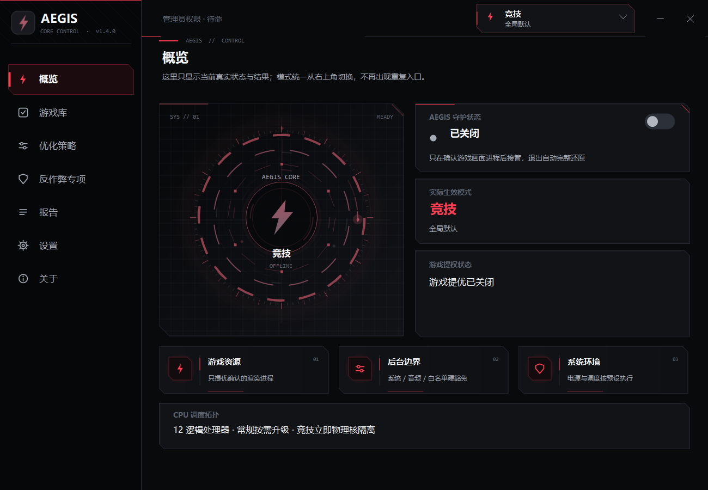
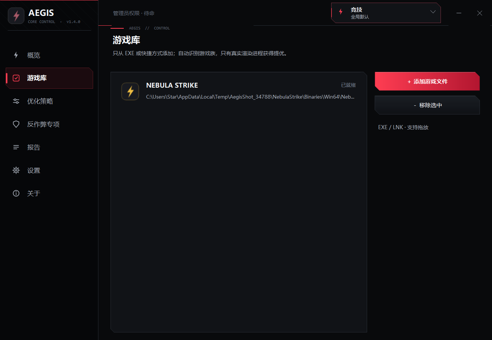
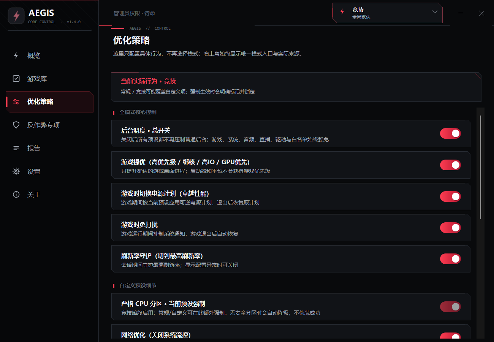
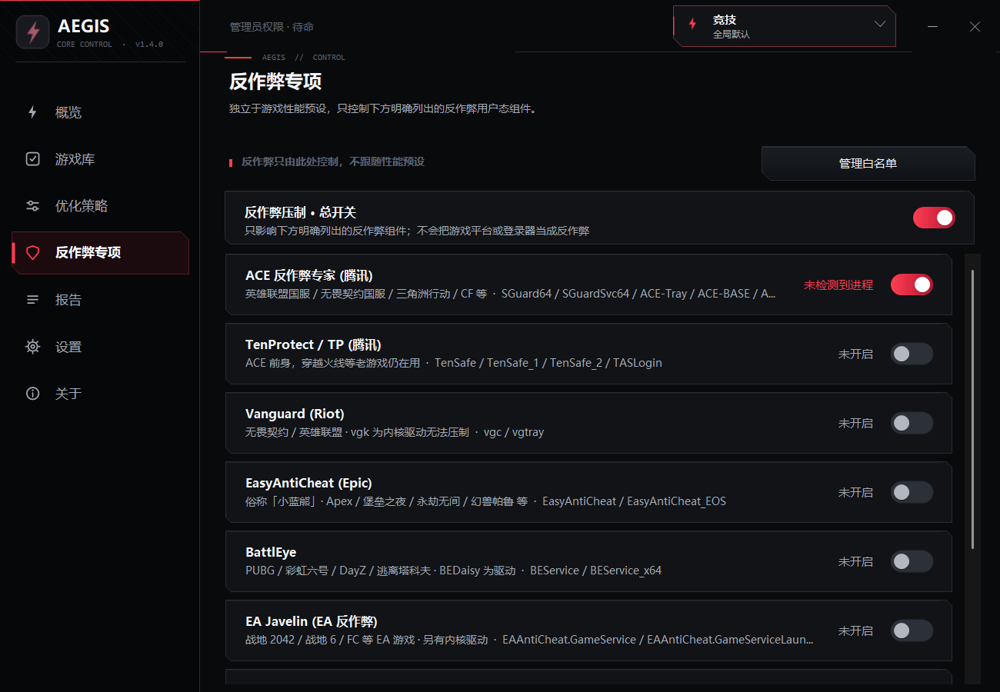
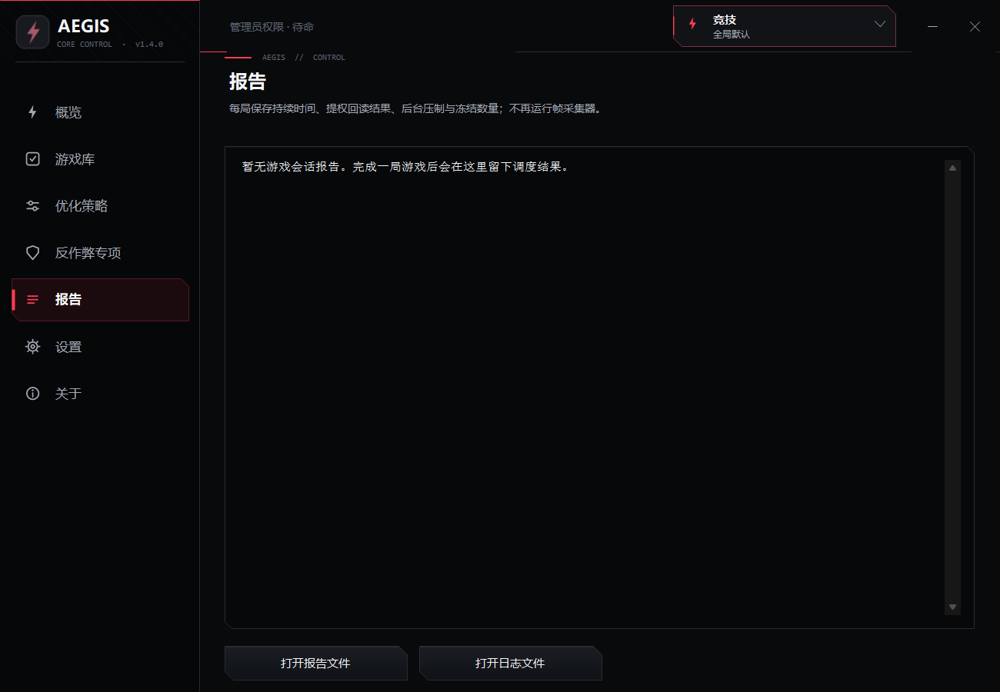
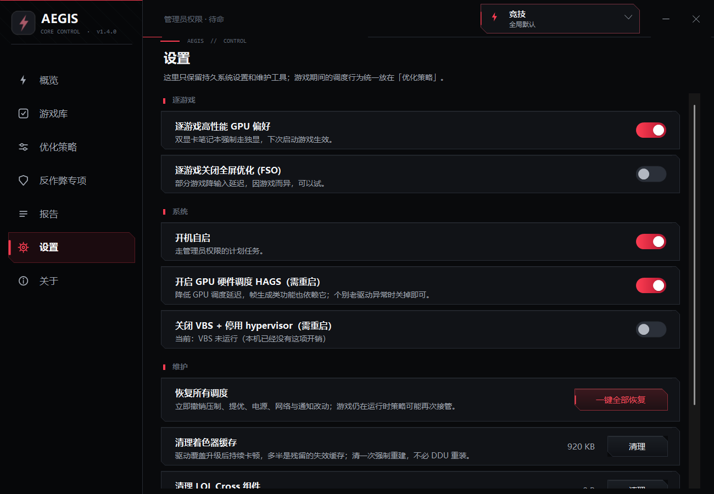

<div align="center">


# Aegis

一个把游戏和后台资源边界管清楚的 Windows 小工具

`C#` · `WinForms` · `单文件程序` · `简体中文`

**简体中文** · [English](README.en.md) · [日本語](README.ja.md)


</div>

## 先说人话：它到底能不能提升性能？

Aegis 不是给电脑“凭空变出性能”的，也不会让 CPU、显卡突破原本的上限。

它做的事情更像是：**你打游戏的时候，尽量把被后台程序、更新任务、反作弊用户态进程和其它资源争抢占走的性能还给游戏。** 游戏优先拿到 CPU、磁盘和调度资源，没在使用的后台程序则先让一让；游戏退出后，再尽量恢复原来的状态。

所以，如果你的电脑后台开得多、CPU 或磁盘经常被抢，Aegis 更可能改善卡顿、帧时间和 1% Low，平均帧数也可能随之好一点。如果系统本来就很干净，或者游戏已经完全跑满显卡，它通常不会带来明显提升。设置得过于激进，反而可能让游戏、语音软件或反作弊出现兼容问题——竞技模式默认就是最激进的那一档，选它就是接受这个取舍。

一句话概括：**Aegis 的目标不是创造新的性能，而是让电脑原有的性能在打游戏时更少被干扰。** 实际效果请以同一游戏、同一场景下的开关对比为准。

## 这是做什么的

Aegis 会从你明确添加的 EXE 或 LNK 开始识别目标程序，不止游戏——任意你想保护/提优的进程都可以加进来。只要这个进程在跑，Aegis 就认它，不依赖它有没有可见窗口、在不在前台；alt-tab 切到桌面或其它程序，目标也不会掉出保护范围。

有些程序（尤其自解压式启动器）真正长期运行的那个进程会跑在安装目录之外，比如临时目录——Aegis 会按入口程序的文件名和常见的位号/版本后缀（如 `xxx64`、`xxx_x64`）把它认回来，而不是要求它必须待在你指定的目录里。

我最初只是想处理游戏退出后还在后台占资源的程序，后来把目标识别、CPU 分区、反作弊压制、崩溃恢复和界面慢慢补齐，现在它仍然是一个本地工具，不安装服务，不会上传运行数据；帧时间证据采集默认关闭，开启后数据也只写本机文件。

自动调度不注入目标进程，不修改其内存，不改其文件；优先级、IO、页面优先级、CPU Sets 和硬亲和性会在接口支持时回读；Power Throttling 没有可靠的进程读取接口，这里只能按写入结果判断。英雄联盟专栏的文件操作只有一种：需要单独确认的附加层删除，客户端更新会重新下载这些组件。性能变化请用游戏自带基准或常用监控工具对照。

## 工作方式

目标程序不是靠一个进程名就直接认定：Aegis 会结合用户入口、安装目录内的进程关系、位号后缀匹配、可见窗口、前台状态和渲染目录结构判断当前会话；反作弊、更新器、崩溃上报和外部平台会先按角色排除，即便被用户选中也不会被当成目标。确认过的会话会跨窗口焦点变化持续保护，不会因为切到桌面就被误判成已退出。

确认目标后会按当前模式处理资源：

- **常规模式**：给没有用户窗口的其它当前会话进程应用较轻的 Eco 压制，持续高负载时再提高力度；前台窗口和正在使用的程序保留豁免。
- **竞技模式**：首轮就建立最严格的 CPU 和优先级边界——前台窗口和可见程序也不再自动豁免；游戏家族、反作弊、白名单、其它用户会话和真正的系统核心服务仍是硬安全边界。
- **自定义模式**：允许单独选择后台压制、服务暂停、网络、通知、刷新率，以及是否要竞技模式那一档的压制范围和电源强度——两者是独立开关，可以只要其中一项。

选出的目标进程可获得高优先级、较高 IO 优先级、GPU 调度优先级和适合当前处理器的 CPU Sets；后台进程则按模式降低优先级或移动到后台核心，可回读项目的写入失败或回读不一致不会算成成功。

反作弊进程、正在对局的会话宿主（如国服客户端）、以及它们的安装目录，在任何压制强度下都无条件豁免——这条边界不受模式或开关影响，避免压制反而造成掉线或被判定异常。

进程恢复使用 PID、创建时间、映像名和接管前可查询的调度值；CPU Sets 也会按接管前状态恢复。Power Throttling 原始状态无法可靠读取，恢复时会把策略控制权交还系统。Aegis 异常退出后会在下次启动继续处理保留的恢复记录。

## 主要功能

- 从 EXE、LNK 和 Steam 桌面快捷方式（URL）建立目标库，支持拖放（含提权窗口）和本机扫描，不限于游戏
- 用启发式条件从入口关系图筛选最可能的目标进程，避免启动器长期占用保护模式
- 位号/版本后缀兜底匹配：自解压式启动器把真身放到安装目录之外时仍能正确识别
- 同目录窗口兜底：所选 EXE 从不运行、游戏由同目录的 Launcher 命名进程承载时（如骑马与砍杀2）仍能正确识别
- 跨焦点持续保护：确认过的会话不会因为切出前台、最小化而丢失保护或提优
- CPU Sets 分区不依赖 CPU 厂商，混合架构按系统效率等级分区并保留完整 SMT，普通 6 核及以下不强制切核，8 核以上才按规模保留少量后台核心
- 持续异常的 DPC 和中断核心可以从竞技分区中避开
- USB 控制器中断避让：4K/8K 高回报率鼠标的中断/DPC 风暴可引离游戏核心（与显卡中断"贴近游戏核"方向相反，原值可恢复）
- 提优和后台压制对接口支持的项目使用写入结果与回读结果共同判断
- 英雄联盟专栏提供 WeGame 借壳启动、LCU 就绪门槛、路径校验后的精准净化、对局真无头和独立恢复看门狗
- 反作弊压制按厂商分组开关，每组可选温和 / 均衡 / 隔离三档力度（默认一律最低的温和档，力度升级由用户决定），默认只开启较保守的 ACE 分组；系统不支持效率模式（旧版 Windows 10）时自动跳过该项
- 电源计划、网络节流、MMCSS、Game DVR、通知和部分服务支持恢复
- 证据模式（默认关）：被动 ETW 帧时间统计（平均 / 1% Low / 0.1% Low）加每 5 秒 GPU/CPU/内存只读归因采样，会话结束写入本地证据记录，只读不动作
- NVIDIA 深度调优：按游戏驱动 Profile 写入电源最高性能与帧率上限（关 / 60 / 120 / 240 / 刷新率减 3；原值快照、关闭即恢复）；无 NVIDIA 驱动时整体停用
- 对局前待机内存一次性清理（默认关）与 MPO 多平面叠加排查开关（持久设置、可恢复）
- HAGS 和 VBS 属于用户主动选择的持久系统设置，不会跟着会话自动切换
- 英雄联盟竞技画质：一组可逆的 `game.cfg` 设置（阴影、抗锯齿、光束、装饰效果、画质档位、独占全屏），原值记录在注册表，可一键还原
- 每局生成本地报告，记录会话时间和已经确认的调度结果
- 界面仅内置简体中文；多语言机制与全部文案键保留在代码中

## 安全边界

反作弊进程、正在对局的会话宿主及其安装目录、Windows 核心服务（会话建立、安全认证、服务管理、桌面合成器、音频处理等）、其它登录会话和 Aegis 自身，任何模式和强度下都不会被当作压制目标——这条边界不因开关而改变。

非竞技级强度下，Aegis 不会把前台进程、带可见主窗口的程序及其同名进程和后代当作普通后台目标，这样浏览器、IDE 和带工作子进程的前台工具不会只保护界面进程；额外例外由用户白名单维护。竞技级强度（竞技模式，或自定义模式单独开启）会取消前台/窗口这层豁免，前台窗口和正在使用的程序也会被压制；游戏家族、反作弊、白名单、其它用户会话和系统核心服务的硬安全边界仍然保留。

反作弊压制本身比较激进，某些受保护程序可能拒绝句柄或自行改回状态，这时 Aegis 会记录失败并保留恢复凭据，不会为了显示好看而报成功。

注销或关闭系统时会还原可持久化的改动（电源计划、注册表类开关）——这类改动重启后不会自动消失，所以必须在关机前处理。退出程序时按风险排序：先还原进程状态（优先级、亲和性、EcoQoS、核心分区），再还原耗时的服务与显示设置；退出预算被截断时，优先保住的是重启也无法自愈的那部分。

## 英雄联盟专栏

专栏允许 WeGame 完成正常登录和启动。只有 LCU 登录状态成功且召唤师接口可用后，Aegis 才会按已验证的安装路径精准结束 WeGame 与可选组件进程；进入对局后通过客户端原生 LCU 接口关闭大厅 UX，独立看门狗在对局结束后重新获取本机凭据并恢复大厅。手动恢复会立即停止本局的自动无头流程。

附加层清理是需要单独确认的直接删除：当前扫描并删除 `Cross`（AI 教练、iCreate 录制等）。客户端每次更新都会重新下载这些组件，因此不保留副本；英雄联盟、WeGame 或反作弊运行时拒绝操作，删除范围不含游戏本体、登录链路与更新器，重解析点会整体否决候选目录。

竞技画质是另一组独立的可逆操作：只改写 `Game\Config\game.cfg` 中十个已知键（阴影、抗锯齿、环境/特效/角色质量、HUD 动画、装饰效果、光束、垂直同步、独占全屏），其余每一行逐字保留。这是游戏自己维护的用户设置文件，改它与在游戏内设置界面调整等价，不涉及游戏本体或反作弊。全部原值连同安装路径一并记录，可一键还原；客户端或游戏运行时拒绝写入，因为客户端退出时会用内存中的设置整体覆写该文件。

运行时流程不注入进程、不修改内存、不改游戏核心文件，也不触碰 `League of Legends.exe`、Riot 核心、认证/补丁组件或 ACE。LCU 凭据只在内存中短暂使用，不写入日志、注册表、文件或子进程参数。文件层变化只来自用户单独确认的附加层删除。专栏停用时不扫描磁盘、不枚举进程、不访问客户端接口；WeGame 以登录用户而非管理员身份启动，游戏与反作弊不会被连带提权。

## HAGS 和 VBS

HAGS 开关会修改系统 GPU 调度设置，需要重启后生效，原值会先保存。

VBS 开关会修改 DeviceGuard 相关注册表值和 `hypervisorlaunchtype`，同样需要重启，关闭后会影响内存完整性、WSL2、Docker、Hyper-V 和 Windows 沙盒，这个取舍需要用户自己决定。

这两项都是持久系统设置，不属于自动会话调度，恢复失败时快照会保留。它们和 MPO、显卡/网卡/USB 中断亲和一起集中在「系统环境」页——这一页的六项全部需要重启才生效，而且卸载 Aegis 之后依然留在机器上，所以和随会话来去的调度项分开放。

## 界面

<div align="center">




<br>


</div>

## 构建

项目直接使用 Windows 自带的 .NET Framework C# 编译器，不需要 Visual Studio，也没有需要还原的包。

```cmd
build.cmd
```

开发期不必手动"构建再运行"，一条命令完成结束旧实例、重新构建并启动：

```cmd
dev.cmd        rem 结束旧实例 → 构建 Aegis.dev.exe → 启动
dev.cmd test   rem 构建含自测的版本，跑完自测并输出结果摘要
```

构建脚本先生成图标，再编译带管理员权限清单、产品名称、公司名称和当前文件版本的 `Aegis.exe`。版本号以 `src/Program.cs` 中的 `App.Version` 为准。

源码构建默认没有 Authenticode 数字签名，个人开源项目可以直接发布未签名版本，如需验证发布者身份或改善 SmartScreen 体验，发布者可以使用自己的可信代码签名证书。

## 运行和数据位置

- 双击 `Aegis.exe` 后程序会进入托盘
- 调整其它进程和系统设置需要管理员权限
- 设置页的维护区域提供一键恢复
- 开机启动通过计划任务实现
- 启动后只会向 GitHub 检查一次版本，不会上传本机数据

默认数据目录是 `%AppData%\Aegis`：

- `Aegis.profiles.dat` 保存目标配置
- `Aegis.whitelist.txt` 保存用户白名单
- `Aegis.reports.log` 保存会话报告
- `Aegis.log` 保存运行日志
- 注册表 `HKCU\Software\Aegis` 保存界面和功能开关

在程序旁放置空文件 `Aegis.portable` 且目录可写时，数据会改为保存在程序目录。

## 代码结构

- `src/Core` 放目标识别、调度、压制和恢复逻辑
- `src/Platform` 放 Windows 原生接口、设置、路径和系统服务封装
- `src/Ui` 放 WinForms 界面和自绘控件；`src/Ui/Pages` 一页一个文件，`src/Ui/Controls` 放自绘控件
- `tests` 放项目自测（仅在 `build.cmd xxx.exe --selftest` 时编入，发布构建不含测试代码）
- `scripts` 放应用冒烟测试

项目使用 `SetPriorityClass`、`SetProcessDefaultCpuSets`、`NtSetInformationProcess`、`SetProcessInformation` 和 `D3DKMTSetProcessSchedulingPriorityClass` 等 Windows 接口，进程身份使用创建时间参与校验，防止 PID 复用时改到新的进程。

## 验证范围

内置自测当前包含 `78` 项，覆盖 CPU 拓扑和高低核心数分级、CPU Sets 和硬亲和性恢复、PID 复用、真实子进程提优、分级压制、反作弊压制档位映射、帧时间统计与遥测汇总、Present 线程归属判定、界面缩放变化的判定边界、驱动设置快照、位号后缀兜底匹配的边界、跨焦点会话保护、前台和用户窗口保护、事件驱动扫描预算、会话边界、英雄联盟凭据解析、精准净化边界、附加层删除边界、会话报告、发布元数据和界面离屏绘制。机器缺少对应能力时会记录 `SKIP`，不会算作 `PASS`。

同核心争抢测试是人为把两个计算进程放在同一核心后冻结竞争者，它只能证明释放 CPU 时间后吞吐能够恢复，不是实际游戏 FPS 或 1% Low 证明。

HAGS、VBS、电源计划、MMCSS、网络节流、服务暂停和真实反作弊兼容性目前没有端到端自动化测试，这些功能需要在目标机器上单独验证。

## 请作者喝杯咖啡

如果 Aegis 对你有用，可以请我喝杯咖啡。

<div align="center">

&nbsp;&nbsp;

</div>

## 作者和许可

作者：bdth

邮箱：2074055628@qq.com

项目使用 [MIT License](LICENSE)

这是个人开源项目，按现状提供，不作效果和兼容性保证。反作弊压制、VBS、服务暂停和删除缓存都可能带来副作用，请只在自己的电脑上使用并先了解对应风险。
