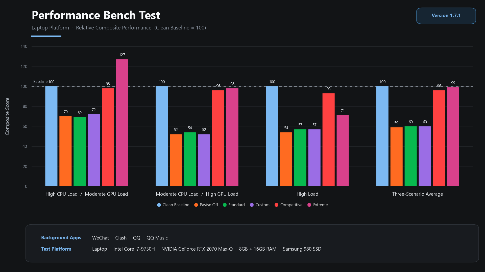
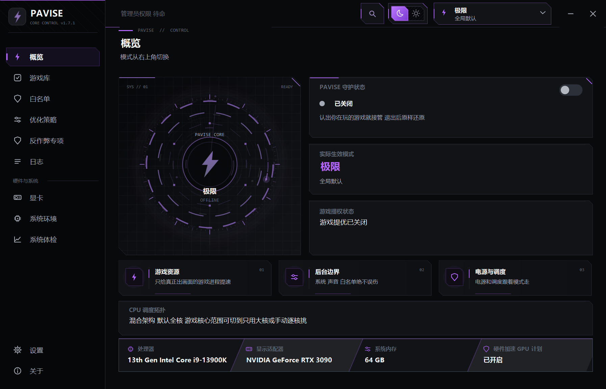
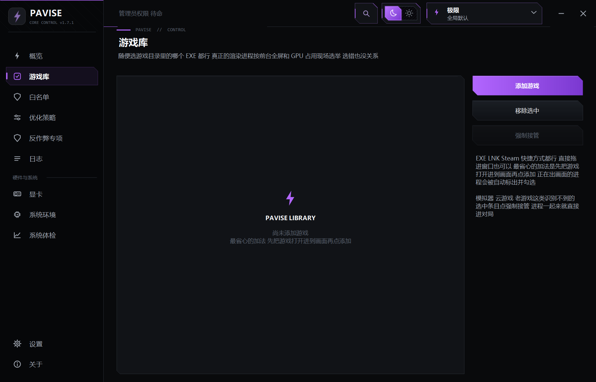
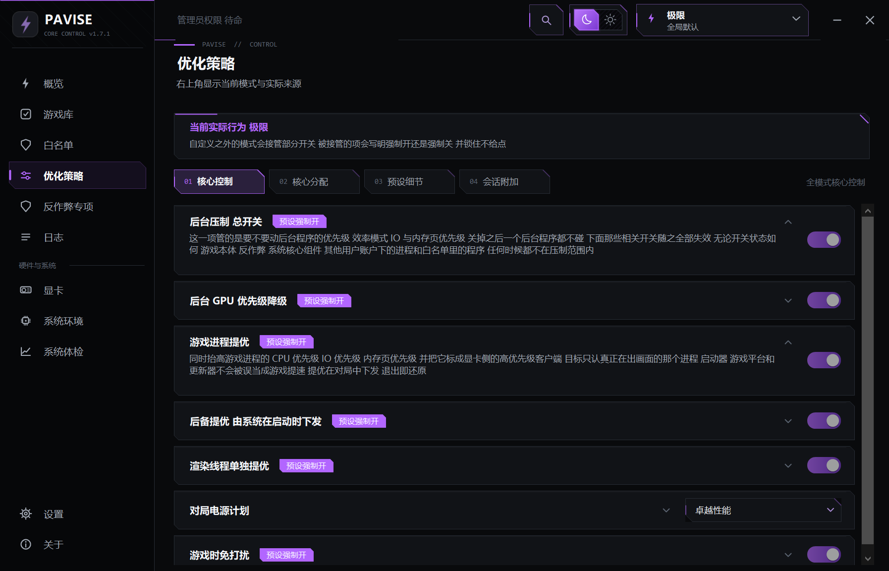
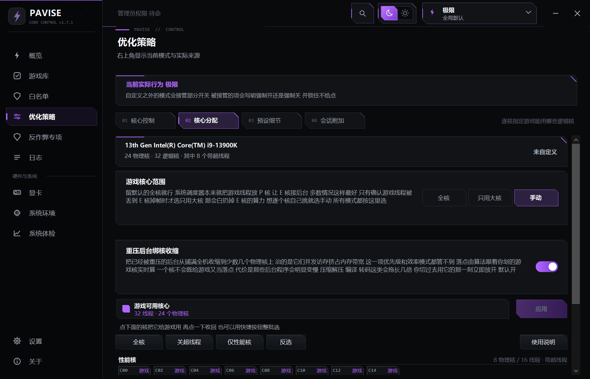
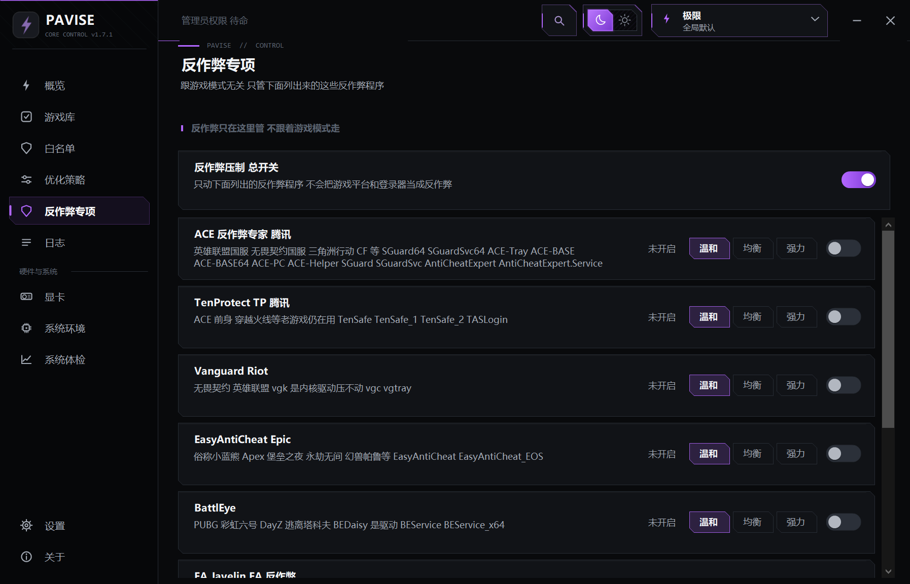
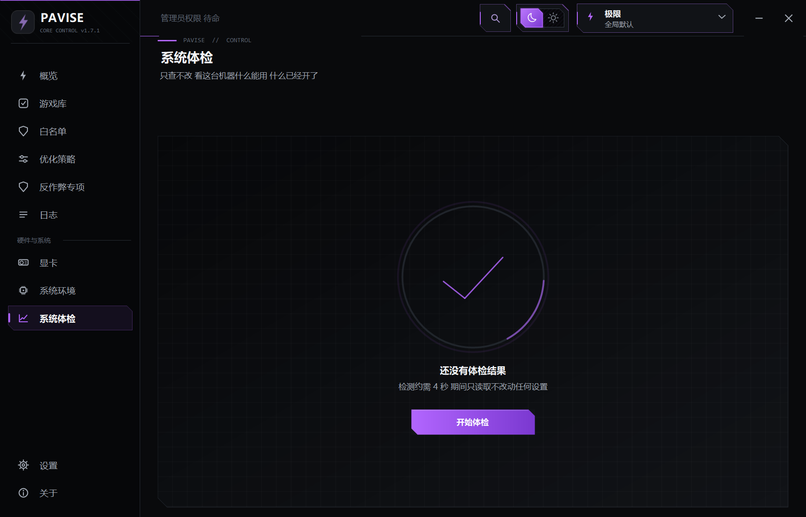

<div align="center">


# Pavise

打游戏时把系统资源让给游戏的 Windows 小工具

`C#` · `WinForms` · `简体中文`

**简体中文** · [English](README.en.md) · [日本語](README.ja.md)

<br>



</div>

## 性能

上图测试条件：i7-9750H 笔记本，后台运行微信、Clash、QQ、QQ 音乐，以干净系统为基准 100。三场景平均下来，不开 Pavise 为 59，常规模式 60，竞技模式 96，极限模式 99。

Pavise 不产生额外性能，作用是把后台占用的那部分还给游戏。所以后台程序多、CPU 或磁盘争抢明显的机器提升明显，系统本身干净或者游戏完全卡在显卡上的，提升有限。

需要注意极限模式在高负载场景只有 71，低于竞技模式的 93。压制强度和性能不是正相关关系，默认预设是最温和的一档。

实际效果请在同一游戏、同一场景下自行开关对比。

## 使用

把游戏的 EXE 或快捷方式加入目标库，也可以用扫描功能导入已安装的 Steam / Epic / GOG / 育碧 / Riot / WeGame / 战网 / Xbox 游戏。

游戏运行期间自动保护，切换到桌面或最小化不会失效。通过启动器启动的游戏（如英雄联盟）首次确认后会记住游戏本体，下次直接识别。启动器、更新器、崩溃上报和反作弊进程不会被识别为游戏。

游戏退出后按记录还原所有改动。Pavise 异常退出时，下次启动继续完成还原。

## 模式

| 模式 | 压制范围 |
|---|---|
| 常规 | 无窗口的后台轻度压制，持续抢占资源的加码。正在使用的程序不动 |
| 竞技 | 游戏之外全部压制，有窗口的也不例外。仅当前前台程序及其子进程保留 |
| 极限 | 在竞技基础上追加，服务宿主进程也会被移到后台核心 |
| 自定义 | 后台压制、网络、通知等逐项自选 |

任何模式下，反作弊、正在对局的游戏宿主、Windows 核心服务、网游加速器和其它登录账户都不会被压制。这条边界不受任何开关影响。

## 功能

**进程和核心**

- 游戏进程获得高优先级、更高的磁盘 IO 和显卡调度优先级以及独立核心，后台按模式降级或迁移到其它核心
- CPU 分区适配混合架构、X3D 和多处理器组。6 核及以下不做核心切分
- 核心分配可以逐核手动划，预设有全核、关超线程、仅性能核和反选，改完要点应用才算数。多数人不需要动它，系统调度器默认就把游戏线程放 P 核
- 重压后台绑核收缩：把已经压制的后台从铺满全机收缩到少数几个物理核，治的是它们并发访存挤占内存带宽，这一项优先级和效率模式都管不到。落点跟着你划的游戏核实时算，多 CCD 会整个躲开游戏核那块 L3。台架实测 33 帧到 95 帧
- 智能保帧：识别决定帧率的关键线程单独提升。台架实测 CPU 满载时 1% 最差帧改善 77%~96%
- 后备提优：被内核反作弊挡住句柄的游戏改由系统在进程创建时给高优先级，下次启动生效
- 服务让路：对局中把指定的服务进程引到后台核心，只引流，不停服务

**显卡**

- 后台 GPU 让位：后台进程使用显卡时，同步降低其 GPU 调度优先级
- NVIDIA 深度调优：电源最高性能、DLSS4 Transformer 覆写、按游戏开启 ReBAR、关闭 Ansel 注入、解除电池限帧。原值有快照，关闭即恢复
- 双显卡机器上，被压制的后台里那些用独显的程序改走集显

**键鼠和中断**

- 关闭筛选键、粘滞键和切换键。微软对这几项的定义就是忽略短促击键，开着必然有延迟
- 禁止系统挂起键鼠设备，治的是空闲一会儿之后第一下操作发飘。只碰键鼠，不碰 U 盘和声卡
- 修复其它工具改动过的输入队列长度，关闭指针精度增强（系统那条鼠标加速曲线）
- 4K/8K 鼠标的中断风暴引离游戏核心。开启前会先说明代价，1000 Hz 及以下的鼠标基本没收益
- 硬盘控制器的读盘完成中断挪到空闲核心

**内存和电源**

- 对局前清理低优先级待机页、对局稳定后回收后台工作集、待机列表超阈值时清空。三项都默认关，各自的代价写在开关下面
- 对局切到卓越性能电源计划，本机没有会自动建一份，有就直接用你那份
- 电源计划、网络、Game DVR、通知和索引服务在游戏结束后全部恢复

**看得见的部分**

- 系统体检页：只读检查本机能力，每条结论标注依据等级。支持一键实测 NVIDIA 写入是否生效、实测鼠标回报率、查看显卡当前受功耗墙或温度墙限制的状态。中断那一行用内核 ETW 抓 DPC 和 ISR，直接点名头号来源
- 会话报告：游戏时长、压制的进程数量及其 CPU 占用、受功耗墙和温度墙限制的时间占比
- 游戏库支持强制接管，模拟器、云游戏这类识别不出来的，进程一起来就进对局
- 白名单独立成页，拖入即可，作用范围自动判断

纯本地工具，不安装服务、不上传数据、不注入游戏进程、不修改游戏内存和文件。每一步写入尽量读回核对，读不到预期值不计为成功。

## 不做的事

流传的键鼠注册表优化项大多作用在零点几毫秒的量级上，而延迟的主要来源是渲染队列。这类项目 Pavise 只报告不修改，包括蓝牙鼠标和 125 Hz 回报率——体检页会把它们点出来，改不改由你自己决定。

MSI 模式、低延迟模式、后台硬限帧、窗口化游戏优化、游戏文件预热和按位置屏蔽 CPU 0/1 都实现过并已移除，原因分别是实测无效、有写坏设备的风险，以及语义理解错误——驱动中的后台限帧实际作用于失去焦点的应用，切出游戏后被限制的是游戏本身。移除的项目在升级时会自动还原旧版本写进去的值。

内存清理同理。清空整个待机列表只增加 382 MB 可用内存，代价是丢弃 18.9 GB 文件缓存，游戏加载需要重新读盘。因此默认只清理系统判定最不可能再使用的页面，耗时 13 毫秒。

## 界面

<div align="center">






</div>

## 构建

使用 Windows 自带的 .NET Framework 编译器，不需要 Visual Studio，没有需要还原的包。

```cmd
build.cmd      rem 生成 Pavise.exe
dev.cmd        rem 结束旧实例 → 构建 → 启动
```

源码构建没有数字签名，SmartScreen 会拦截提示。

## 运行和数据位置

双击 `Pavise.exe` 后进入托盘。调整其它进程需要管理员权限。开机启动通过计划任务实现。启动时向 GitHub 检查一次版本，不上传本机数据。

数据默认保存在 `%AppData%\Pavise`，包括目标配置、白名单和运行日志；界面和功能开关保存在注册表 `HKCU\Software\Pavise`。在程序旁放置空文件 `Pavise.portable` 后改为保存在程序目录。

设置页提供一键恢复。

## 请作者喝杯咖啡

<div align="center">

&nbsp;&nbsp;

</div>

## 作者和许可

作者 bdth ｜ 邮箱 2074055628@qq.com ｜ 微信 Ssssssstyle（Bug、建议和使用问题）

项目使用 [Pavise 许可协议](LICENSE)：源码公开，可自由使用、修改和免费分发，**禁止销售**。

不允许以任何形式从分发 Pavise 或其修改版中收钱，包括出售拷贝、激活码和下载权限，作为收费商品或订阅服务的组成部分，付费墙、付费解锁和赞赏门槛。

分发时完整保留许可协议和作者信息，告知接收者本软件禁止销售，分发修改版时标注修改者和修改内容。

这是个人项目，按现状提供，不作效果和兼容性保证。反作弊压制、VBS 和缓存清理都可能带来副作用，请只在自己的电脑上使用并先了解对应风险。

最新版和源码更新永远在微信群、QQ 群免费提供。QQ 一群 1051472054，二群 1101249532，三群 383761286；微信 Ssssssstyle，备注 Pavise。**如果你是花钱买到的，你被骗了**，请要求退款并从群里免费获取。
