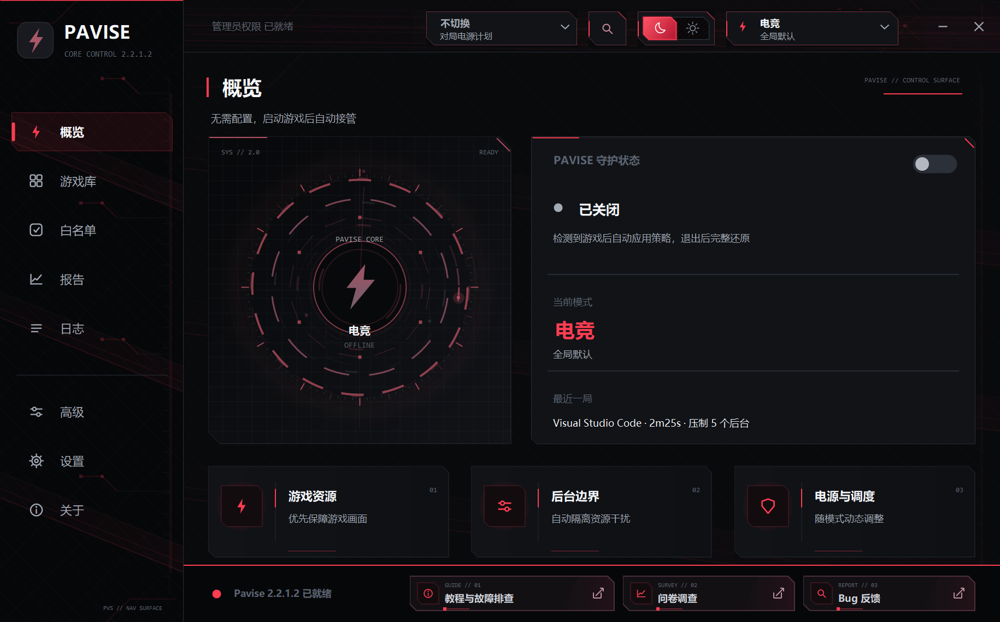
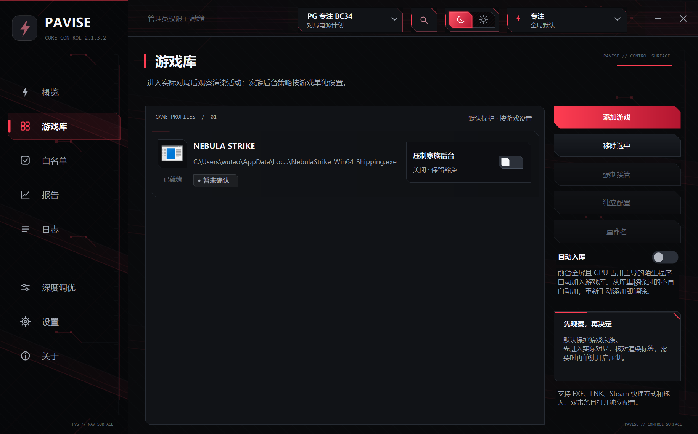
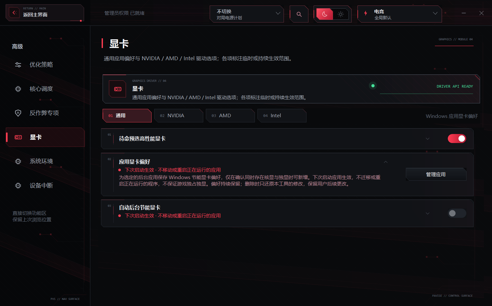
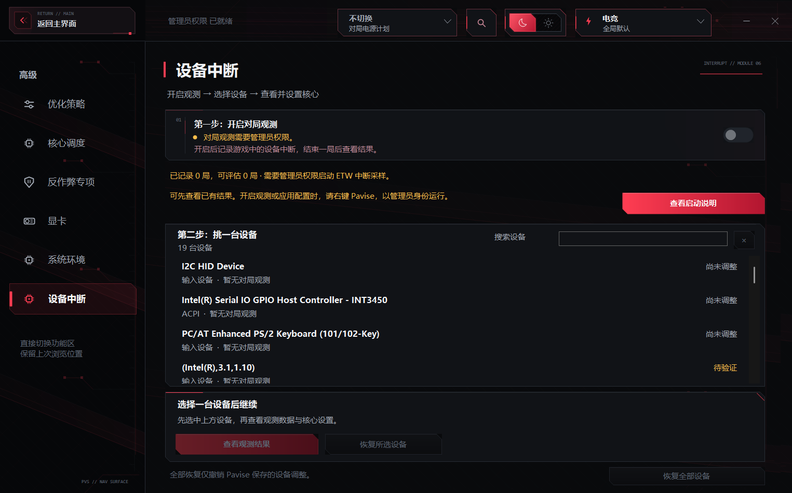
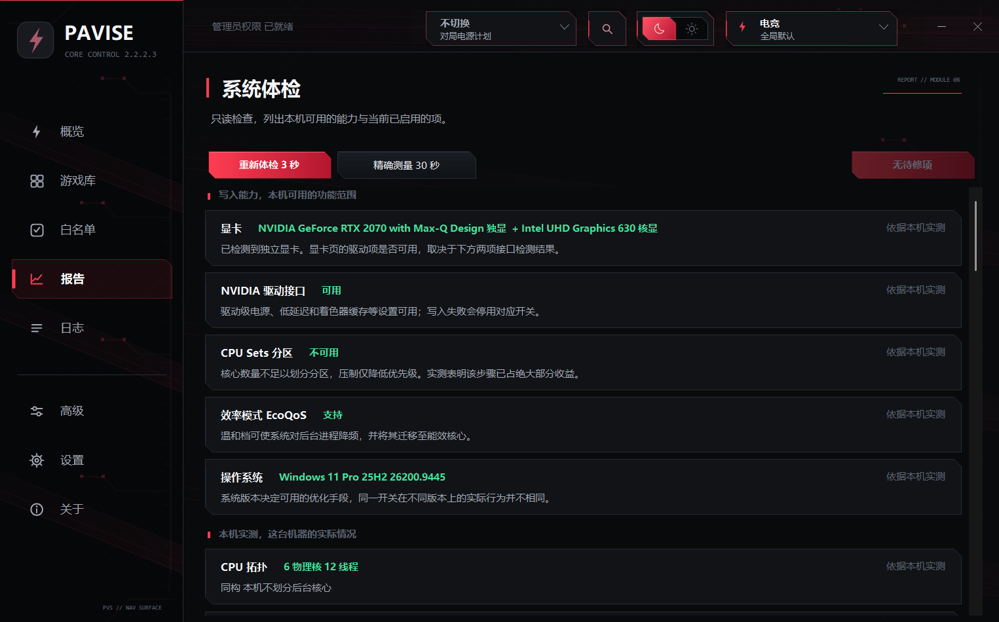
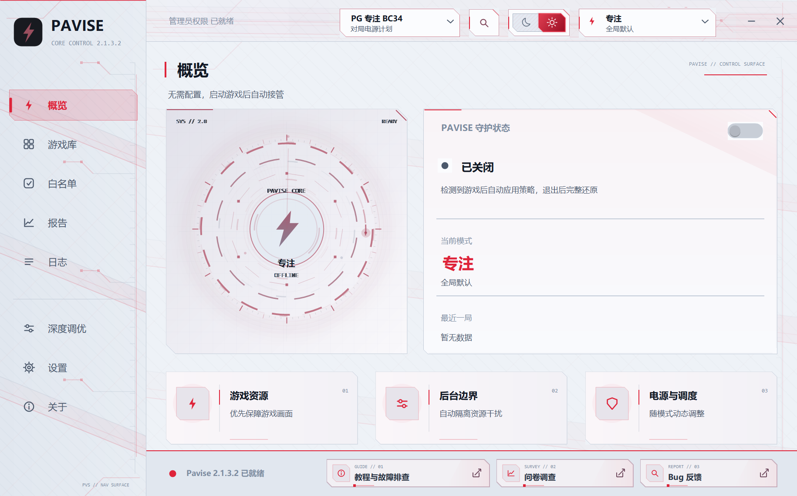

# Pavise

Windows 游戏资源调度与守护工具

`C#` · `WinForms` · `界面：中文 / English`

**简体中文** · [English](README.en.md) · [日本語](README.ja.md)

**v2.2.1.4 · [更新说明](docs/releases/v2.2.1.4.md)**

 

## 性能

Pavise 不产生额外性能。它做的是把后台占走的那部分还给游戏。后台程序多、CPU 或磁盘争抢明显的机器提升明显；系统本身干净、或者游戏完全卡在显卡上，提升就小。

收益请在同一游戏、同一场景下开关对比。

## 使用

需要 Windows 10 2004（内部版本 19041）或更高，推荐 Windows 11 24H2。低于这条线的系统上，后台压制依赖的能效模式和逐进程计时器精度隔离不存在，调度不会生效，程序会在提示后退出，并把此前版本留下的系统改动还原掉。

把游戏的 EXE 或快捷方式加入游戏库，也可以用扫描功能导入已安装的 Steam / Epic / GOG / 育碧 / Riot / WeGame / 战网 / Xbox 游戏。

游戏运行期间自动保护，切到桌面或最小化不失效。通过启动器启动的游戏（如英雄联盟）首次确认后记住游戏本体，下次直接识别。启动器、更新器、崩溃上报和反作弊进程不会被认作游戏。

游戏退出时按记录还原对局期改动。Pavise 异常退出后下次启动继续尝试，失败时保留恢复记录。应用显卡偏好、逐 EXE 兼容设置和系统环境持久项需要单独还原；英文输入切换不回退。已清理的缓存和手动删除的 LOL 附加层无法由恢复功能找回，附加层可由客户端更新或修复重新下载。

## 模式

| 模式 | 压制范围 |
|---|---|
| 智能 | 对局一开始就把通过保护边界的后台一次性隔离到底，不看热度也不逐级爬。你正在用的程序和它的家族不参与压制；另有默认关闭的自适应升档开关，打开后 CPU 持续饱和（90% 以上超十秒）时临时升到电竞口径，负载回落到 80% 以下并稳定两分钟后自动降回，一局最多三次 |
| 电竞 | 压制范围扩大到通过保护边界的非游戏进程，有窗口的也不例外；切出游戏后使用的程序也会被压制，白名单与系统保护边界仍有效 |
| 极限 | 以电竞为底，自动开启极限清单内通过本机资格检查且未被停用的项目，含部分系统环境持久项。默认隐藏，需在设置里解锁并重启电脑后才出现；压制范围与力度和电竞完全相同，不会自动开启所有可选项 |
| 掌机 | 后台压制与电竞相同，功耗侧让给厂商工具：不拨电源滑块，插电也放开纯省电项。需要电池，掌机和轻薄本用 |
| 自定义 | 后台压制、核心、内存电源、系统环境、显卡逐项自选 |

各档的差别主要是哪些进程有资格被压制，以及启用哪些附加策略。通过边界的普通后台直接隔离，写入 Idle 优先级、极低磁盘 IO、低分页优先级、EcoQoS 与定时器精度封顶；开启 GPU 让位后再降低显卡调度优先级。保留 Windows 动态优先级提升，帮助被游戏等待的后台及时完成工作；这与处理器睿频不是同一个机制，后台压制不直接关闭处理器睿频。

通用后台压制始终跳过反作弊、Windows 核心服务、网游加速器、输入音频与外设链、硬件控制工具和其它登录账户。反作弊页提供独立、默认关闭的用户态进程压制开关；开启它不等于可以控制反作弊内核驱动。

游戏家族豁免默认开启：游戏平台、启动器外壳、游戏目录下的常驻进程和游戏派生的子进程整族放行。手动关闭后才只放行游戏本体和白名单，其余按普通后台压制。

极限档有自动回退：解锁后系统若发生两次非正常重启（Kernel-Power 41、BugCheck 1001 或 EventLog 6008），下次启动自动取消解锁并按账本还原环境项，只回滚 Pavise 记过账的，你自己开的一概不动；读不到系统日志时按零次算，宁可不跳闸。单项功能自身熔断只退出极限清单，不影响其它项。

系统已经起不来或程序打不开时，用仓库根目录的 `Pavise-Rescue.cmd`（自动请求管理员）：先把日志、蓝屏记录、电源与启动配置导出到桌面的 Pavise-Rescue 文件夹，再退出 Pavise 并按收据还原系统改动，收据缺失的项按 Windows 默认值复位，删除托管电源方案并把全部电源方案恢复出厂，复位显卡频率锁定与功耗墙。**它会一并删除游戏库、白名单和全部设置**，跑完必须重启一次。除非收据里有，否则不改动 HAGS、VBS 与 hypervisor 的现状。

## 逐游戏独立配置

游戏库选中游戏点独立配置进入。每个游戏可单独覆盖模式、后台压制、核心、内存电源、系统环境和显卡策略，当前策略目录共 34 项（含模式、家族压制和核心掩码）。没覆盖的项跟随全局，改动立即保存。另有逐 EXE 的全屏优化与 DPI 兼容设置，不计入这 34 项，也不随退局自动还原。

- 多数逐游戏配置在对局激活时确定，下一局应用。暂停非必要服务和禁止 CPU 空闲在当前会话中处理，关闭即撤销本次修改
- 当前的核心选择可以锁定给某个游戏，其它游戏不受影响
- 一套覆盖可以一键清回全局
- 概览页和托盘显示当前实际生效的模式，来自哪个游戏的独立配置会标注
- 驱动写入连续失败自动关闭开关时，该游戏的这条覆盖一并清除

游戏条目支持重命名，只改显示名称，不影响识别。

## 功能

会话改动按记录在退局时还原。持久设置主要在系统环境页，应用显卡偏好和逐 EXE 兼容设置也会持续保留，需单独还原；是否需要重启以对应项目说明为准。文件清理是独立操作，删除内容不能由设置恢复找回。下面按界面顺序介绍。

### 概览与守护

守护总开关管理通用游戏会话调度：开启后自动识别并接管，关闭后停止接管并尝试恢复会话改动。待命预置、持久设置及 LOL 扩展的行为以各自开关和说明为准，关闭守护不等于撤销全部修改。

- 概览页显示当前模式、它来自全局还是某个游戏的独立配置，以及最近一局报告
- **会话报告**：游戏时长、压制的进程数与其 CPU 占用、受功耗墙和温度墙限制的时间占比、游戏溢出到系统内存的共享显存峰值
- **功能搜索**：顶部输入关键词直接定位到开关，不用记它在哪一页
- **自动收起窗口**：检测到游戏 10 秒后收进托盘，每局一次
- **界面**：深浅两套主题，中文 / English 即时切换，新产生的日志一并跟随。日本語是文档译本；当前应用不提供日语界面

### 游戏库

- 手动添加 EXE、快捷方式或游戏文件夹，也可把它们直接拖进窗口；文件夹里有多个候选程序时列出来让你挑。也可扫描导入 Steam、Epic、GOG、育碧、Riot、WeGame、战网、Xbox
- **强制接管**：模拟器、云游戏这类识别不出来的，进程一起来就进对局
- **自动入库**：识别到的新游戏自动收录；从库里移除过的路径进忽略表不再自动加回，手动加回即解除
- **疑似恶意进程提醒**：没有可见窗口、不在系统目录和 Program Files 里的进程连续两分钟占用四分之一以上的逻辑核，或被压到后台核后自行解除了核心限制，记日志并弹托盘气泡提示可能感染挖矿病毒。随机名进程门槛减半，同名一天只提醒一次
- **渲染观测标签**：标注这个 EXE 上是否观察到 GPU 3D 活动；这不能单独证明它是游戏主渲染程序，也不保证压制关联进程安全
- **家族后台压制**：逐游戏开关，默认关闭。关着的时候游戏平台、启动器外壳、游戏目录常驻进程和派生子进程整族放行
- **独立配置**：当前策略目录 34 项可逐游戏覆盖，没覆盖的跟随全局，条目支持重命名
- **WeGame 脱壳**：CF、逆战、三角洲这类经 WeGame 启动的游戏，卡片下方和英雄联盟一样有脱壳区。借壳启动打开后，对局运行 30 秒精确结束 WeGame、Cross 与腾讯附加进程；游戏若在 20 秒内退出，本机停用该游戏的自动脱壳；壳进程反复重生则本局暂停。逐游戏开关，默认关闭
- **手柄映射器保护**：DS4Windows、reWASD 等手柄映射器按名字豁免后台压制。智能档的自适应升档为独立开关，默认关闭

### 进程与核心

- **游戏进程提优**：渲染进程获得高优先级、更高的磁盘 IO、内存页和显卡调度优先级，退场还原
- **候选线程提优**：默认开启，极限档强制开启；其它档位下帧率反而变低的游戏可以逐游戏关掉。掌机档和物理核不足 6 个的机器不提供。按 CPU 耗时筛选候选，并不能证明它是帧关键线程；误选可能拖慢游戏。恢复旧优先级规则后，已生效的候选提优不会仅因整机 CPU 饱和被撤回
- **智能让位**：CPU 持续饱和十秒且没有生效中的候选线程提优时，游戏本体暂回普通优先级。限核、CPU Sets 和核域读取不明不再单独阻止高优先级；退场仍还原
- **对局自让位**：Pavise 让出游戏核心并降低自身调度权重
- **后台压制**：通过保护边界的普通后台直接隔离，调整 CPU、磁盘 IO、分页优先级、EcoQoS 与定时器精度；保留 Windows 动态优先级提升
- **后台 GPU 优先级降级**：后台进程用显卡时同步降低它的 GPU 调度优先级
- **压制后台工作集修剪**（极限档专属）：随极限对局启用，可在极限管理中停用。仅在可用内存同时低于 4 GiB 和总内存的 1/8 时，对隔离后台尝试修剪；仍会带来后续缺页和首次响应变慢，不处理反作弊进程
- **扩大后台压制范围**：扩大到通过保护边界的非游戏后台，切出后也不放行；电竞、极限和掌机档锁定开启，保护名单与白名单仍有效
- **手动核心调度**：手动选择游戏使用的逻辑核心，支持 CCD 快选和「关超线程」。可单独开启核心隔离并展开选择整颗物理核，让普通后台默认避开该范围；仅在游戏提优期间应用，离场后恢复，系统中断等仍可能占用。
- **按 CCD 选核**：通过 CCD 快捷按钮手动选择游戏所在芯片区域。
- **手动选核**：支持全选、关超线程、清空、反选和 CCD 快选，至少选择两个逻辑核。点击保存后从下一次进入游戏生效，本局保持原方案；离场恢复进程原亲和性。
- **白名单**：拖入 EXE 或快捷方式即可，也可从运行中的程序里挑或浏览选择。默认连子进程一起保护，命令行和脚本宿主只保护自身，右键可在「仅保护此程序」和「连同子进程」之间改。系统必需的内置项不可删除，可一键恢复默认预设。页面能展开当前版本实际使用的自动豁免名录，包含反作弊分组的进程名；显卡驱动容器和功耗、睿频、风扇工具始终豁免，不用手动加

### 反作弊适配

九家反作弊各自单列，写明它保护哪些游戏、哪些组件是内核驱动碰不得：ACE（腾讯）、TenProtect、Vanguard（Riot）、EasyAntiCheat（Epic）、BattlEye、EA Javelin、nProtect GameGuard、FACEIT、NEAC（网易）。

国内对战平台单独列出：完美世界竞技平台、5E、B5。它们的反作弊内嵌在平台客户端里，Pavise 只保护不压制。网易 NEAC 补入 NeacClient、OWNeacClient 和 NeacProtect，腾讯 TP 补入 TP3Helper、TPHelper，ACE 补入 ACE-Service64；米哈游只有内核驱动，进识别表用于日志说明。

**仅保护**名单共六组：上述三家国内平台，加上 PunkBuster、Nexon Game Security（BlackCipher 等）、Wellbia XIGNCODE3 / UNCHEATER。按进程名、名称前缀和专用目录豁免后台压制，覆盖 `.aes` 组件和目录内的辅助进程；这六组不提供压制开关，也不参与反作弊绑核。关闭反作弊专项总开关不会关闭后台豁免。[识别规则、来源与覆盖边界](docs/anti-cheat-coverage.md)。

**相容名单**记录拒绝写入的游戏，注定失败的优先级和 IO 不再重试，显卡调度优先级和帧线程照常尝试。游戏换版本后名单自动失效。

**反作弊压制**（反作弊页各组开关，默认关闭）不提供力度选择，构成固定为扫描安全：低于正常的 CPU 优先级、极低磁盘 IO（扫盘是主要伤害来源）、小核限频、限定到游戏不用的最少核心（6 到 8 核机器上就是末尾一个物理核，混合架构落到能效核，多 CCD 躲开游戏那块 L3；反作弊自身保护拒绝写入时整条压制本次运行放弃，不再重试）。不压到最低优先级、不封定时器精度、不降内存页优先级——扫描期间游戏线程可能被系统挂起，恢复时机取决于扫描进程何时跑完，把它压到几乎分不到时间片只会把短暂卡顿拉长为数秒卡死。

### 显卡

- **应用显卡偏好**：给指定后台程序保存 Windows 节能显卡偏好，下次启动生效，不迁移正在运行的程序
- **待命预选高性能显卡**：双显卡机器待命时预选高性能 GPU，已有手动设置则跳过，退场还原
- **对局功耗墙拉满**：拉到厂商允许的上限，退局按快照还原
- **NVIDIA**：电源最高性能（同时挡住 CUDA 触发的显存降频）、G-SYNC 补齐窗口模式、低延迟（开或超级）、Smooth Motion 插帧、着色器缓存放开、DLSS 覆写（最新或指定 J、K 代）、逐游戏 ReBAR
- **AMD**：Anti-Lag、AFMF 补帧、RSR 驱动级升格
- **Intel**：全局低延迟，仅在驱动报告支持实时切换的 DX9/DX11 路径启用，不碰 Boost 与 XeSS；对局关闭 Endurance Gaming，电池下不再按面板刷新率封顶帧率
- **显存驻留**：显存吃紧时为游戏声明最低预留，减少纹理被换出再调入造成的长帧。不增加也不锁定显存，默认关闭
- **自动后台节能显卡**：把仍在游戏渲染卡上跑 3D 的后台程序登记为下次启动用节能显卡，每局最多 2 个，默认关闭

原值都有快照，关闭即恢复；写入无法确认归属的不强行覆盖。

### 键鼠与输入

- 关闭**筛选键、粘滞键、切换键**及相关热键，避免辅助功能改变按键行为或在游戏中被误触
- **禁止键鼠设备选择性暂停**，避免空闲一段时间后第一下操作发飘。只涉及键鼠，不碰 U 盘和声卡
- 在系统体检页修复其它工具改坏的**输入队列长度**；当前不提供关闭指针精度增强的开关
- **前台时间片检查与修复**：在系统体检页读取实际配置并按现行判据修复异常字段；已移除三档选择器
- **进入游戏切英文一次**：入场短窗口内向前台游戏请求一次英文键盘布局，之后切回中文、切出返回都不再干预

### 设备中断

- **对局中断观测**：内核 ETW 采集设备 DPC，按局记账，指出与游戏核争用的设备
- **手动钉核**：选设备、选目标核，写入前说清代价，每台设备留收据可还原
- **显卡中断亲和**：挪到靠近渲染线程的核心
- **一键还原全部亲和性**：按收据撤销本页做过的所有钉核，重启后生效
- 每台设备标注当前状态：已生效、待重启、未收敛、待验证、对局建议、输入设备，以及是否由系统环境页接管
- 页面会主动标注不值得动的情况：MSI-X 多消息设备钉核可能降低并行度，StorPort 的 DPC 跟随发起 IO 的 CPU、钉了通常无效

### 内存与电源

- **缓存预热**：已恢复，默认关闭，可逐游戏覆盖。对局稳定 90 秒后低优先级预读资源包，每局最多 2 GiB、约 31 MiB/s；仅交流供电、内存充足和固态盘时运行，待机清理优先，退出或内存不足时停止。[运行规则](docs/cache-warm-up.md)
- **托管电源方案**：首次对局自动创建，参数按本机处理器写入。也可改选本机任意计划，方案切换本身不改用户计划参数；显式开启“禁止 CPU 空闲”仍会临时修改当前计划对应值。第三方切走计划后，收到 Windows 方案变更通知再拉回，成功后不定时巡检；这不是阻止第三方写入的权限锁
- **对局存储不休眠**：托管方案把 NVMe 电源态延迟容忍清零并保持 AHCI 链路 Active，防止 SSD 从低功耗态唤醒造成的偶发卡顿；电池上放开 NVMe 侧
- **禁止 CPU 空闲**：仅在游戏中生效，写入当前活动电源方案的交流与电池两侧值，退局还原。电池设备续航会明显缩短；AMD 处理器不提供
- **待机内存清理**：列表大小和真正空闲内存双阈值同时满足才清整个待机列表，技术细节见下文
- **MMCSS 多媒体调度**：非多媒体预留份额从 20% 调到 10%，Games 任务的调度类别和文件 IO 提档，并关闭懒惰检测档
- **DWM 合成低延迟**（极限档专属）：对局中请求 DWM 使用 MMCSS 调度，可在极限管理中停用；是否有收益取决于呈现路径和负载，不保证消除合成抢占
- **暂停 Windows Update、传递优化、非必要系统服务、自动维护**，退场按记录恢复。非必要服务仅处理固定名单；当前没有无线后台扫描抑制入口
- **逐游戏声明 DPI 感知**：缩放非 100% 时让无边框窗口按物理像素给，不再被拉伸合成
- **关闭 Game DVR 与 Xbox 后台录制**、**对局期间屏幕常亮**
- **音频低延迟**（极限档专属）：对局中尝试以设备支持的最小共享缓冲打开静音流，促使音频引擎使用较小周期；随极限对局启用，可在极限管理中停用，退局关闭流
- **功耗让路**：笔记本上 GPU 触及功耗墙而 CPU 有余量时，把共享功耗预算让给显卡，验证失败自动退回并停止尝试。默认关闭，验证机制见下文

### 系统环境

这一页的改动会持续保留，每一项都可尝试还原。部分项目需要重启，具体以对应开关说明为准：

- **GPU 硬件加速调度 HAGS**、**AMD Smart Access Memory**、**关闭虚拟化安全 VBS**、**卸载推测执行缓解**
- **Windows 游戏模式守护**、**窗口化游戏优化**、**可变刷新率优化**（让不支持 VRR 的 DX11 独占全屏游戏也走 VRR）
- **计时器恒定节拍**、**全局计时器分辨率**
- **禁止网卡节能断电**、**关闭网卡链路节能**（关掉 802.3az 低功耗空闲、绿色以太网和空闲链路降速，链路不再睡眠唤醒或在 1G 与 100M 之间来回协商；写入时网卡断线几秒）、**网卡中断合并实验**（默认不改；仅对公网 IPv4 探测路由命中的唯一物理有线出口显式测试 Off，并按 NetCfg GUID + PnP 实例双重身份还原）
- **辅助功能按键拦截**、**禁止键鼠设备选择性暂停**
- **关闭内存压缩与页合并**（极限档专属）：省下压缩线程和页合并扫描的后台 CPU，24GB 内存起提供

### 系统体检

只读检查本机能力，按硬件和采样结果生成结论，不承诺固定条数。分四个分区：写入能力、本机实测、持久系统设置、结论清单。每条结论标注依据等级：本机实测、台架实测、机制明确、未验证。

体检约 4 秒，期间只读不写；另有精确测量档，用 30 秒实测中断分布和整机负载。检出异常配置后可手动修复时间片、网络限流、输入队列、有线路由跃点、FTH 容错堆及被显式关闭的显卡 MSI，也可一次修复全部待修项。显卡功耗与温度限制、中断 DPC/ISR 来源也在这里报告。

纯本地工具。不安装服务、不上传本机数据、不注入游戏进程、不修改游戏内存。通用调度不改游戏文件；LOL 扩展提供用户确认后删除附加层目录的独立操作。每一步写入尽量读回核对，读不到预期值不计为成功。

### 日志

- **结构化事件流**：系统行为、对局接管与异常恢复按事件记录，顶部分别统计事件、警告、异常三类条数
- 可只看警告或只看异常，最新事件排在前面；单击选中，双击复制原文
- **打开日志文件**、**立即刷新**、**清除日志**（只清 `Pavise.log`，归档日志不动）
- **记录运行日志**：可以整个关掉，关掉后不再写入，重新打开即恢复

### 设置

- **开机自启**：通过管理员计划任务实现，开机不弹 UAC 确认框
- **检测到游戏后自动收起窗口**：检测到游戏 10 秒后收进托盘，每局一次
- **界面语言**：中文 / English 即时生效，界面和新产生的日志一并跟随
- **窗口外观**：亮色与暗色主题、可给每个模式单独设强调色、可设背景封面并调浓度，也能一键恢复默认
- **清理着色器缓存**：驱动更新后花屏或卡顿时用；清完各游戏首次启动会重新编译，那一次更卡
- **极限模式**：解锁入口与说明在这一页
- **清除全部配置**：一次撤销 Pavise 做过的所有持久改动，包括已下架功能留下的历史改动
- **卸载 Pavise**：程序内一键完成，先停止运行并按恢复记录还原全部系统改动，再删除开机任务、托管电源方案、设置、数据目录与旧版本残留，执行完相当于从未安装过，最后只需删掉 Pavise.exe 本体

关于页显示当前构建、目标平台、运行状态和许可信息，可查看版本说明，更新检查有主线路和备用线路两条。

### 英雄联盟增强

游戏库识别到英雄联盟后显示扩展卡片，当前构建已接入：

- **借壳启动 / 立即净化**：通过正常客户端完成登录，LCU 确认会话就绪后精确退出 WeGame、Cross 等附加进程；反复重生时停止本局自动处理
- **对局真无头 / 恢复界面**：通过客户端接口关闭大厅 UI，退局恢复；先记录恢复租约并确认独立恢复器就绪，再执行无头操作
- **删除附加层**：客户端退出且通过检查后，手动确认删除国服安装目录中的 AI 教练、iCreate 等识别出的附加层。不会保留副本，Pavise 无法撤销；客户端更新或修复可能重新下载

## 功耗让路的验证机制

这一项改的是处理器能效偏好，属于会影响整机功耗分配的操作，因此验证做得比其它功能重。

观察至少 20 秒决定是否让出，生效后再验证至少 15 秒。完整证据确认无收益或恶化时立即退回并停止自动尝试，需用户重新开启才再试；证据不足则退回，下局可重新观察。

观察阶段不再因满 60 秒就放弃，只计入负载与功耗/频率齐全的配对样本，证据中断达到 20 秒后重新收集基线。缺测最多等待 60 秒；首次验收本身也最多 60 秒。验收证据中断达到 15 秒，恢复后按无法判定还原。观察或验收存在缺测、长采样间隔时，负面结果也只退回，不永久停用，避免把场景变化判断为硬件无效。维持阶段负载证据中断达到 30 秒后重新开始滚动统计。

GPU 利用率只统计当前渲染进程在其实际渲染显卡上的 3D 负载，不把浏览器、视频或其它游戏的占用算进来。启动器交接、PID 复用或渲染显卡变化会使旧基线立即作废；若已经改过 EPP，会先尝试还原，本局不再沿用旧数据。

验证通过后不是一让到底。持续监测 30 秒滚动窗口，瓶颈移回处理器（GPU 掉载或 CPU 吃紧）就归还预算，GPU 再次饱和可重新让出，一局最多三次，每次重走完整的观察与验证。滞回带为 90 让出、80 收回，防止在阈值附近振荡。

验证分两级：

- 可读取 RAPL 功耗的机器按封装功耗验证。未释放至少 3W，或 GPU 利用率下降超过 3%，退回并停止尝试
- 无法读取功耗的机器降级用平台频率验证。EPP 释放功耗的途径就是降频，频率相对降幅不足 3% 说明 EPP 在该机器上无效，同样退回并停止尝试

两级分别记账。验证窗内 CPU 负载漂移超过 10 个百分点时判定为无法判定，退回但不停止尝试，下局重试。这一条是为了避免验证窗恰好落在过场动画或加载屏上时，功耗自然回落被误判为无效。

本机 i7-9750H 实测 EPP 在全量程内对封装功耗与实际频率均无作用，这类机器两级验证都不会通过，属预期行为。

## 内存清理

**当前可选：待机内存清理，默认关闭。** 在优化策略 → 会话附加开启，旁边的设置参数统一保存三项：列表大小阈值、空闲内存阈值、检测间隔。弹窗内提供保守 / 标准 / 激进三档预设，点击填入再保存。默认值分别为 1024 MB、1024 MB、4000 ms；MB 按 1024² 字节计算，阈值范围 0～1048576 MB，间隔范围 250～300000 ms。

判定条件为 `List ≥ 列表阈值 AND Free < 空闲阈值`。List 使用待机列表加系统工作集的计数；Free 只统计 Free + Zero 页，不把待机缓存计作真正空闲。任务管理器的 Available 包含待机缓存，不能代替 Free。[微软对内存计数的定义](https://learn.microsoft.com/en-us/windows/win32/api/psapi/ns-psapi-performance_information)。

仅在检测到游戏会话时轮询，操作为 `MemoryPurgeStandbyList`，清理全部优先级的待机页。不清系统或进程工作集、不刷新修改页、不合并内存页、不更改内存压缩、页面文件或定时器精度。轮询使用独立线程，不重叠执行、不补发积压检测。连续两次读取或清理失败会关闭策略，重新开启需再次确认。

清理动作本身会让游戏卡顿一下，且调用不可中断。成功清理后至少冷却约一分钟（不少于 8 个检查间隔）才会再次清理。清理还可能增加磁盘读取和加载时间，不保证提升帧率。不建议与另一个自动内存清理器同时开启。

## 界面

完整图文教程见 [docs/tutorial](docs/tutorial/README.md)，含 21 张界面配图。

## 运行和数据位置

双击 `Pavise.exe` 后进入托盘。程序未数字签名，SmartScreen 可能拦截，选择仍要运行即可。调整其它进程需要管理员权限。开机启动通过计划任务实现。启动时向官方更新源检查一次版本，不上传本机数据。

数据默认保存在 `%AppData%\Pavise`，包括目标配置、白名单和运行日志；界面和功能开关保存在注册表 `HKCU\Software\Pavise`。在程序旁放置空文件 `Pavise.portable` 后改为保存在程序目录。

设置页提供一键恢复。

## 请作者喝杯咖啡

&nbsp;&nbsp;

## 作者和许可

作者 bdth ｜ 邮箱 2074055628@qq.com ｜ 抖音 44601770838（Bug、建议和使用问题）

项目使用 [Pavise 许可协议](LICENSE)：免费使用，可原样免费分发，禁止逆向，**禁止销售**。

不允许以任何形式从分发 Pavise 或其修改版中收钱，包括出售拷贝、激活码和下载权限，作为收费商品或订阅服务的组成部分，付费墙、付费解锁和赞赏门槛。

分发时完整保留许可协议和作者信息，告知接收者本软件禁止销售，分发修改版时标注修改者和修改内容。

按现状提供，不作效果和兼容性保证。反作弊压制、VBS 和缓存清理都可能带来副作用，请只在自己的电脑上使用并先了解对应风险。

最新版永远在 QQ 群免费提供。QQ 一群 1051472054，二群 1101249532，三群 383761286。**如果你是花钱买到的，你被骗了**，请要求退款并从群里免费获取。
