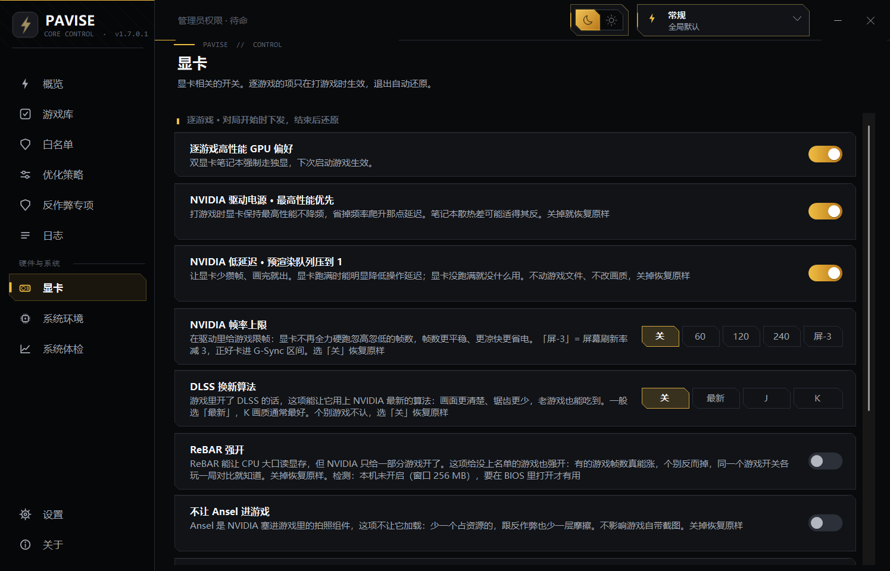
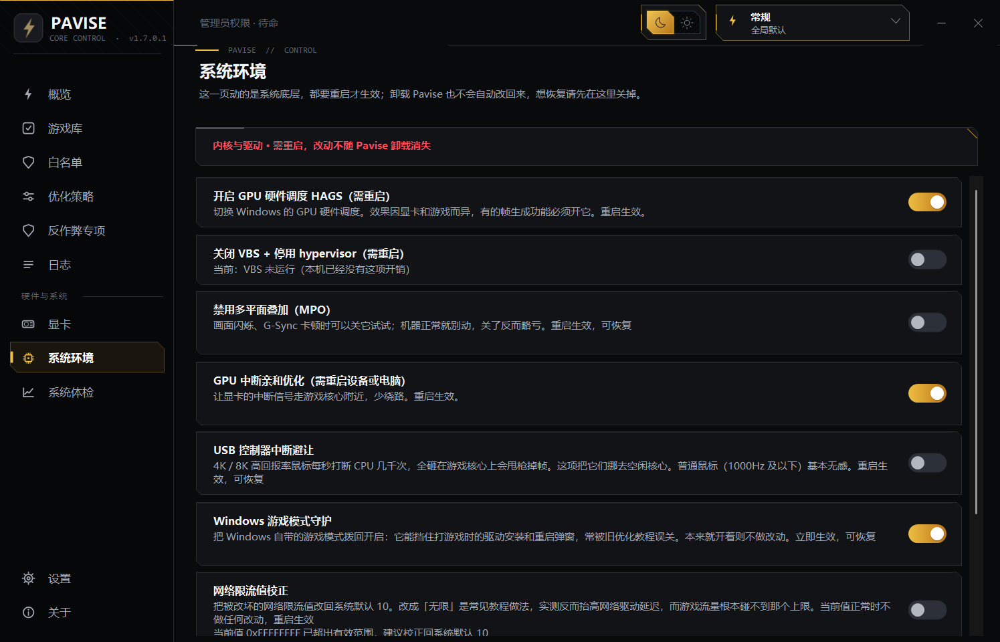
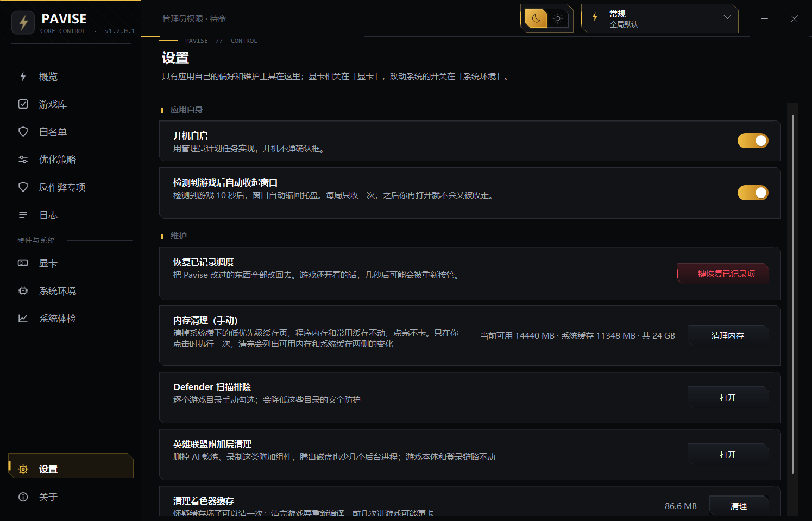

# Pavise 设置指南

默认值就是推荐值，装完不动任何开关直接打游戏，就是我调好的状态。下面是写给想自己动开关的人的，按页面走。截图都是 v1.7.0 实机截的。

## 抄作业

- 笔记本：开「禁止网卡省电」，其余默认。双显卡本确认下「逐游戏高性能 GPU 偏好」开着（默认就是开的）
- 台式机：默认。用 4K/8K 鼠标的开「USB 中断避让」
- K 字 CPU + Z 板、认真打排位：竞技模式，开「禁用 CPU 空闲状态」，散热得跟上。「GPU 中断亲和」「NVIDIA 低延迟」可以试
- 玩 LOL / 三角洲的翻到最后「游戏专项」，ACE 档位两个游戏不一样

## 策略页

| 开关 | 干什么的 | 默认 | 建议 |
|---|---|---|---|
| 后台压制 | 游戏时后台降级让路，退出还原 | 开 | 开着 |
| 后台 GPU 让位 | 被压的后台用显卡时也让路 | 关 | 后台挂视频/壁纸的开 |
| 游戏提优 | 游戏拿高优先级、高读写、显卡调度偏向 | 开 | 开着 |
| 智能保帧 | 单独抬高决定帧数的那个线程 | 开 | 开着 |
| 对局内存驻留 | 内存紧张时把游戏内存钉住不被换出 | 关 | 内存 16G 以下建议开 |
| 游戏文件预热 | 后台低优先级把游戏文件灌进缓存 | 关 | 想开就开,不抢游戏资源 |
| 后台上传让位 | 限制被压制后台的上行带宽 | 关 | 网盘/做种党开,生效时会有一两秒策略刷新 |
| 冻结静默后台 | 无窗口的静默后台彻底暂停 | 关 | 看下面，想清楚 |
| 后备提优 | 反作弊罩住的游戏由系统在创建时给高优先级 | 关 | 日志提示"被反作弊保护"再开 |
| 切换电源计划 | 切自建的「Pavise 竞技」计划，退出切回 | 开 | 开着；笔记本电池会明显不耐用 |
| 免打扰 | 压掉通知横幅 | 关 | 随意 |
| 刷新率守护 | 刷新率被改低时拨回最高 | 关 | 高刷屏开 |

后台压制不用担心切屏：前台永远豁免，游戏里切出去回微信，微信那一刻就是前台，立刻被放开。聊完切回游戏它才重新排队。

智能保帧多说两句，这是 1.7.0 新的。游戏动辄上百个线程，真正决定帧数的往往就一个，它开局认出来单独抬一档。游戏把 CPU 吃满的时候 1% 最差帧能改善 77%~96%（6 核 12 线程台架数据），吃不满的时候没收益也无害。认不出来也不乱抬，CPU 吃满还认不出就把整进程提优先降回普通档——这个组合实测是负优化，等负载退了再恢复。

冻结要单独说。它和压制不是一个量级：压制是让后台抢不过游戏，冻结是让后台彻底停摆，一点资源不占。代价就是字面意思——被冻的程序死了一样，游戏里切出来点微信没反应，消息收不到，语音掉线。适合打游戏时后台什么都不需要的人。挂着微信谈事的、开着下载的别碰。解冻靠一键恢复、退游戏、关开关，Pavise 崩了下次启动也会把冻的叫醒。怕误伤就把微信加白名单。

自定义模式下面还有几个逐项开关（常规/竞技模式会替你决定，不用管）：

| 开关 | 默认 | 建议 |
|---|---|---|
| 严格核心分区 | 关 | 8 核以上可开；6 核及以下开了也不生效，核不够分 |
| 竞技级压制范围 | 关 | 想要竞技那种狠度又想逐项控制的开 |
| 暂停后台下载 | 开 | 开着 |
| 暂停索引 / 预取服务 | 关 | 机械盘开，SSD 别开 |
| 关闭 Game DVR | 开 | 用 Xbox 即时回放的关掉这项 |

附加那一栏：

| 开关 | 默认 | 建议 |
|---|---|---|
| 竞技模式禁用 CPU 空闲状态 | 关 | K + Z 板可开；其他平台是灰的，禁了 C-State 睿频跟着没，不让你开 |
| 降级桌面视觉效果 | 关 | 弱机开 |
| 重压时清空后台内存 | 关 | 别开，会触发读盘 |
| 对局前待机内存清理 | 关 | 随意，13 毫秒的事 |
| 暂停 Windows 更新 | 关 | 随意 |
| 不许无故降级 | 开 | 开着。系统会在长时间没键鼠时给前台降档，手柄玩家和看过场的正中枪 |
| 不熄屏、不睡眠 | 开 | 开着 |

禁 C-State 能开的也注意：更热更费电，散热不行反而降频。开了之后监控显示 CPU 100% 是核心活跃度，不是真负载，别慌。

清内存说一下为什么只清一百多 MB。清空整个待机列表是各种"优化工具"的常规操作，实测丢 18894 MB 系统缓存换 382 MB 可用内存，接下来游戏加载全部重新读盘。Pavise 只清低优先级页，13 毫秒，该留的缓存全留着。数字没别人好看，但那些数字本来就不该好看。

## 显卡页

| 开关 | 默认 | 建议 |
|---|---|---|
| 逐游戏高性能 GPU 偏好 | 开 | 开着，双显卡本靠它强制走独显 |
| NVIDIA 电源最高性能 | 关 | 台式机可开；笔记本更热，自己权衡 |
| NVIDIA 低延迟 | 关 | 竞技开 |
| NVIDIA 帧率上限 | 关 | 笔记本限个 120 很舒服，温度风扇安静一截 |
| DLSS 覆写 | 关 | 40/50 系可试，需要驱动 566+ |
| ReBAR 按游戏强开 | 关 | 开关旁有检测标注，BIOS 没开就别折腾 |
| Ansel 注入关闭 | 关 | 可开，没人用那玩意 |
| 电池限帧解除 | 关 | 拔电玩才有意义，电池掉得飞快 |
| 后台 20 帧驱动限帧 | 关 | 可开；直播、录屏、双屏挂监控的别开，第二块屏也会被限 |

纯核显机器这页大部分用不上，正常。核显机的收益从压制、绑核、电源那边来。

## 系统环境页

改动写进系统，多数要重启，都记着原值可恢复。

| 开关 | 建议 |
|---|---|
| Windows 游戏模式守护 | 开。旧优化教程老让人关系统游戏模式，是错的，这项把它拨回来 |
| 禁止网卡省电 | 笔记本必开，无线网卡被断电再唤醒就是卡一下加掉包 |
| 网络限流值校正 | 开。值正常时它什么都不动；被"网络优化教程"改成无限的才修，那玩意实测反而抬高延迟 |
| USB 中断避让 | 4K/8K 鼠标开，普通鼠标无感 |
| GPU 中断亲和 | 独显可开，重启生效；核显置灰 |
| 禁用 MPO | 画面闪烁、G-Sync 卡顿再关，正常别动 |
| 关闭 VBS | 帧数收益因机器而异，安全性损失是确定的。办公游戏一台机的别关 |
| HAGS | 别折腾，系统和驱动怎么定就怎么用 |
| 前台时间片校正 | 被老教程改过时间片值的开，修回系统默认；值正常时开关是灰的 |

键盘、鼠标、耳机、音频、输入法、手柄类程序(按名字和文件说明识别)Pavise 完全不碰——不压制也不冻结。小众工具没被认出来、游戏里按键或鼠标变卡的话,把它加白名单。

## 设置页

开机自启建议开（管理员计划任务实现，开机不弹 UAC）。Defender 扫描排除知道代价再勾，会降低那些目录的防护。LOL 玩家可以用「英雄联盟附加层清理」删掉 AI 教练、录制这类附加组件，本体和登录链路不动。手动内存清理想点就点，不用常点。

## 游戏专项：英雄联盟 / 三角洲行动

两个游戏都是 ACE 反作弊（反作弊页「ACE 反作弊专家 (腾讯)」那组），压制建议开，档位不一样：

三角洲行动开「强力」。ACE 在这游戏里后台扫描吃 CPU 比较狠，压到底对局里能明显少卡。出现掉线、验证失败就降回「均衡」。

英雄联盟开「温和」或「均衡」，别上强力。LOL 的 ACE 组件和客户端耦合得紧，压狠了触发它的自我保护反而添乱。

添加游戏选谁都行，WeGame 换壳、启动器这些会自动认出游戏本体，确认一次记住。对局中的反作弊和 WeGame 客户端无条件豁免，任何模式都不会压它们——压了只会掉线，我不干这事。

## 模式

- 常规：日常用。没窗口的后台轻压，持续抢资源的才加码，你开着的东西不动，切屏无感
- 竞技：排位用。除前台和豁免名单全压，浏览器语音也不例外，配电源竞技档。切出来那些程序会慢半拍（切到谁谁被放开），语音要全程流畅加白名单
- 极限：竞技之上再加满。冻结静默后台、锁核、GPU 让位、电源计划和各项系统开关一次全锁上，策略页里这些开关会显示为锁定不可改。键鼠耳机输入法照常豁免。打游戏时后台什么都不需要、又不想逐项调的选它
- 自定义：知道自己在调什么再用

## 常见问题

**开了压制怎么任务管理器里进程都还在？** 压制不杀进程，降优先级挪核心而已。所以退出游戏才能原样恢复。

**游戏里切出来微信点不动？** 开了冻结。一键恢复或者退游戏就活了，不想再遇到就把微信加白名单，或者别开冻结。

**禁 C-State 之后 CPU 一直 100%？** 核心活跃度，不是负载，监控软件读的口径就那样。不放心就关，立即恢复。

**清内存怎么才一百多 MB？** 上面说过了，只清该清的。清出几个 GB 的工具是把你的缓存全扔了。
