# Pavise 2.1.2.0 使用教程

更新于 2026-08-28。与飞书正文对应，含 35 张无光标界面配图。

[线上教程](https://ycnqux4mseky.feishu.cn/wiki/Do1jwytjmit0DJke8CvcyJEenxd)

## 01｜先用起来：三分钟快速上手

Pavise 是 Windows 游戏资源调度与守护工具：在游戏运行时减少可避免的后台竞争，结束后恢复对局期改动。它不是硬件升级，也不能保证每台电脑、每个游戏都涨帧。后台本来很少或显卡已经满载时，收益可能有限。

第一次使用：①把程序放在固定目录，以管理员权限运行；②进入游戏库添加游戏；③先用智能模式，游戏核心保持全核，保留默认家族豁免；④打开概览中的守护开关，再进入实际游戏对局；⑤退出后查看概览最近一局、日志及设备中断记录。

不要第一天把所有实验开关打开。一次只改一个项目，在相同游戏场景、画质、帧率上限和电源条件下比较；不稳定就撤回该项。

配图说明：本文图片由 2.1.2.0 当前项目的真实界面控件在隔离预览中渲染，不是概念设计图，也没有启动优化任务。示例游戏和日志仅用于演示；开关状态不是推荐清单，硬件支持以你的电脑为准。图中守护关闭、暂无数据或权限提示，是预览状态，不代表正常使用时也应如此。

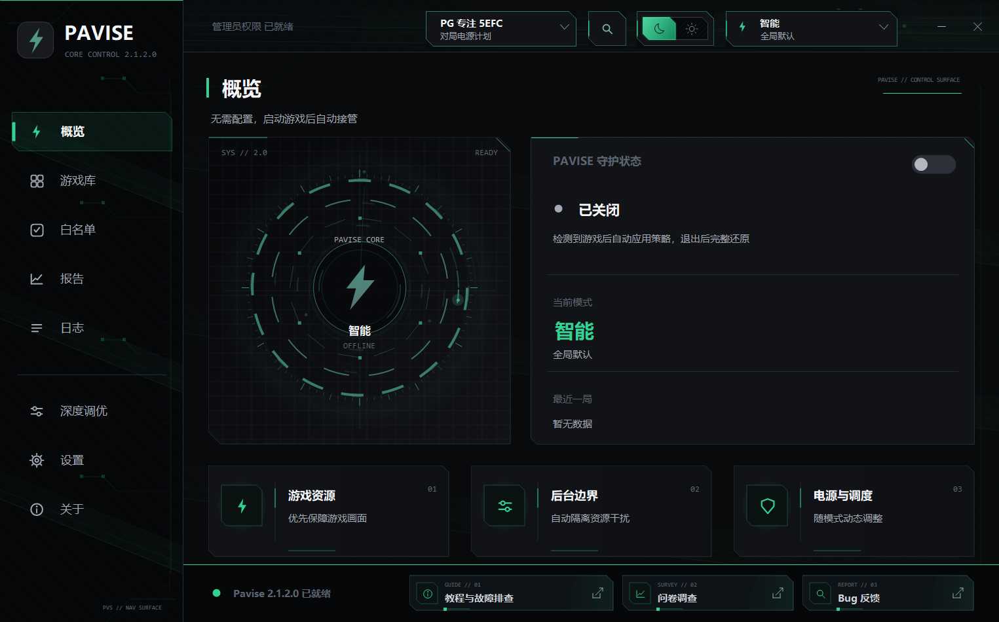

概览：守护开关、当前模式、最近一局和主导航。实际使用时需开启守护。

## 02｜模式、导航与对局电源

主侧栏提供概览、游戏库、白名单、报告、日志、深度调优、设置、关于。深度调优已在主窗口内整合：可直接切换优化策略、反作弊专项、显卡、系统环境、设备中断，不必每次退回首页。左上角返回主界面；页面会保留浏览位置。

智能：适合第一次使用。专注：更积极地处理通过保护边界的后台，先确认语音、直播和外设软件不受影响。轻载：面向支持的电池设备，采用对应电源策略；不是更强的通用性能档。自定义：适合明确知道自己要改哪些项目的人。

先看右上角的实际模式和来源。逐游戏独立配置可能覆盖全局选择；非自定义模式下显示“预设强制开/关”的项目由模式接管，不是开关坏了。对局开始后使用本局策略快照，修改通常在下一局应用。

从待命到接管：只启动登录器或客户端不一定立即激活。确认游戏运行并达到识别条件后才接管；切回桌面不是游戏退出。游戏进程退出后会先恢复后台，再处理退出宽限和环境还原。不要直接结束 Pavise 进程来代替正常退出。

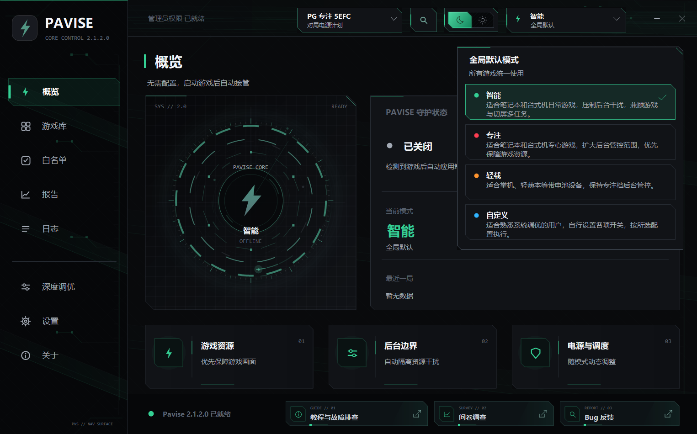

右上角模式菜单：先选智能，再按实际问题调整。

### 对局电源计划与功能搜索

顶部电源计划入口选择对局期间使用的方案。“不切换”表示 Pavise 不替你切换方案；托管的 PG 方案会按模式写入对应参数，退出对局后恢复原方案。方案名字带“专注”不等于当前模式必然是专注，要看右侧模式和日志。

放大镜是功能搜索。输入功能名可快速跳到对应位置；需要进入深度调优时仍遵守风险提示。主题按钮切换深浅色，不改变性能策略。

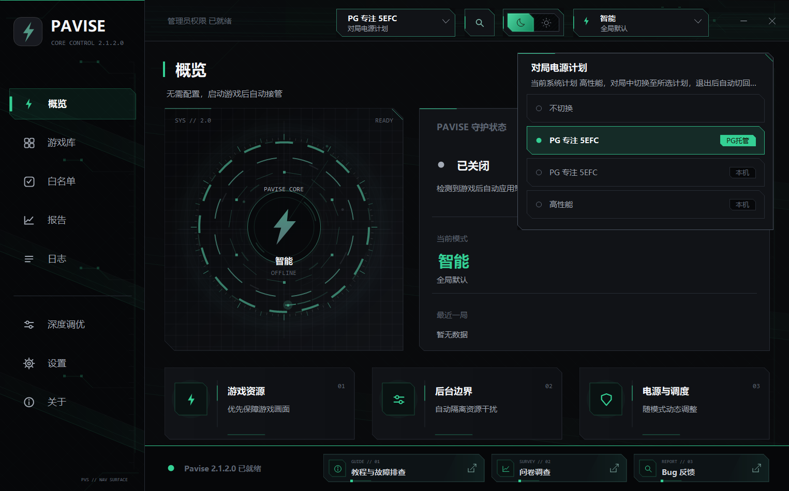

顶部电源计划选择。

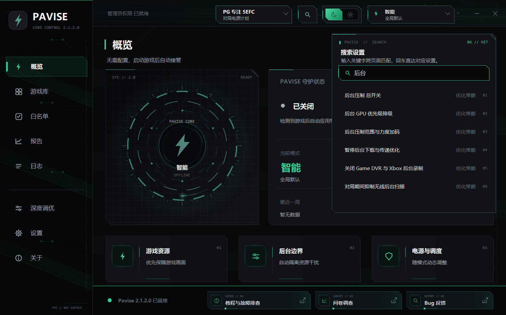

功能搜索：输入关键词定位设置。

## 03｜游戏库：添加、识别和家族后台

点击添加游戏，可从已安装游戏和运行中的候选程序选择，也可浏览 EXE、LNK 或受支持的 Steam URL 快捷方式。扫描参考安装记录等信息，不保证找到全部游戏；便携版、自定义目录和安装记录缺失时，手动浏览文件即可。当前没有深度扫描入口。

最好添加实际运行游戏画面的 EXE，不要优先选更新器、卸载器或平台本体。启动器与渲染进程可能不同，Pavise 会利用通用进程关系和安装范围等信息寻找关联，但不能保证任意启动链都能识别。

没识别到：先进入实际对局，再从正在运行的进程里确认真正的游戏程序；核对路径，不要只看文件名。模拟器和云游戏要确认承载画面的本地进程，但本地调度不能提高云端服务器的算力。

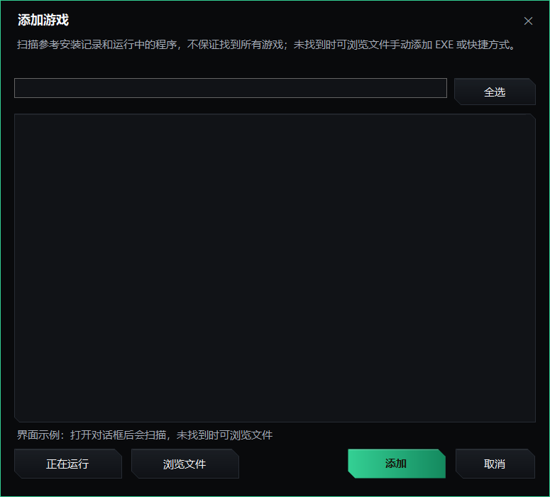

添加游戏窗口。此处为空列表演示，未实际扫描你的游戏。

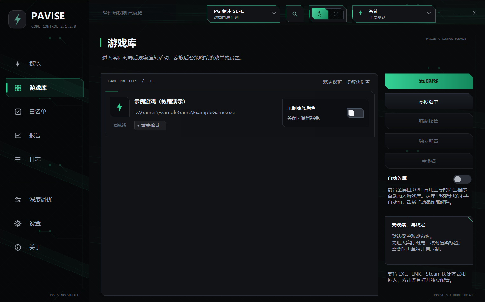

游戏库：路径、渲染观测标签、家族后台开关和条目操作。

### 渲染标签与“压制家族后台”怎么选

“暂未确认”：尚无足够的渲染观测证据，不等于它肯定不是游戏。“已观测渲染”：曾观测到渲染活动，不等于永久认证为唯一主渲染进程，也不证明压制其关联程序一定安全。

“压制家族后台”默认关闭：也就是默认保留家族豁免。建议先保持关闭，正常打一局，确认路径和实际渲染进程后，再决定是否开启。

开启后，原本因关联关系被保护的家族后台可能进入普通后台压制范围。例如从 Steam 启动 CS 系列游戏时，如果 Steam 被归入关联后台，它也可能受到压制；被其他保护规则或白名单保护的进程仍不会因此强制压制。它不是一键只压启动器，也不是进程识别开关。

选错了 EXE 又开启家族后台压制，可能影响真正游戏或依赖程序的响应。出现加载变慢、语音异常或卡顿时，先关闭这一项，再核对 EXE。渲染观测标签不能替代你对实际进程的确认。

强制接管只用于明确目标的临时排查，不是确认渲染进程的证据。移除只移出游戏库，不卸载游戏；重命名只改显示名称。自动入库是可选项，会结合前台与图形活动判断，不保证发现全部游戏；不需要时保持关闭。

## 04｜逐游戏独立配置

入口：游戏库 → 单击选中一张游戏卡片 → 右侧“独立配置”；也可以直接双击游戏卡片。如果按钮灰色，先确认已经选中条目。此页只设置当前游戏，不是修改所有游戏的全局策略。

独立配置怎么用：顶部为这一个游戏指定运行模式，下方分后台压制、核心、系统环境、显卡四个页签。默认跟随全局；需要区别对待时才覆盖对应项。普通选项修改后保存、下一局应用；手动选核还要点击“应用”。模式锁定项仍以页面实际标注为准。

例子：全局保持智能，游戏 A 单独选择专注，游戏 B 保持跟随全局；或者只给游戏 A 关闭后台 GPU 降级，其余仍跟随。这样不用每次换游戏都改全局配置。想撤销时把对应项改回跟随全局；右上角“全部清除”清除该游戏所有覆盖，不会删除游戏。

后台压制页：为本游戏覆盖后台范围、后台 GPU 降级、游戏提优、备用提优和渲染线程提优等策略。游戏依赖的后台较多时，可以只对这款游戏放宽。

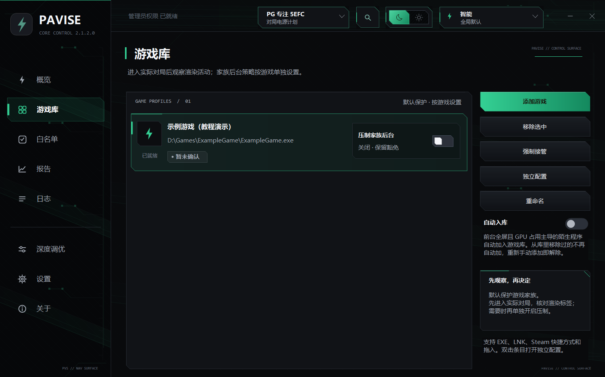

独立配置入口：先选中游戏，再点击右侧“独立配置”，或直接双击卡片。

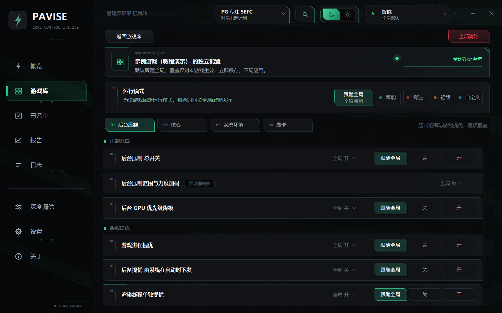

独立配置：运行模式和后台压制覆盖。

### 逐游戏核心、系统环境与显卡

核心页：跟随全局、全核或手动指定。先用全核，不要照抄别人的核心编号；不同处理器的拓扑、SMT 和核心类型可能不同。

单游戏手动选核：游戏库 → 该游戏的独立配置 → 核心 → 手动。点击小格切换游戏可用的逻辑核心，也可用全核、关超线程、反选等快捷选择；确认后点击右下角“应用”。只进入手动或点选格子，还不等于已经保存。此处只为该游戏覆盖核心范围，不改变其他游戏。

“跟随全局”与“全核”不同：跟随全局会继续采用全局核心设置；全核是明确让这款游戏使用全部核心。想取消单游戏核心覆盖，选跟随全局；不要误用右上角全部清除，它会清掉该游戏其他页的覆盖。图中只保留每个物理核一个线程是操作示例，不是推荐方案。

系统环境页：覆盖本游戏的对局电源、功率让位、下载处理及会话附加等项目。这里是逐游戏会话策略，不等于全局系统环境页中的安全与启动项。

显卡页：可覆盖显存驻留、NVIDIA/AMD 支持的逐游戏项目及全屏优化相关项目。灰色或预设锁定的选项先看说明，不要通过改配置文件强行开启。

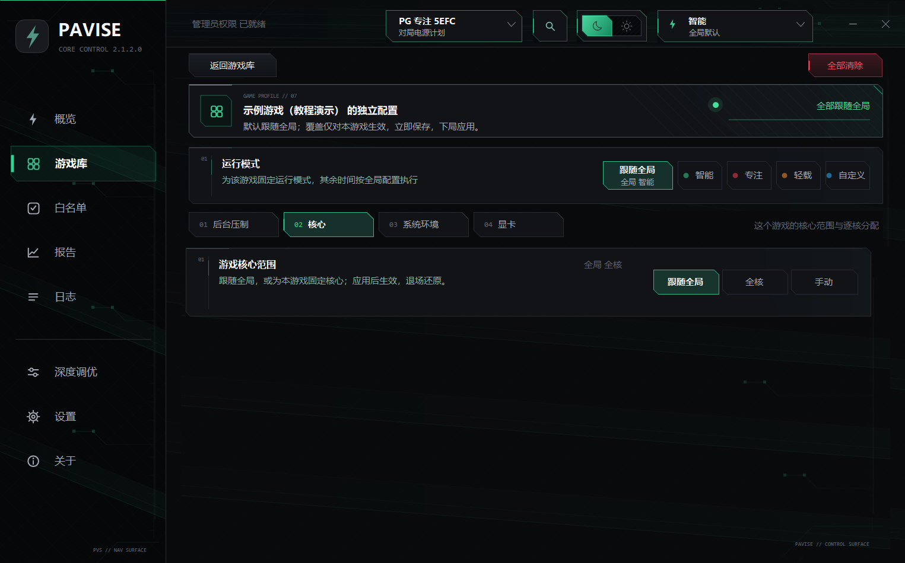

独立配置—核心。

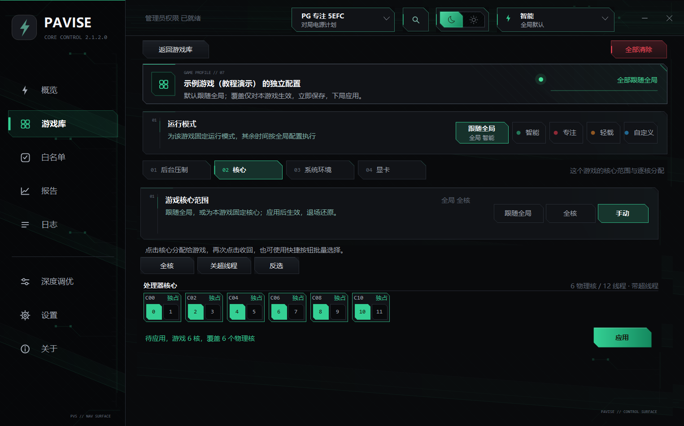

独立配置—手动选核：当前为待应用示例，点击右下角“应用”才保存选择。

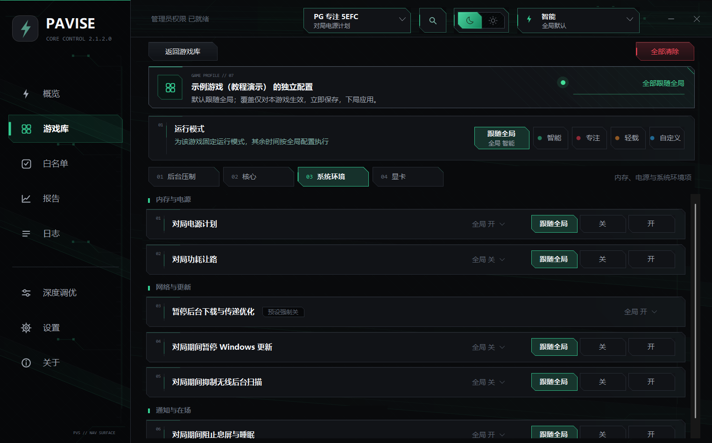

独立配置—系统环境。

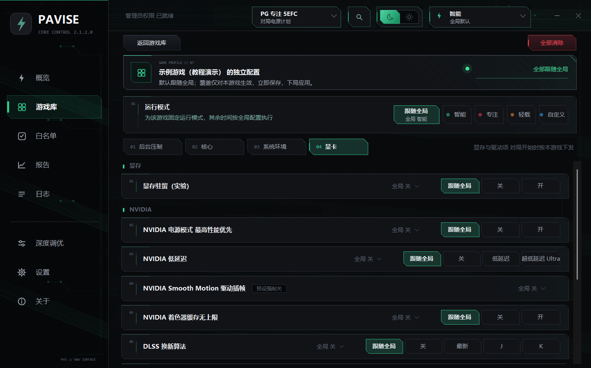

独立配置—显卡；更多选项向下滚动。

## 05｜优化策略：核心控制

入口：深度调优 → 优化策略 → 核心控制。点卡片右侧的小箭头可展开说明，再操作开关。

后台压制总开关：调整符合条件的后台优先级、效率模式、IO 和内存页优先级。普通后台压制不通过缩核、CPU Sets、硬性 CPU 配额、挂起或结束进程实现；系统、游戏、白名单等保护规则仍然有效。

后台 GPU 优先级降级：降低符合条件后台的 GPU 调度权重。直播、录屏、视频处理等可能依赖后台 GPU，必要时加白或关闭该项。

游戏进程提优：尝试提升已确认游戏进程的 CPU、IO、内存页与 GPU 调度优先级。受到进程保护或驱动限制时可能跳过或失败，以日志为准，不会因为开关亮了就保证全部写入成功。

后备提优（IFEO）已从当前版本移除，旧截图中的对应开关不再提供，不做旧字段兼容。游戏库含已移除的逐游戏字段时，走现有不兼容处理流程：还原系统改动、自动清理旧数据、弹窗并退出；清理失败则保留恢复记录。

渲染线程单独提优：尝试识别主要渲染线程并做更细的调度。负载分散、证据不足或目标受保护时会保守跳过，不会任意挑一条线程。

显存驻留（实验）：通过支持的系统接口尝试保留显存预算，并检查结果；游戏已有预留或不适用时会跳过。它不会增加物理显存，也不是把所有纹理永久锁在显存里。先默认关闭，只在可重复的显存竞争场景里对比。

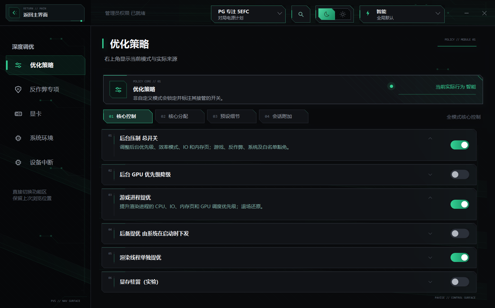

核心控制：六组调度选项，开关状态以实际模式为准。

### 核心分配

入口：优化策略 → 核心分配。全核适合作为基线；手动分配是限制游戏可使用的核心范围，不会创造额外核心。

手动选核步骤：深度调优 → 优化策略 → 核心分配 → 手动。展开后，点击编号小格分配游戏可用的逻辑核心，再次点击取消；确认所选数量和提示后，点击上方“应用”保存。出现“待应用”时只是编辑中的选择，没有保存。内容较长时向下滚动即可看到全部核心和状态条。

快捷按钮：全核选中全部逻辑核心；关超线程只为游戏保留每个物理核心的一个线程，不关闭 BIOS/系统的 SMT；反选切换当前选中与未选中。性能核、缓存核或 CCD 等额外快捷项只在适用拓扑上出现。应用不可用时，检查是否选得过少或与已保存配置相同。

同一物理核卡片里若有两个编号，通常是该物理核的两条 SMT 线程。这里限制的是游戏可用核心；未选的核心不代表被后台独占，后台仍可使用所有核心。图中选择每个物理核一个线程只演示操作，不建议照抄。恢复默认可返回全核；只想为一款游戏设置时，优先使用第 04 章的独立配置。

混合架构、多芯粒或带 SMT 的处理器显示方式不同。不能把别人的 C00、C02 等编号当通用推荐。限制过少可能降低帧率、拖慢着色器编译或加载。

核心分配和设备中断亲和性是两件事：前者面向游戏进程，后者面向设备中断。不要只因为两页都有核心格子，就照搬同一组选择。

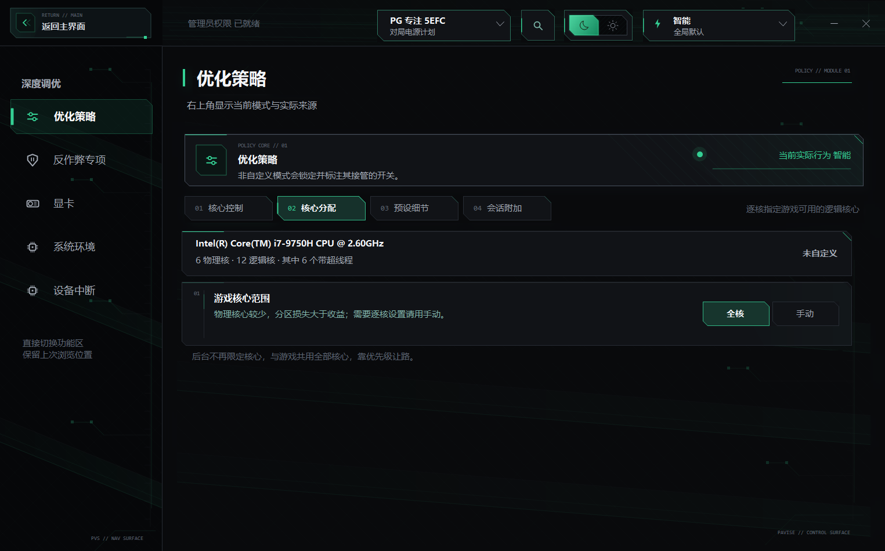

核心分配：先保持全核，需要时再按本机拓扑调整。

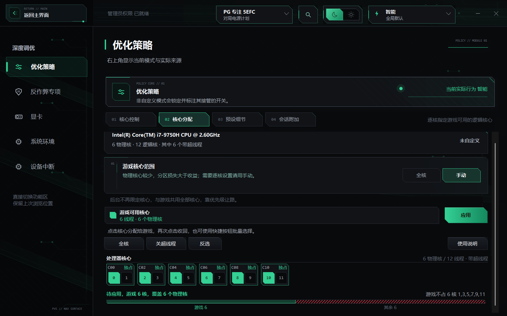

全局手动选核：展开后的核心格子、快捷按钮、待应用状态与“应用”按钮。

### 预设细节与功率让位

激进后台范围：扩大符合条件的后台处理范围，仍遵守保护规则；不是越多越好。暂停下载：减少对局期间受支持下载任务的竞争，但不代表能暂停电脑上的全部网络流量。

Game DVR：处理 Windows 相关后台录制功能；使用系统录屏时不要不加区分地开启。MMCSS：调整对局相关多媒体调度策略，是否有益取决于负载，不保证通用涨帧。

功率让位（实验）：尝试在共享功耗预算的硬件场景中调整资源让位关系。温度、供电、固件和具体游戏都会影响结果；并非所有电脑都适用，遇到 CPU 性能下降应撤回。

“禁用处理器空闲”等已移除的旧选项，不再按旧教程设置。预设接管的项目请看实际模式，不要把灰色误认为故障。

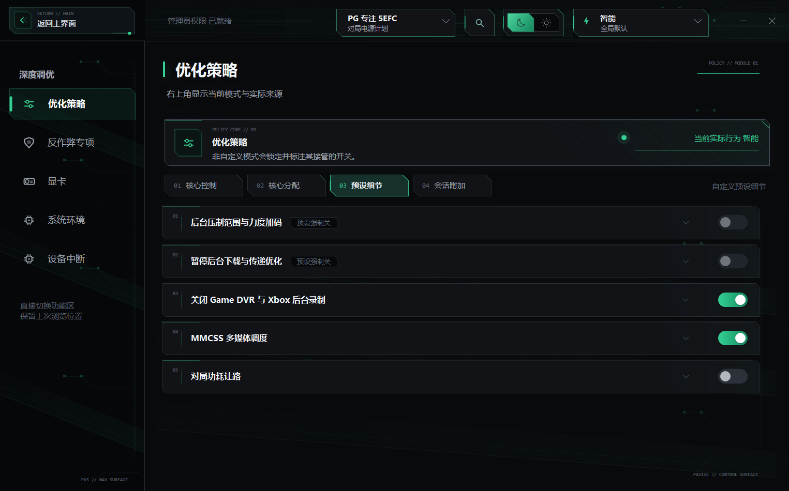

预设细节：后台范围、下载、录制、多媒体调度与实验项。

### 会话附加

暂停 Windows 更新服务：对局期间暂时处理相关更新服务，结束后按记录恢复；不是永久禁用系统更新。

抑制无线后台扫描：面向适用的 Wi-Fi 环境；遇到网络切换、连接异常时先关闭并比较。不会让本身的宽带带宽变大。

阻止息屏与睡眠：游戏期间保持系统唤醒，结束后撤销请求。它不是性能加速项。

会话附加与模式核心策略分开。修改后关注下一局日志中的生效和还原记录；异常退出后也应检查恢复情况。

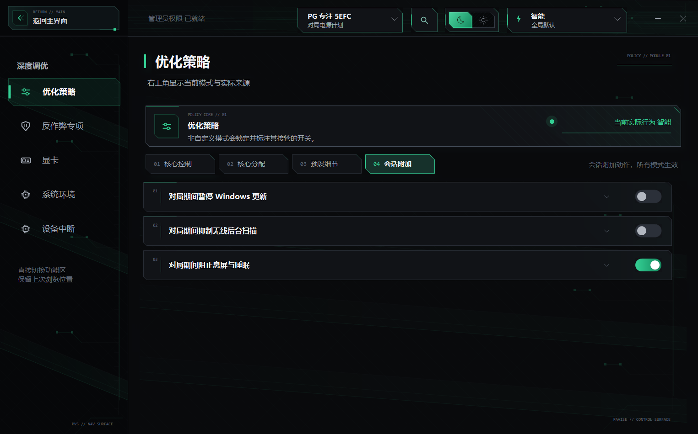

会话附加：更新、无线扫描、息屏与睡眠。

## 06｜显卡：按硬件支持选，不要全开

入口：深度调优 → 显卡。分 NVIDIA、AMD 两页，部分项目需向下滚动。支持情况由显卡、驱动、系统和游戏共同决定；灰色不可用不一定是 BUG。逐游戏项按对局应用并还原，写入失败以日志为准。

高性能 GPU 偏好：在支持的多 GPU 系统中为目标游戏设置高性能 GPU 偏好，不等于把两个 GPU 的算力相加。

NVIDIA 最高性能优先：影响驱动电源行为，可能增加发热和耗电。低延迟/Ultra：调整适用渲染路径的排队行为，不是所有游戏与图形 API 都同样受益；游戏已有相关低延迟选项时需分别对比。

Smooth Motion 驱动插帧：只在支持条件满足时可用。插帧提升显示帧数不等于同幅度降低操作延迟，快速运动和界面边缘可能出现瑕疵。

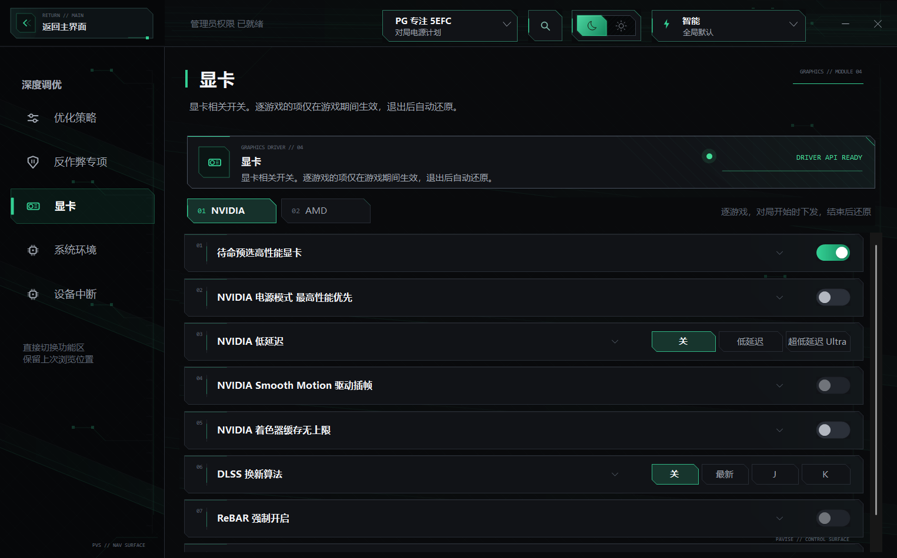

NVIDIA 页上部：GPU 偏好、电源与低延迟等。

### 着色器缓存、DLSS、ReBAR 与功耗墙

着色器缓存无上限：调整驱动缓存容量策略，不会预先编译所有游戏着色器。可能增加磁盘占用；与设置页的“清理着色器缓存”完全不同。

DLSS 换新算法：为支持的游戏和驱动选择最新或 J/K 等预设。它不能给原本不支持 DLSS 的游戏凭空添加 DLSS，画面、性能和兼容性都可能变化，出现闪烁、拖影或异常时关闭覆盖再比较。

ReBAR 强制开启：需要硬件、固件和驱动已有相应能力；软件开关不能代替 BIOS 支持。不是每个游戏开启都会变快。

对局功耗墙拉满：仅在接口支持时使用允许范围内的功耗设置，可能提高温度、风扇噪声和耗电；不替代散热，不是刷 BIOS，也不保证持续频率一定更高。

不要把驱动键写入成功当成实测涨帧。出现接口拒绝、回读不一致或保护提示时，先检查支持条件和其他调优软件冲突，不要反复强制写入。

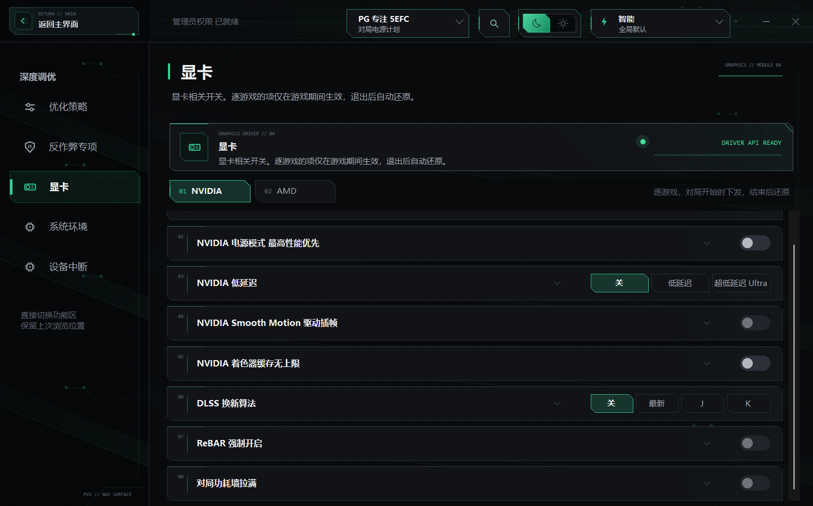

NVIDIA 页下部：着色器缓存、DLSS、ReBAR 与功耗墙。

### AMD：Anti-Lag、AFMF 与 RSR

Anti-Lag 面向支持条件下的延迟控制；AFMF 是驱动插帧；RSR 是驱动层空间放大。三者解决的问题不同，不能把显示帧数、原生渲染性能和输入延迟当成一个指标。

AFMF 可能有插帧伪影；RSR 通常涉及降低渲染分辨率再放大，画质可能变化。先读页面提示，再按游戏单独比较。没有兼容 AMD 驱动时会灰显，截图中的灰显不是让你照着开启。

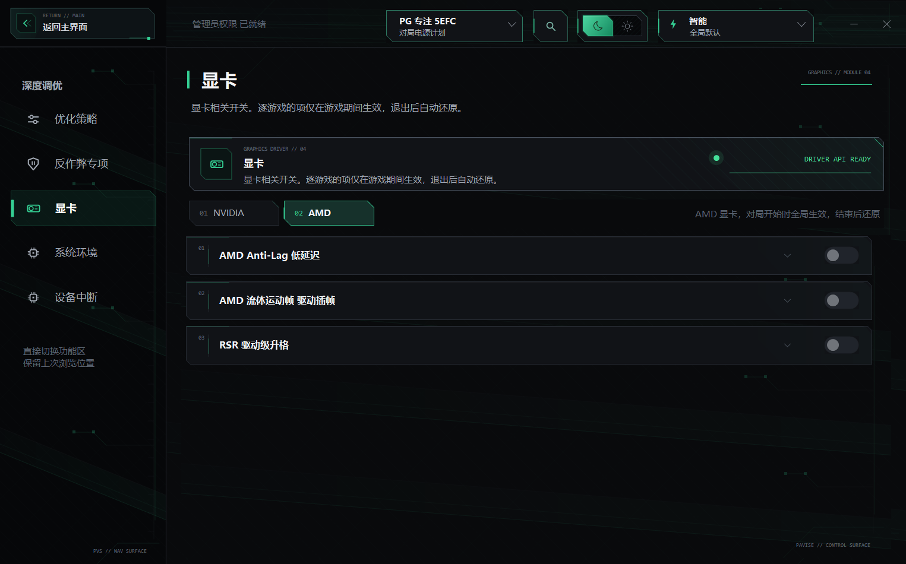

AMD 功能页：本截图机器未满足相关支持条件，保持真实灰显。

## 07｜系统环境：持久设置，先读风险

入口：深度调优 → 系统环境。这里很多项目需要重启，并非游戏退出就自动恢复；卸载或删除 Pavise 也不等于撤销它们。恢复前应在原入口关闭相关项目，并按提示重启。

内核调度页包括 HAGS、VBS、Windows 游戏模式守护、窗口化游戏优化、推测执行缓解和计时器相关项目。关闭 CFG 已从当前版本移除，旧截图中的对应开关不再提供；历史改动可在设置页清除全部后恢复，恢复后需重新启动游戏。先查看当前状态，系统已经启用且无需处理的项可能不可操作。

HAGS 与窗口化优化是否有益取决于系统、驱动和游戏组合，不建议看到名字就全开。Windows 游戏模式守护用于对应系统设置，不等于 Pavise 的智能/专注模式选择。

关闭 VBS 或推测执行缓解会影响安全防护。它们不是无代价优化，不作为默认推荐；办公、共享设备或处理不可信内容的机器尤其要谨慎。涉及组织管理策略时不要自行覆盖。

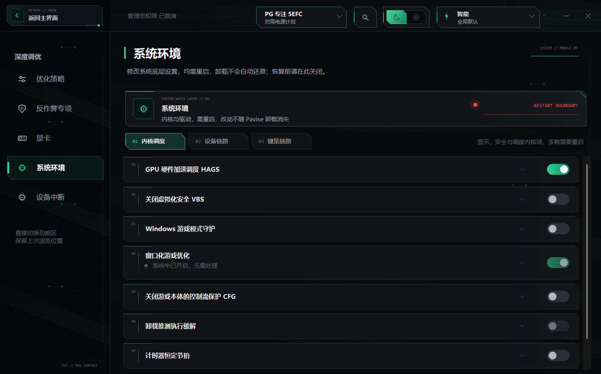

系统环境—内核调度，先确认支持条件和风险提示。

### 计时器、设备链路与键鼠链路

计时器固定节拍、全局计时器分辨率属于实验或条件性选项。它们不是对所有游戏有效的低延迟开关，可能影响耗电；按页面的重启与会话条件执行，没有可重复收益就恢复。

设备链路：处理受支持设备的省电策略。遇到网卡或设备连接问题时，检查具体项，不能据此推断网络延迟一定降低。

键鼠链路：辅助按键相关设置用于避免粘滞键等交互干扰；HID 省电相关设置面向设备电源行为。外设异常可能来自驱动、USB 供电或设备策略，单纯把 EXE 加白不能回滚这些改动。

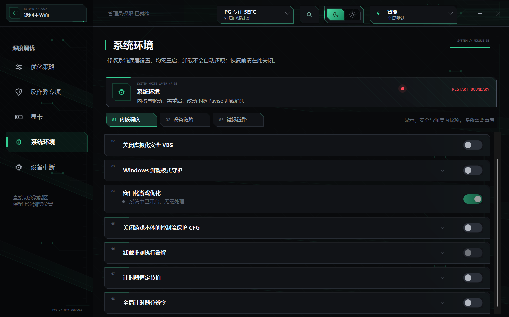

内核调度下部：安全项及计时器项目。

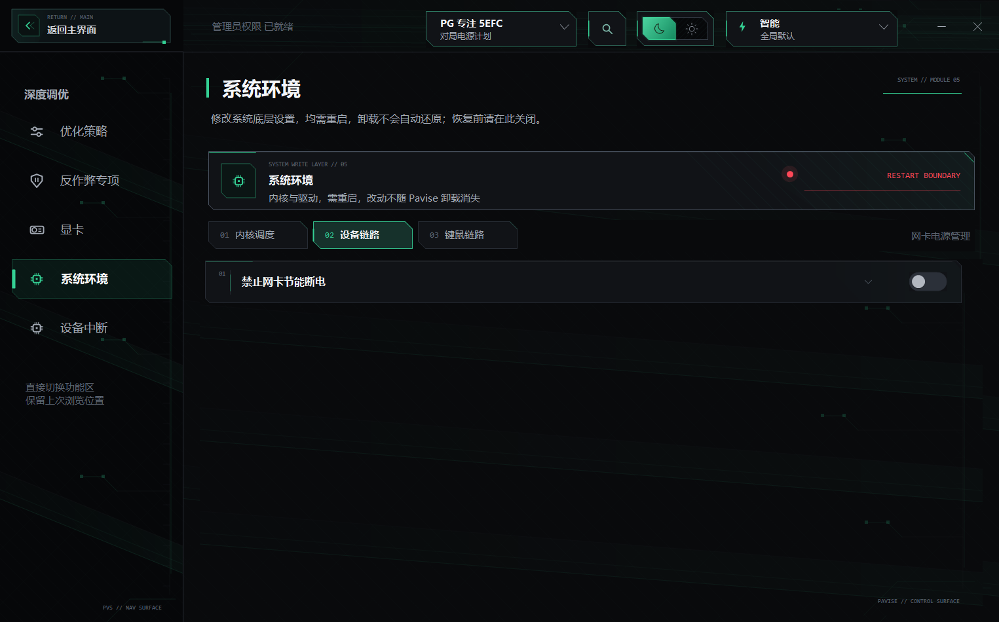

设备链路。

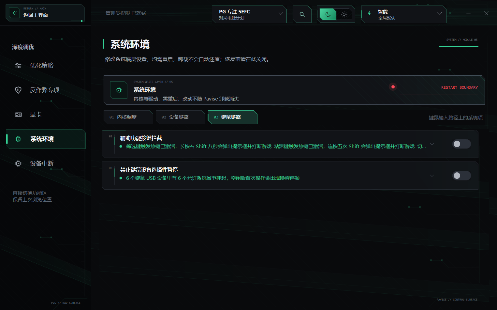

键鼠链路。

## 08｜白名单与外设软件

入口：主侧栏 → 白名单。将确实需要保持响应的语音、直播、录屏、外设控制或工作软件加入保护范围。先确认完整路径，同名 EXE 可能不是同一个程序。

按页面提供的规则选择程序本体或关联进程保护。家族保护不是“某目录下所有 EXE 都永久加白”，也不等于关闭所有调优模块。

例如罗技软件提示驱动加载失败：先核对实际后台服务和子进程是否也在保护范围；再检查反作弊专项、HID/设备省电、设备中断和其他调优软件。EXE 白名单不能修复驱动安装，也不会自动撤销系统层改动。

排查顺序：保留日志 → 关闭相关调优项并正常恢复 → 重启对应软件或按要求重启系统 → 复现对比。不要只凭加白后仍报错就断定一定是 Pavise 或一定是厂商驱动的问题。

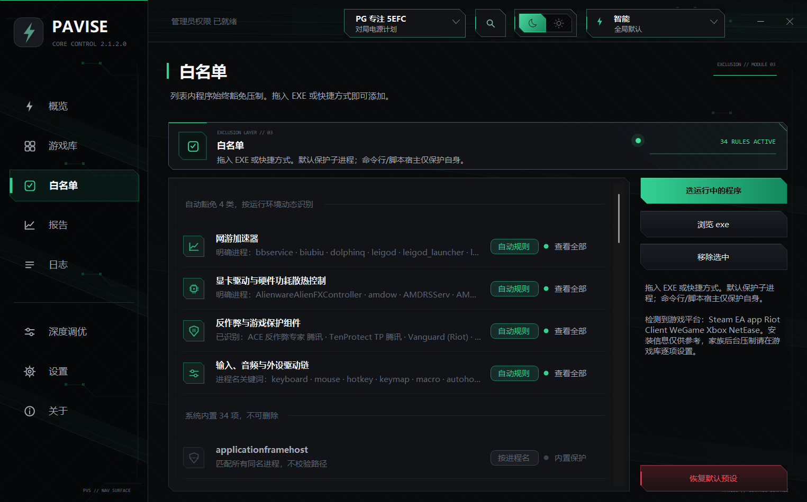

白名单页：按实际依赖配置保护，不要把整个磁盘都当白名单。

## 09｜反作弊专项：兼容性优先

入口：深度调优 → 反作弊专项。此页有独立总开关与分组策略，和普通后台压制不是同一套开关。它面向相关用户态辅助进程，不是修改反作弊内核驱动，也不是绕过反作弊。

游戏或反作弊具有保护限制时，Pavise 会按相容保护记录跳过部分游戏提优和线程操作。不要为了让日志看起来“全部生效”就反复清空保护记录。

不同游戏、平台与更新版本的兼容性会变化。这里不承诺零封号风险、零误报或所有反作弊都兼容。出现启动失败、异常退出或校验问题时，先停用对应专项并恢复，再验证。

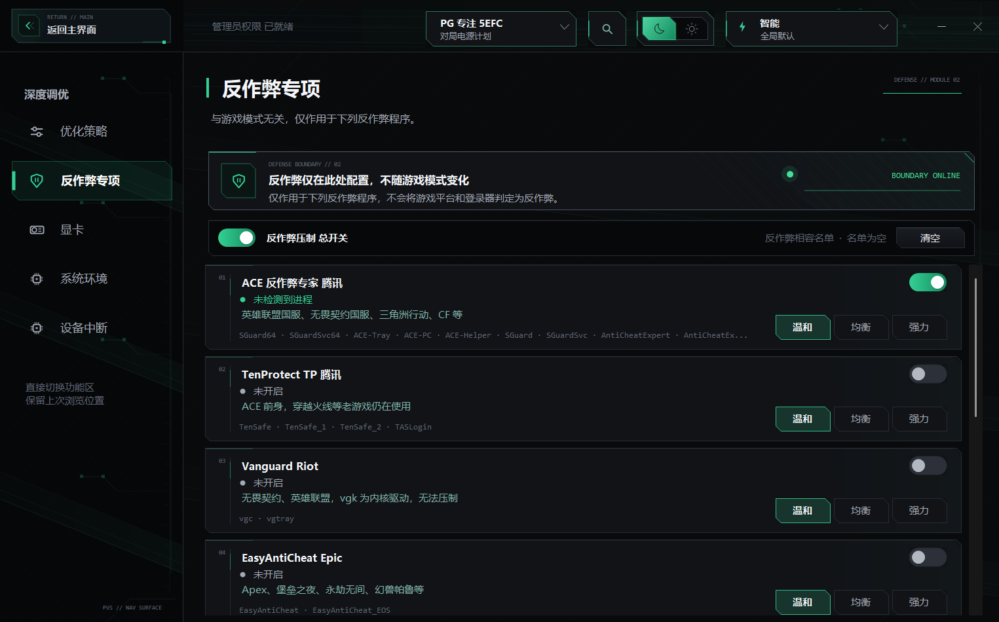

反作弊专项：总开关、相容保护记录与分组。

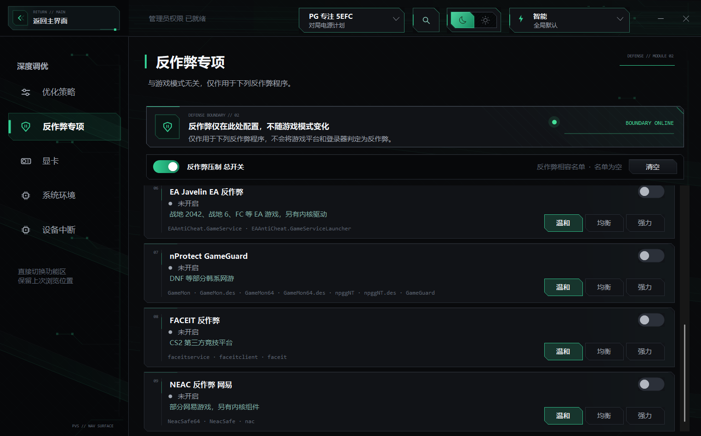

反作弊专项下部：按分组查看，不要统一套用最激进档。

## 10｜设备中断：先观测，再调整

入口：深度调优 → 设备中断。先以管理员权限运行并开启对局观测，进入真实游戏对局；结束后查看记录和设备排序。观测不要求你先限制游戏核心，也不依赖游戏提优开关必须开启。

记录与建议是两回事：有有效采样的短局也可以保留原始记录，但形成可靠建议需要足够样本和有效归因。无法确认游戏核心范围时，只显示系统观测，不会把未知范围当作已验证游戏核心。

没有记录时，检查是否真正激活对局、观测是否开启、管理员权限、ETW 会话是否启动、采样是否失败或丢失，以及是否成功落盘。仅看到“游戏模式激活”日志，不代表中断采样一定完成。

选择设备后再选择目标核心。核心格子的负载是对应观测局期间的系统核心平均负载，不是此刻实时值，也不是结束瞬间最后一帧；它包含系统与其他程序的负载。缺少数据时显示横线，不应按零负载理解。

设备中断亲和性改动与还原通常都需要重启。不要照抄别人的编号，也不要把多队列网卡、存储设备等一律挤到单核。High 中断优先级是实验项，优先保留默认。没有可重复改善就恢复。

页面中的微秒值与帧预算占比用于理解中断时间，不等于已经测出了你的游戏掉帧率，更不是必然能提升多少 FPS。

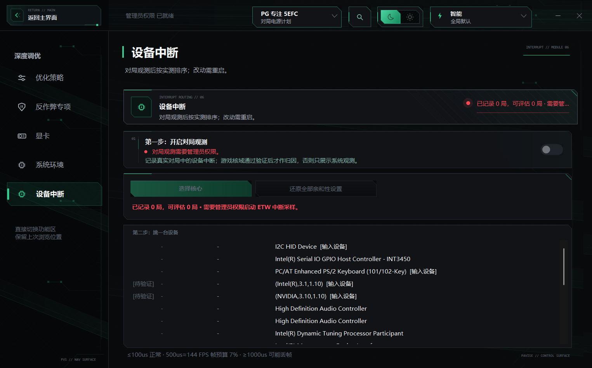

设备中断页。隔离预览未启动管理员采样，因此保留真实的权限/暂无记录提示。

弹窗入口：在设备列表单击选中目标，再点“选择核心”；也可以双击设备行。按钮灰色时先检查管理员权限、是否已选设备、是否标记为[环境页]；由系统环境页管理的项目，应回原页面调整。打开弹窗本身不会改设备配置。

先理解它调什么：设备中断与 DPC 是驱动在 CPU 上处理设备事件的工作。这里选择的是设备中断的目标逻辑核心，不是把显卡计算搬到 CPU，也不是给游戏选核心；不需要为了让图上出现空闲核，就先砍掉游戏可用核心。

配图说明：以下弹窗采用真实控件与示例对局数据，模拟 6 物理核 / 12 线程。图中选中 10 号只展示操作，不是推荐所有人绑定 10 号，也不是实测提速结果。

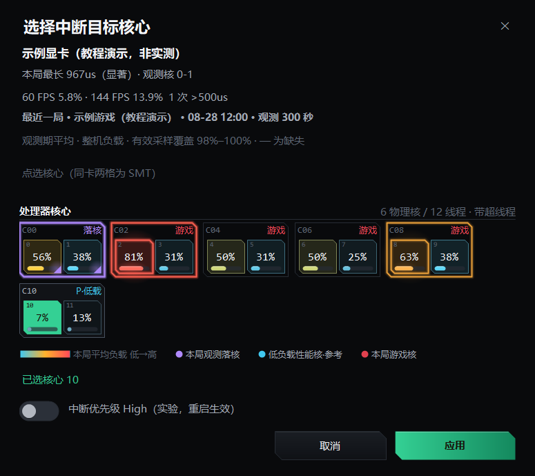

选择中断目标核心：示例对局平均负载、观测落核、游戏核与待应用的 10 号核心。编号与数值仅供演示。

① 顶部数据怎么看：设备名下面的“本局最长”是这次有效记录中该驱动的最长 DPC 耗时；“观测核 0-1”表示记录曾在逻辑核心 0、1 上看到它，不是刚刚设置的目标。967us 约为 0.967ms；60 FPS 5.8%、144 FPS 13.9% 是相对理论单帧预算的比例，不是掉帧率，也不是整个对局都占用这么多时间。“1 次 >500us”是超过该时长的事件次数。

② 先核对数据来源：“最近一局”显示游戏、时间和观测秒数。核心百分比是该局观测期间的整机平均负载，包含其他程序，不是此刻桌面负载、游戏单独占用或退出那一瞬间的值。有效采样覆盖 98%–100% 表示各核心有有效数据的观测时间占比，不是 CPU 使用率，也不是预测准确率。低平均值不能排除短时满载。

③ 核心编号与 SMT：C00、C02 等是物理核分组标记；真正点选的是小格左上角的逻辑核心编号。示例 C00 内的 0、1 属于同一物理核的两条 SMT 线程，不能当作两个完全独立的物理核。若游戏用 0、设备放 1，仍共享同一物理核资源。没有 SMT 的处理器不一定每卡两格；P/E、CCD 与编号以本机实际拓扑为准。

④ 颜色和标签：格子百分比及青→黄→红的渐变表示本局平均负载由低到高；紫色“落核”是本局看到设备中断的核心；红色“游戏”是本局已确认的游戏核范围，不等于该核一直满载；P 是性能核，E 仅在识别到混合架构能效核时显示。紫色观测位置、红色游戏标签和负载颜色可以同时出现，含义不同。

⑤ “P·低载”只供参考：当前实现要求该物理核未被标为本局游戏核，且同卡所有逻辑核心都有记录、平均负载都低于 35%，才给出低载性能核标签。它不表示完全空闲、独占或保证提速；缺一个线程的数据也不能据此认定整颗核低载。它是候选线索，不是自动调优结论。

⑥ 选中与应用：点击一个或多个逻辑核心，再点一次取消；主题色填充与下方“已选核心 10”才表示准备写入的选择。应用前核对设备名、已选编号和 SMT 关系。全不选或全选都不会形成有效的部分核心限制，因此应用按钮不可用；想恢复原设置请用主页面还原按钮，不是全选。取消或右上角关闭不会应用本次点选。

怎么选更稳妥：先看数据是否完整、设备有没有持续问题，再参考本局负载和游戏核重叠，优先比较低负载性能物理核；不要只挑最低百分比，也不要把多个繁忙设备都堆到同一核心。若游戏覆盖全部核心，或没有清晰的空闲候选，保持默认通常更合适。一次只试一个设备、一个变化。

⑦ 无数据弹窗怎么看：横线“—”表示未记录，不是 0%；没有红色游戏标签可能是该局未确认游戏核心范围，不能当作游戏没用这些核。“本局暂无此设备的有效中断记录”也不等于设备没有工作：可能这局没有有效归因、驱动版本不匹配，或记录不适用于本次启动/当前 CPU 拓扑。先检查时间和提示，重新完成一局观测；不要用上一张图的编号补猜。

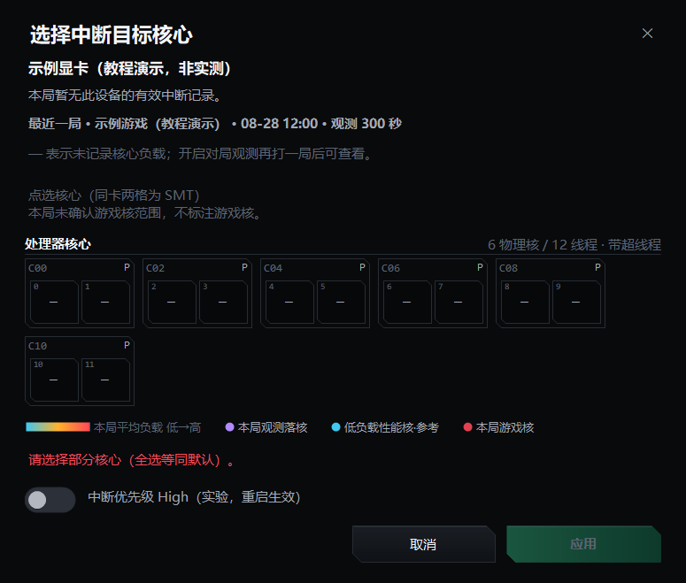

缺少数据的选核弹窗：横线不是零负载；没有游戏核标签也不是空闲证明。先补齐观测再判断。

数据门槛：当前版本有效短局可展示原始观测，形成多局建议至少需要 3 局合格样本，每局至少 60 秒，并且还要通过其他质量和归因检查。已记录数量、可用数量、对局建议不是同一个概念。页面若写“驱动汇总”或“框架汇总”，不能把汇总耗时全部算到某一个具体设备上。

⑧ High 优先级：这是实验选项，建议初次保持关闭，先单独验证亲和性。它不是游戏进程的高优先级，也不保证降低延迟。若显示“已是 High”，不要理解为 Pavise 刚刚设置；该开关也不是通用重置键，撤销 Pavise 写入的优先级应使用主页面还原入口。

⑨ 应用后如何验证：点击应用后先确认写入成功，再按提示重启；回到 Pavise 保持对局观测开启，用相同游戏场景再打一局。设备行[待重启]表示尚需重启；[待验证]表示还缺有效落核证据；[未收敛]表示观测仍有目标外落核；[已生效]表示观测落点落在设定范围内，不代表 FPS 已提升。重启前的旧观测不能拿来证明新设置生效。

⑩ 如何还原与避坑：主页面“还原全部亲和性设置”会尝试恢复本页管理的全部设备亲和性及 Pavise 管理的中断优先级，不仅是当前选中的设备；按反馈检查结果并重启，必要时再打一局核对。此类持久设置不会随游戏退出自动撤销。MSI-X/RSS 多消息设备可能因集中到少数核损失并行度；StorPort 的完成 DPC 可能跟随发起 IO 的核心；输入设备要关注响应和低频核风险。没有可重复改善，或出现输入/音频/网络异常，就还原，不要继续叠加调整。

## 11｜报告、最近一局与日志

主侧栏“报告”打开系统体检，列出本机可用能力和相关状态。开始体检是读取与检查；是否修复某项需要另外确认，不是点击后自动把所有项目改成激进配置。

概览的最近一局和日志中的本局结束摘要用于回看对局。摘要可能有时长或有效样本门槛，不能把没有摘要等同于完全没接管。设备中断原始记录与概览摘要的门槛也不是同一个。

压制进程数多、后台累计 CPU 时间大，不等于这些时间全部变成了游戏性能收益。判断收益要比较同一场景的帧时间、稳定性与响应，并同时看温度、功耗和后台功能是否正常。

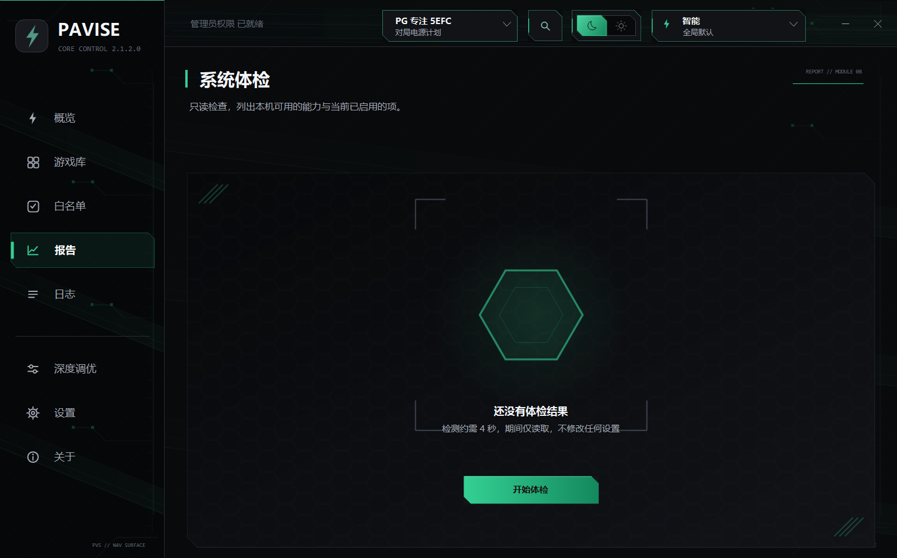

报告入口中的系统体检：先检查，再决定是否处理具体问题。

### 结构化日志怎么看

日志按事件展示，可切换全部、警告、异常；单击选中、双击复制原文，也可打开日志文件、立即刷新或清除日志。提交问题前先保存，不要先清空。

“跳过”可能是当前系统不适用、游戏已有配置或目标受保护；“回读不一致”表示写入后检查未匹配，可能存在其他程序争用，不能当成功；“已还原”应与对应模块的恢复记录一起看。

界面按有限的近期事件显示，不会把整个历史文件无限堆成控件。保留历史日志仍可能占用磁盘；清除日志是维护操作，不是性能优化。

反馈请附：Pavise 版本、Windows 版本、CPU/GPU、游戏及准确 EXE、模式与独立配置、复现步骤、问题时间前后的原始日志。公开发布前遮掉账号、个人目录和其他敏感内容。

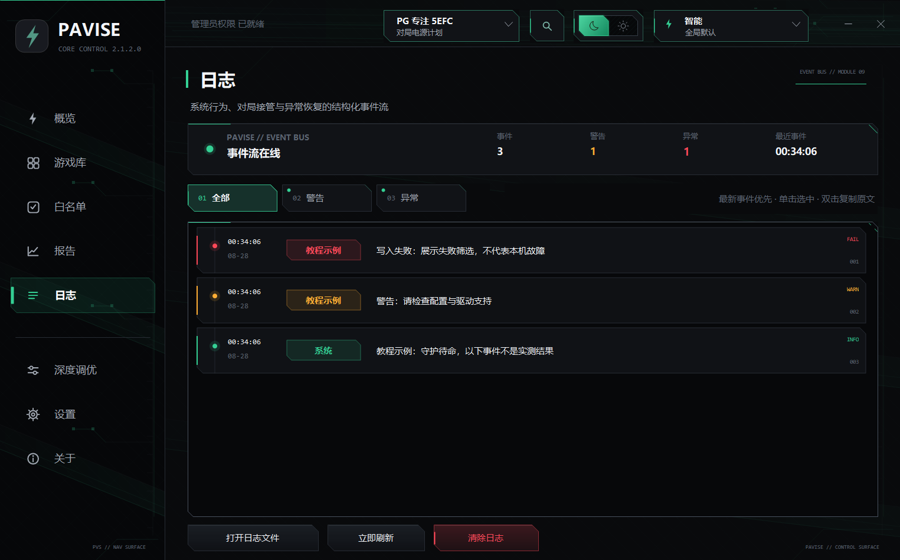

结构化日志示例；带“教程示例”的事件仅展示筛选，不是性能测试结果。

## 12｜设置、清理与外观

设置页管理应用自身：开机自启、检测到游戏后自动收起窗口、界面语言，以及维护和外观。自动收起是隐藏面板，不是停止守护。关闭主窗口通常收起到托盘；需要完全结束时使用托盘退出。

清除全部配置：是重置操作，不是常规加速。应先停止对局并完成相关还原，再按确认提示执行；恢复失败时需要保留恢复记录，不能删除文件强行当作已经清干净。

清理着色器缓存：用于特定缓存损坏或排查场景。清理后游戏可能重新编译着色器、暂时加载更慢或卡顿，不建议每次游戏前清理。

外观：背景封面、封面浓度、模式主题色。界面图案与颜色不代表实际调度强度，性能策略仍以模式和开关说明为准。

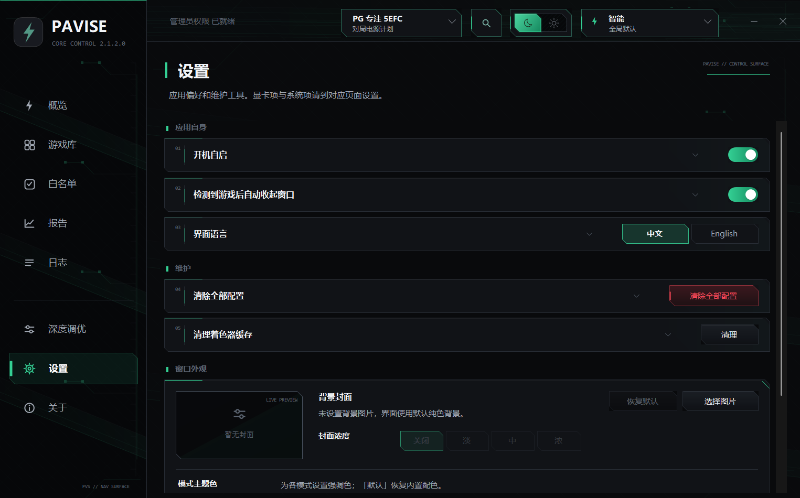

设置：应用偏好与维护。

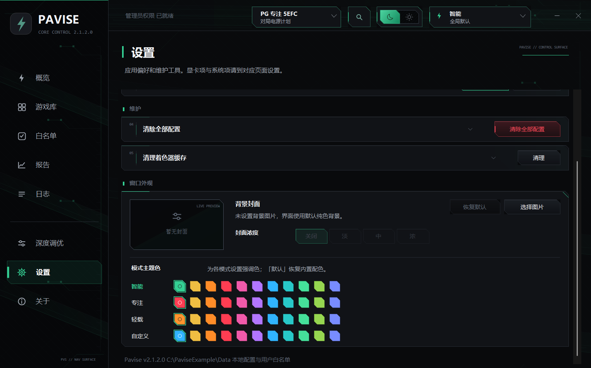

设置下部：背景和模式主题色。

## 13｜关于、更新与常见问题

关于页查看版本、更新与反馈入口。更新时使用本文顶部的下载链接或应用内更新入口，先正常退出旧版，再替换对应文件；不要运行来源不明的所谓增强包。

Q：开启后没涨帧？A：先确认真的接管，再看是否存在后台竞争。GPU 满载、帧率封顶或系统本来很干净时，平均帧可能基本不变。优先比较帧时间和异常卡顿，不要凭体感给固定百分比。

Q：游戏库选了启动器但对局不识别？A：保持家族后台压制关闭，进入对局后确认实际渲染 EXE，重新添加准确路径。自动家族关联不是万能的，强制接管也不证明选对了。

Q：开关灰了、改不了？A：依次看模式是否接管、是否被独立配置覆盖、硬件驱动是否支持、系统是否已经启用、是否有权限或重启要求。不要直接判断是界面 BUG。

Q：卡顿、驱动或语音异常怎么办？A：保存日志，撤回最近一项，保留家族豁免，核对白名单；再逐个检查专项与持久系统设置。恢复与重启后做同场景对比，不要一次关闭十项后猜原因。

Q：退出游戏后是不是所有东西都恢复？A：对局期策略会按记录还原；系统环境、设备中断等明确标注持久/重启的项目要在原入口撤销。异常退出后还应检查恢复日志。

Q：能保证不封号吗？A：不能。兼容保护、未修改游戏文件或某项不注入，都不能代替游戏运营方规则。竞技游戏优先稳定与合规，对有疑问的实验项目保持关闭。

最后原则：先默认、后定位；一次一项、保留日志；有收益再留，没有收益就撤回。

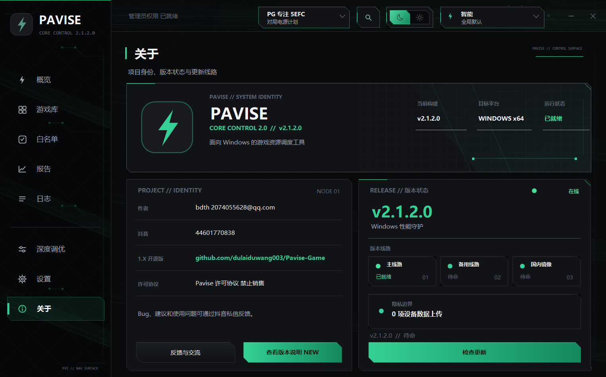

关于页：版本、更新和项目入口。
