# Pavise 使用教程

对应版本 2.1.3.3。配图为界面实拍，深色主题、无光标。

[线上教程](https://ycnqux4mseky.feishu.cn/wiki/Do1jwytjmit0DJke8CvcyJEenxd)

## 01｜三分钟上手

以管理员身份运行 Pavise，程序进入托盘。调整其它进程的优先级需要管理员权限，普通权限下大部分功能会置灰。

四步就能开始用：

1. 进游戏库添加游戏，或用扫描导入已安装的平台游戏
2. 模式保持默认的智能档，核心保持全核
3. 打开概览页的守护开关
4. 进一局真实对局，退出后回来看概览的最近一局和日志

概览页左侧是主导航，右上角显示当前模式与对局电源计划。守护关闭时不做任何事，打开后检测到游戏才接管。

界面支持浅色主题，在设置页切换。

## 02｜模式与顶部工具条

右上角的模式菜单有四档。先用智能，遇到具体问题再往上调。

| 模式 | 什么时候用 |
|---|---|
| 智能 | 默认。日常游戏，兼顾切屏多任务 |
| 专注 | 需要把资源尽量集中给游戏时。压制范围扩到游戏之外全体 |
| 轻载 | 掌机和轻薄本。压制范围同专注，功耗侧交给厂商工具 |
| 自定义 | 想逐项决定的用户 |

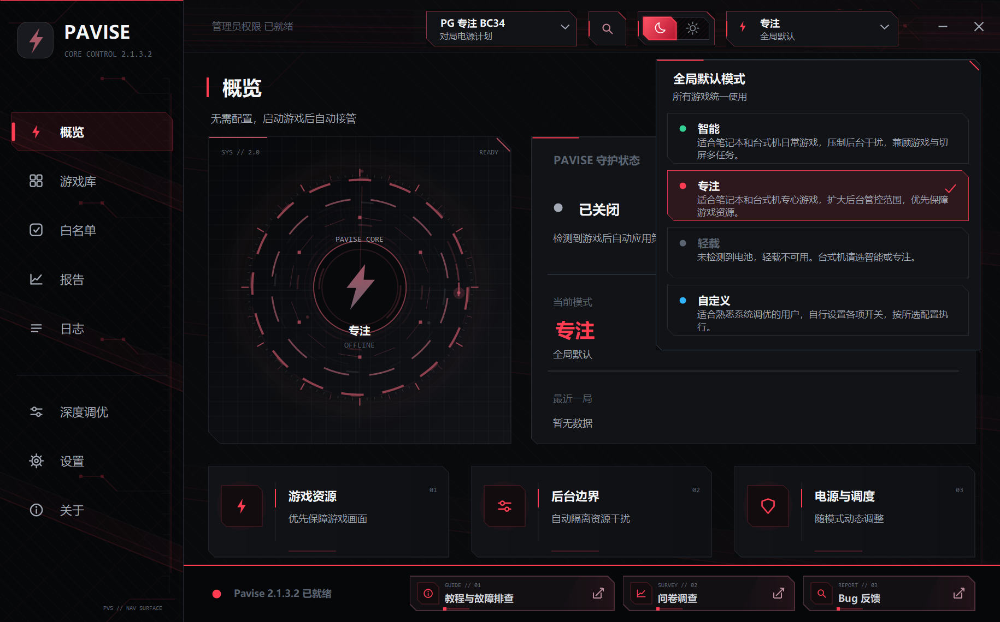

顶部还有两个入口。对局电源计划选择使用哪套电源方案，默认是 Pavise 托管的 PG 方案；也可以改选本机任意计划，Pavise 只负责切换，不改它的参数。

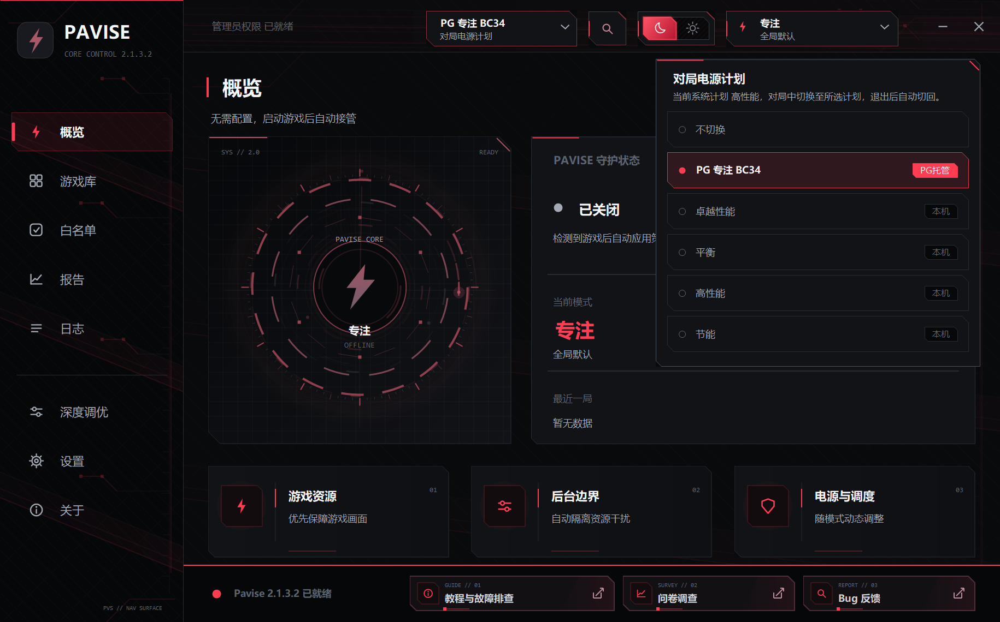

功能搜索用来直接定位设置项，不用记它在哪一页。

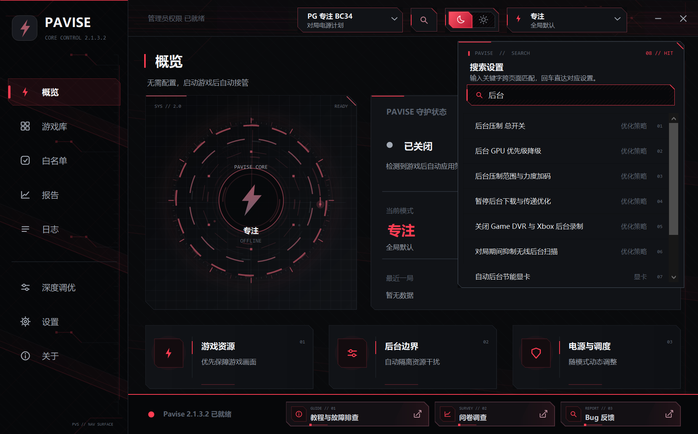

## 03｜游戏库

添加游戏的 EXE 或快捷方式，也可以扫描导入 Steam、Epic、GOG、育碧、Riot、WeGame、战网、Xbox 的已安装游戏。

通过启动器启动的游戏（如英雄联盟）首次确认后会记住游戏本体，之后直接识别。启动器、更新器、崩溃上报和反作弊进程不会被认作游戏。

### 渲染标签与家族后台压制

每个条目会显示渲染观测状态。「已观测渲染」表示在这个 EXE 上看到过 GPU 3D 活动，「暂未确认」表示还没有记录。

家族后台压制默认关闭，这是对的。关闭时，游戏平台、启动器外壳、游戏目录下的常驻进程和游戏派生的子进程整族放行。打开后这些关联进程会按普通后台压制，可能导致平台聊天、浮层或依赖功能异常。

建议顺序：先打一局，核对渲染标签确实指向游戏本体，再决定要不要开。需要保留的具体进程可以单独加白名单。

## 04｜逐游戏独立配置

选中游戏后点独立配置，或直接双击卡片。每个游戏可以单独覆盖 34 项策略，没覆盖的跟随全局。

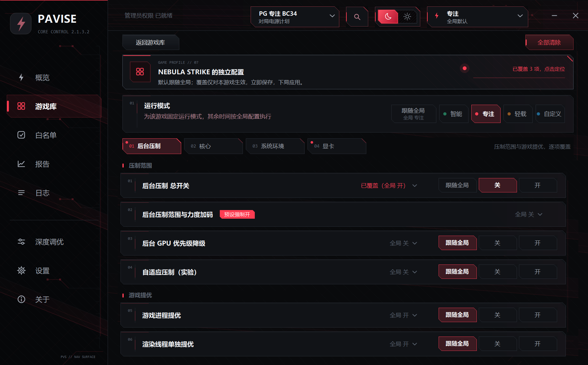

四个分组各管一块：

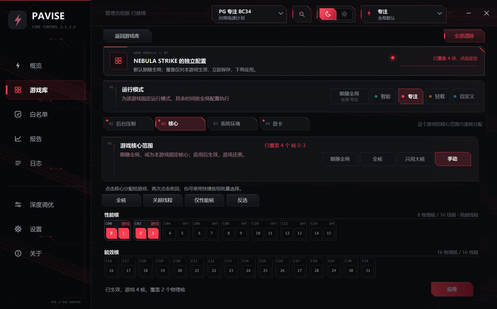

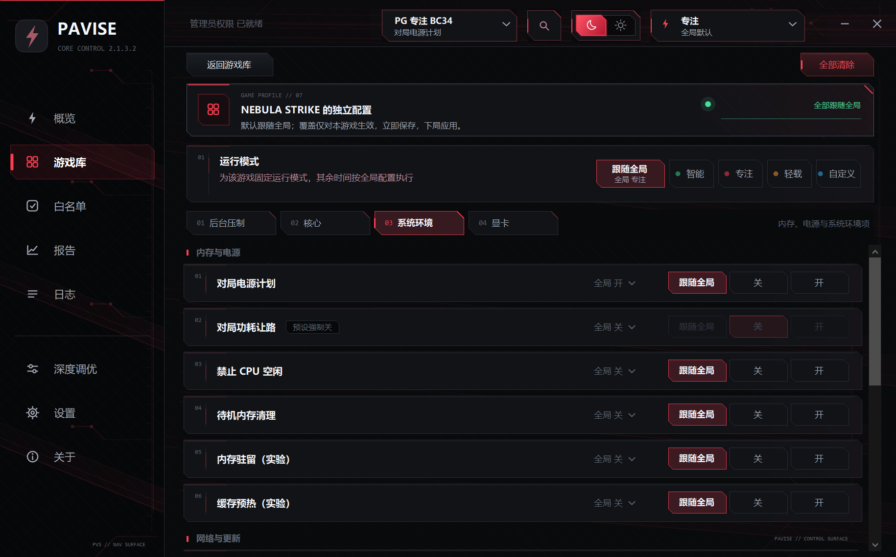

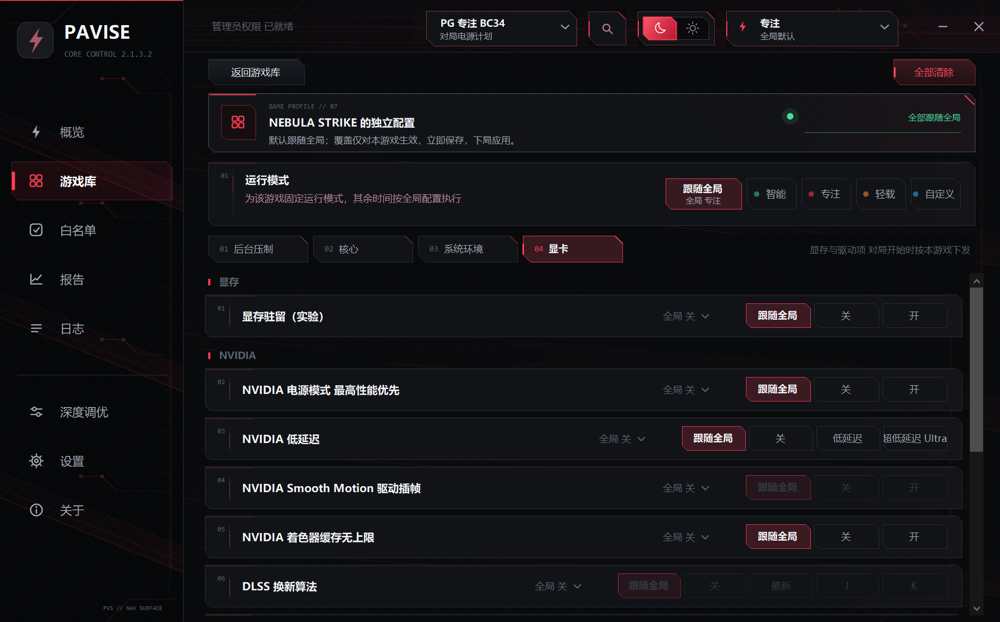

大部分覆盖在对局激活时确定，下一局生效。暂停非必要服务和禁止 CPU 空闲是当前会话内处理的，关掉即撤销。一套覆盖可以一键清回全局。

## 05｜优化策略

高级 → 优化策略，分四个标签页。非自定义模式会锁定并标注它接管的开关，右上角显示当前实际生效的行为。

四个标签页的分工：

- **核心控制**：后台压制总开关、后台 GPU 优先级降级、游戏进程提优、渲染线程单独提优，以及显存驻留和内存驻留两个实验项
- **核心分配**：CPU 分区。先保持全核，需要时再按本机拓扑调整。手动选核要点右下角的应用才保存
- **预设细节**：后台范围、下载、录制、多媒体调度
- **会话附加**：Windows Update、无线扫描、息屏、对局单屏、进入游戏切英文、待机内存清理、禁止 CPU 空闲、缓存预热

实验功能全部默认关闭，开启前有确认说明。建议一次只开一项，在同一场景下对照评估。

## 06｜显卡

按硬件实际支持选，不要全开。不支持的项会自动置灰。

- **通用**：应用显卡偏好，给后台程序保存 Windows 节能显卡偏好，下次启动生效。同页的自动后台节能显卡默认关闭，开启后会在对局稳定约一分钟时检测一次，把仍在游戏渲染卡上跑 3D 的后台程序自动登记
- **NVIDIA**：电源最高性能、低延迟模式、Smooth Motion 插帧、着色器缓存放开、DLSS 覆写、逐游戏 ReBAR。原值有快照，关闭即恢复
- **AMD**：Anti-Lag、AFMF 补帧、RSR 超分
- **Intel**：全局低延迟，仅在驱动报告支持实时切换的 DX9/DX11 路径上启用

显卡功耗墙在对局中拉到厂商允许的上限，退局按快照还原。

## 07｜系统环境

这一页放的是需要重启、或者会留在机器上的改动。每一项都可还原，但开之前先读风险说明。

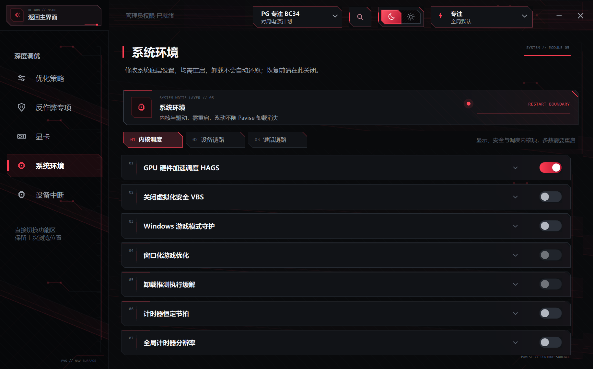

- **内核调度**：HAGS、VBS、推测执行缓解卸载、游戏模式守护、窗口化优化、计时器分辨率
- **设备链路**：设备电源管理、关闭网卡中断合并
- **键鼠链路**：辅助功能键、HID 电源、输入队列长度修复、指针精度增强

关闭网卡中断合并是持久改动，重启生效，非游戏时段同样承担更高的中断率。VBS 关闭前有独立的风险确认。

## 08｜白名单

拖入 EXE 即可，作用范围自动判断。白名单里的程序在任何模式下都不会被压制。

按实际依赖来配，不要把整个目录都加进去。输入法、外设工具、录屏软件、需要保留功能的平台进程是典型候选。

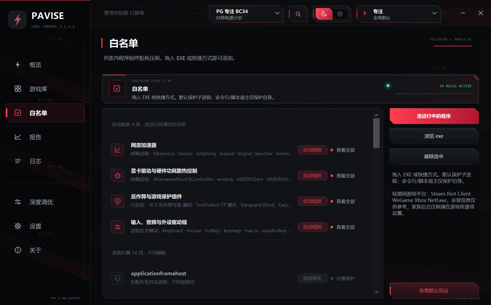

## 09｜反作弊专项

被拒绝写入的游戏会记进相容名单，注定失败的优先级和 IO 写入不再重试，显卡调度优先级和帧线程照常尝试。游戏换版本后名单自动失效。

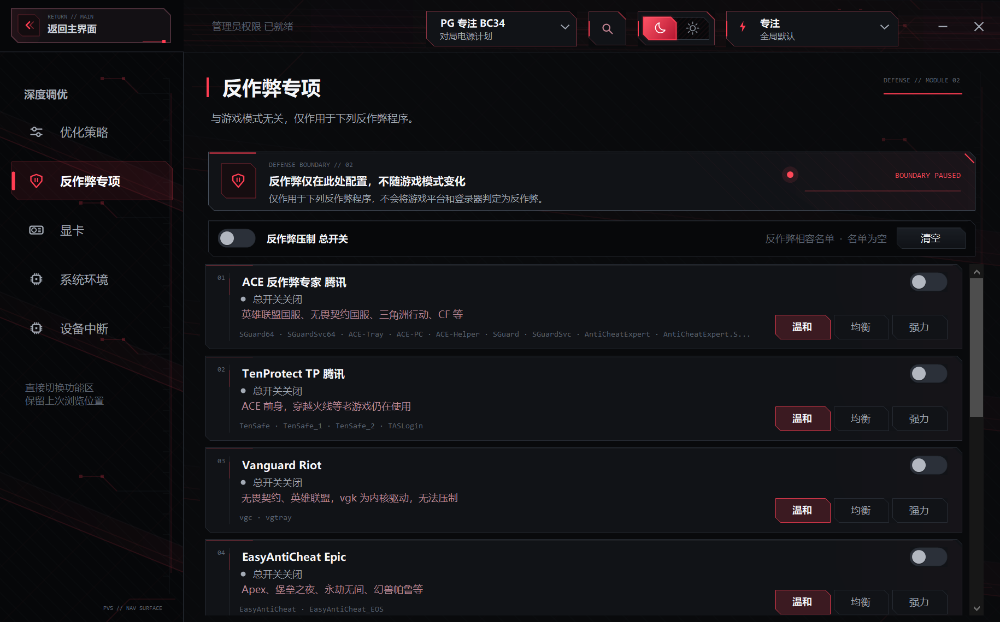

## 10｜设备中断

先观测，再调整。这一页的所有判断都建立在实测数据上，没有数据时不要动。

流程是三步：

1. 打开对局中断观测，正常打几局。观测用内核 ETW 采集设备 DPC，按局记账
2. 攒够合格局数后，页面会指出哪些设备与游戏核存在争用
3. 手动钉核，或打开自动中断编排让它按实测结果自动处理

自动中断编排默认关闭，开启前会明确告知它会自动写注册表。它在判定某设备与游戏核冲突后自动把中断钉到游戏核之外，每台设备写入备份收据，重启后生效；随后累计三局自动验收，冲突没消失就按收据回滚。多队列网卡、存储控制器、显卡与音频设备、键鼠链路不在范围内。

关掉观测会连带关掉编排并还原它的钉核。

## 11｜报告与日志

报告页是只读的系统体检，列出本机可用的能力与当前已启用的项，每条结论标注依据等级。被第三方工具改坏的系统项可以就地一键修复。

日志页记录守护过程中的每一步动作和结果。写入失败、验证不通过、熔断停止尝试都会在这里留痕。

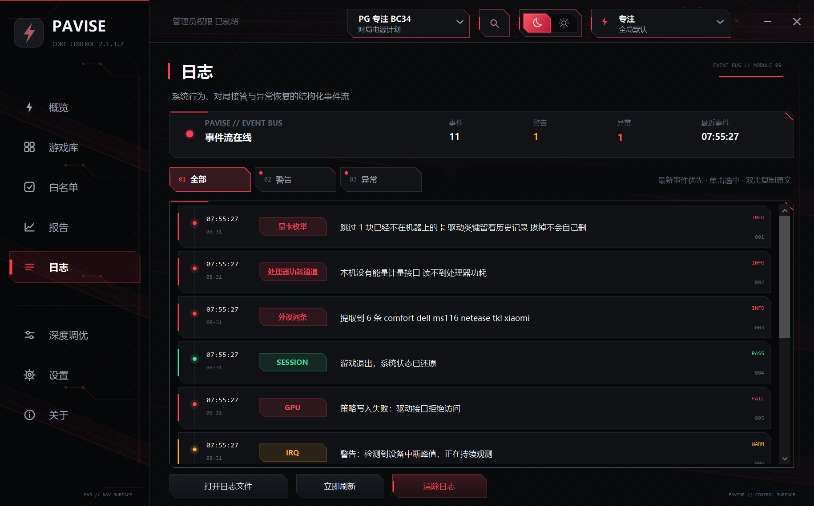

## 12｜设置

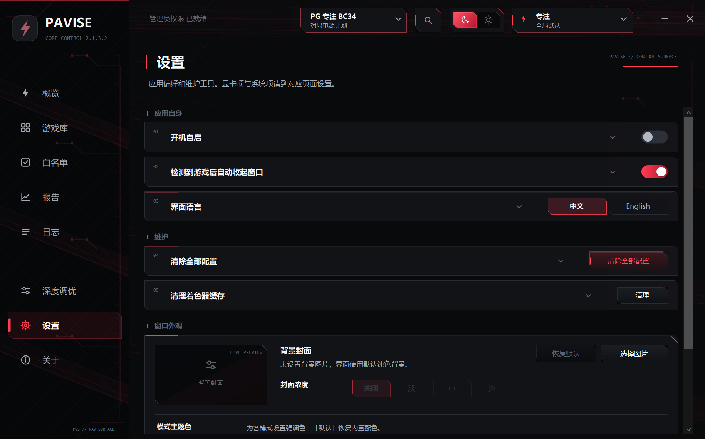

外观、语言、开机自启、数据位置和一键恢复都在这一页。

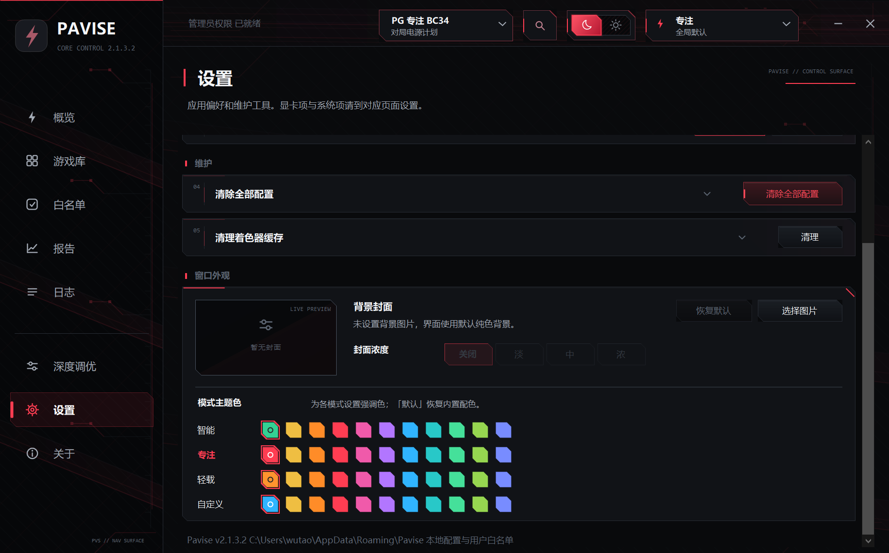

数据默认保存在 `%AppData%\Pavise`，界面和功能开关保存在注册表 `HKCU\Software\Pavise`。在程序旁放置空文件 `Pavise.portable` 后改为保存在程序目录。

一键恢复会撤销 Pavise 做过的所有持久改动，包括已下架功能留下的历史改动。

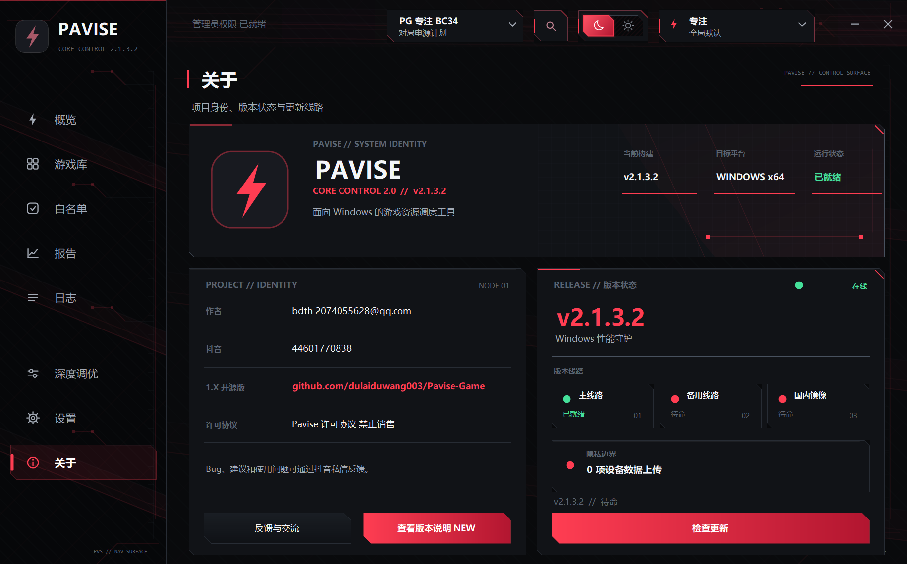

## 常见问题

**开了没感觉到提升。** 先确认后台确实有东西在抢资源。系统本身干净、或者游戏完全卡在显卡上，Pavise 能还给游戏的就很少。在同一场景下开关对比，不要跨场景比。

**游戏平台的聊天或浮层出问题了。** 关掉那个游戏的家族后台压制，或者把具体进程加白名单。

**某个开关自己关掉了。** 驱动或系统拒绝了写入，回读核实没通过，程序按设计撤销并停止尝试。日志里有具体原因。重新打开开关等于重新授权尝试一次。

**中断页说没有数据。** 需要管理员权限，并且要打开对局中断观测后完整打几局。单局时长太短的不计入。

**改完要不要重启。** 系统环境页的项目需要重启，页面上会标注。其余都是对局期临时改动，退局自动还原。
